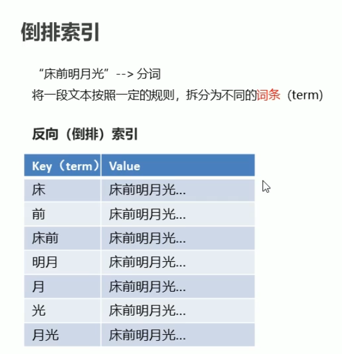
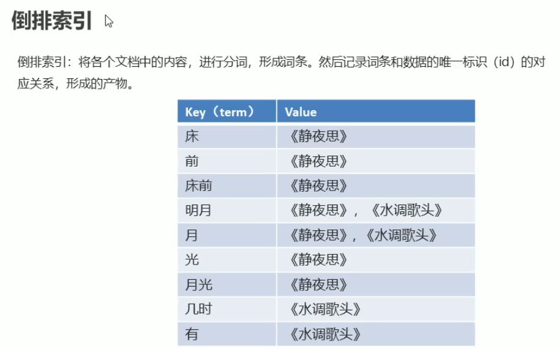
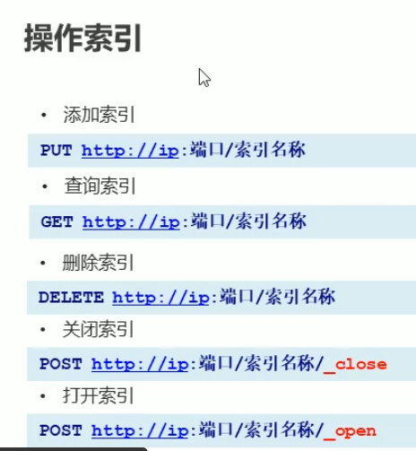
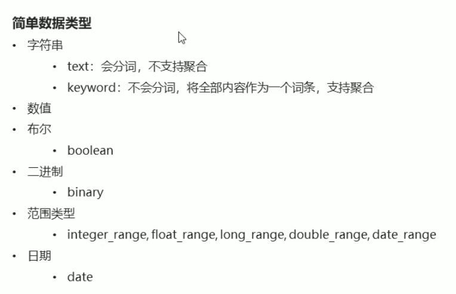
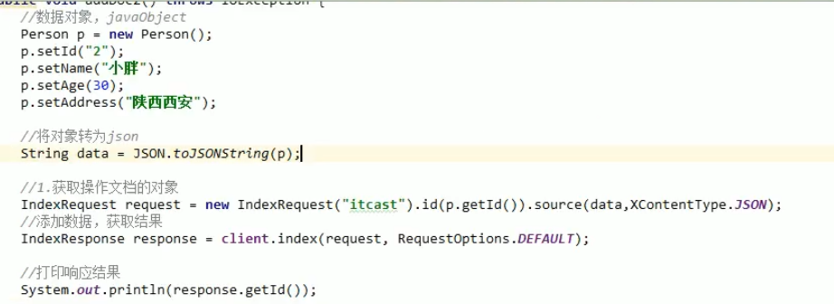
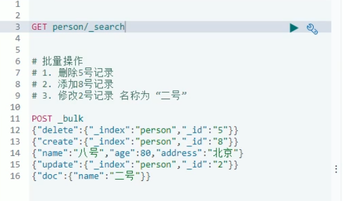

### 教程 

https://blog.csdn.net/qq_46548855/article/details/107386642


### JSON

Javascript Object Notation（方便转换为字符串用于网络上传输）

#### 基本介绍

JSON字符串：网络中传递的字符串的格式符合JSON格式

```json
新建对象例子：
var obj = {"name":"张三" , "age":30 , "info":{"email":"123@qq.com"}}

新建集合例子:
var objs = [obj , obj]
```

简单来说服务器与前台之间复杂一点的数据都可以转换为JSON，再通过网络进行传输

#### JSON与JAVA对象转换

Fastjson：Fastjson是阿里巴巴提供的一个Java语言编写的高性能功能完善的JSON库，是目前Java语言中最快的JSON库，可以实现Java对象和JSON字符串的相互转换。

故具体使用时，会调用Fastjson的 javaAPI就行

导入坐标后，代码示例如下：

```java
Java对象转JSON：
String jsonStr = JSON.toJSONString(obj);

JSON转java对象：
User user = JSON.parseObject(jsonStr,User.class);

```


### Elasticsearch

#### Elasticsearch与mysql类比

```json
索引库（indexes）---------------------------------Databases 数据库

    类型（type）----------------------------------Table 数据表

        文档（Document）--------------------------Row 行（记录）

             字段（Field）---------------------Columns 列 
                
                映射配置（mappings）--------- 表结构

```

<font color="skyblue">ES 7.x以后一个index中只有一个type 默认为 _doc</font>

### 幂等

幂等就是让多次重复操作的结果跟一次操作的结果是一样的

https://www.zhihu.com/search?q=%E5%B9%82%E7%AD%89%E6%80%A7&type=content&sort=upvoted_count


### 倒排索引





### ElasticSearch

ES是一个基于Lucene的搜索服务器

#### RESTful风格

- REST (Representational State Transfer)，表述性状态转移，是一组架构约束条件和原则。满足这些约束条件和原则的应用程序或设计就是RESTful。就是一种定义接口的规范。
- 基于HTTP
- 可以使用XML格式定义或JSON格式定义。
- 每一个URI代表1种资源。
  - URI可以是index、document等
- 客户端使用GET、POST、PUT、DELETE4个表示操作方式的动词对服务端资源进行操作:
  - GET:用来获取资源
  - POST:用来新建资源(也可以用于更新资源)。
  - PUT:用来更新资源
  - DELETE:用来删除资源

补充：ES中已给的指令一般都是以"_"开头

#### 索引操作



#### 映射操作



复杂数据类型：

- 数组：[ ]
- 对象：{ }

#### 分词器 Analyzer

ES内置分词器对中文不友好，一字一词，解决方法：用中文分词器插件

##### IK分词器：

#### 查询文档

- 词条查询:term

  - 词条查询不会分析查询条件，只有当词条和查询字符串完全匹配时才匹配搜索
- 全文查询:match
  - 全文查询会分析查询条件，先将查询条件进行分词，然后查询，求并集


text类型会被分词器解析，而keyword类型不会被分词器解析


javaAPI添加文档：

批量操作脚本：




#### 全文检索

##### 参考博客：

- **全文检索介绍：**https://blog.csdn.net/sinat_38102206/article/details/81784315?ops_request_misc=%257B%2522request%255Fid%2522%253A%2522164977364416782246463338%2522%252C%2522scm%2522%253A%252220140713.130102334.pc%255Fall.%2522%257D&request_id=164977364416782246463338&biz_id=0&utm_medium=distribute.pc_search_result.none-task-blog-2~all~first_rank_ecpm_v1~rank_v31_ecpm-2-81784315.142^v7^pc_search_result_cache,157^v4^new_style&utm_term=%E5%85%A8%E6%96%87%E6%A3%80%E7%B4%A2&spm=1018.2226.3001.4187

- **ES各类检索介绍：**https://blog.csdn.net/Octopus21/article/details/109559242

  

### echarts

### restful

https://www.zhihu.com/search?q=restful&type=content&sort=upvoted_count


