git官方有详细的教程（[Git Book](https://git-scm.com/book/zh/v2)），遇到问题或者不懂的地方还是看人家官方文档比较靠谱

廖雪峰的[Git教程](https://www.liaoxuefeng.com/wiki/896043488029600)也十分的通俗易懂，值得一看

B站黑马Git笔记：https://blog.csdn.net/qq_58168493/article/details/122592304

Git进阶视频，课程讲的很详细且命令都有具体操作：https://www.bilibili.com/video/BV1y4411a7Nn/

### GitHub

> 一个在线软件源代码托管服务平台，使用Git作为唯一的版本控制软件

#### 基本概念

**Repository** 仓库：一个仓库等于一个项目

**Star** 收藏 ：

**Fork** 复制克隆项目 ：在原仓库的基础上新建一个分支（相当于对仓库进行备份）

- 快照

  - ```shell
    存储网络行业协会（SNIA）对快照的定义是：对指定数据集合的一个完全可用拷贝，该拷贝包含源数据在拷贝时间点的静态影像。　　
    快照可以是数据再现的一个副本或者复制。对于文件系统来说，文件系统快照是文件系统的一个即时拷贝，它包含了文件系统在快照生成时刻所有的信息，本身也是一个完整可用的副本。
    ```

**Pull Request** ：你fork了别人的仓库，同时做了修改想要把这个修改发给原仓库，这个请求就是pull request

**Watch** ：相当于关注项目，当对方项目有修改能收到通知

**Issue** ：就是一个讨论，可以用于通知项目维护者你发现的问题或者Bug（相当于一个评论区，可以在此联系作者）


### Git基础

> 一个开源的分布式版本控制系统（svn是集中式版本控制系统）

<font color="red">说明：以下展示的所有代码中 \<xxx\>  表示参数为 xxx</font>

#### 基本概念

Git的基本路子就是每次修改都在本地新建一个文件快照（也就是每次提交后都产生一个独立的版本），所以所有的操作都在本地完成

查看本机Git版本：git -v

##### Bash、CMD、GUI

**Git Bash**：就是在windows环境下模拟linux环境的命令行窗口，在这里可以使用大部分linux的命令（**首选用此方法操作Git**）

**Git CMD**：就是windows的命令行窗口，在这里可以使用windows指令

- Bash 是一种 Unix shell 和命令语言，是 Linux (Ubuntu 等)和 OS X 上的默认 shell。用外行的术语来说，运行在任何 Linux 设备终端上的 git 称为 git bash。

**Git GUI**：就是一个图形化操作界面，由于Git就是在linux环境中写出来的，所以GUI并不是主流的操作方式，它只是照顾一下不习惯用黑框框的人，不过缺点就是他只实现了Git部分的命令


##### Bash窗口使用

```shell
ctrl+a		\\光标快速移到当前行最左端 
ctrl+e		\\光标快速移到当前行最右端
ctrl+c		\\放弃当前行内容直接，开始另一个语句编写


```


##### 文件状态转换

关于文件状态转换廖雪峰讲的通俗且易懂：https://www.liaoxuefeng.com/wiki/896043488029600/897271968352576

```shell
git commit <-m "XXX">
```

这个命令会一次性将暂存区（Staged）中的所有文件都提交到仓库中

其中 <-m "XXX"> 虽然是可选的选项，但是默认情况下都要写上，毕竟使用Git是多人之间合作，你的每次提交还是要写清楚你所做的操作

 


git status示例：

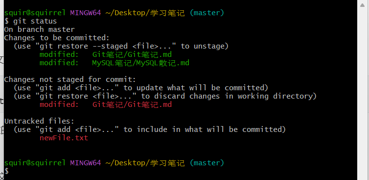

文件分两种：已追踪和未追踪

**Untracked**：文件未跟踪，就是新建的文件但是没有通知git

- ```shell
  Untracked files:
    (use "git add <file>..." to include in what will be committed)
  ```
  
- 如上图中的 newFile.txt

**Unmodified**：就是存放在仓库中未修改的文件

- 就是上图git status没显示的文件

**Modified**：跟踪文件已修改但未暂存，文件任在工作区

- ```shell
  Changes not staged for commit:
    (use "git add <file>..." to update what will be committed)
    (use "git checkout -- <file>..." to discard changes in working directory)
  ```

- 如上图中的 Git笔记/Git笔记.md

**Staged**：跟踪文件已暂存

- ```shell
  Changes to be committed:
    (use "git restore --staged <file>..." to unstage)
  ```

- 如上图的  Git笔记/Git笔记.md     MySQL笔记/MySQL散记.md

commit命令提交的是你最后一次运行 `git add` 命令时的那个版本，而不是你运行 `git commit` 时，在工作目录中的当前版本。 所以，运行了 `git add` 之后又作了修订的文件，需要重新运行 `git add` 把最新版本重新暂存起来：


##### Head

HEAD是一个指针，指向当前版本

HEAD^指向当前版本的上一次commit版本

HEAD^100指向当前版本的前100次commit版本


##### 文件类型

Git可以详细的记录下仓库总文件发生的变化

- 对于文本文件，由于是有结构文件，git可以详细的记录下文件的变化
- 对于二进制文件，由于文件本身没有结构，故git仅能记录下文件大小发生的变化


##### 四个区域

图文简述了Git四个区域之间的转换：https://www.cnblogs.com/qdhxhz/p/9757390.html

这副图讲的很明白

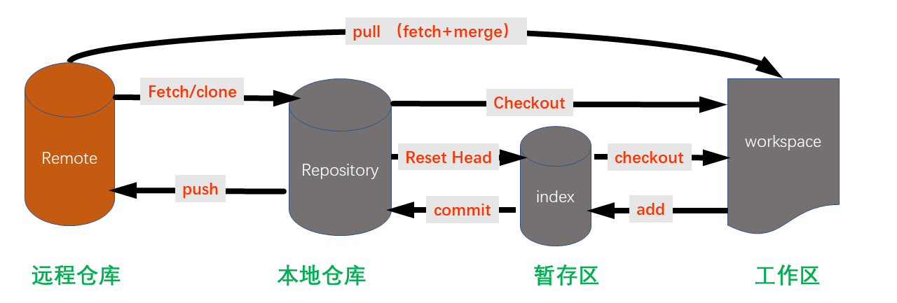

本地三个区域

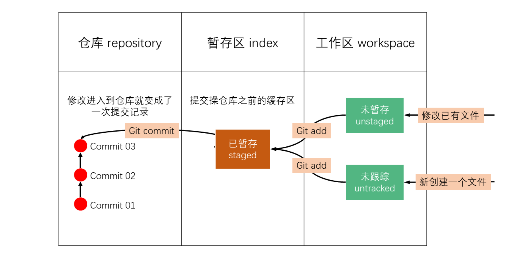

- 工作区：就是执行了 git init 的那个文件夹
- 暂存区：是 .git 目录下的 index 文件
- 版本库（本地仓库）：就是 .git 目录
  - 这个区也可以叫：对象区
  - 总之一次commit对应一个版本，所有版本都可以在版本库中找到（可以进行版本穿梭）


​	所有文件要想提交到本地仓库中，都要先 add 到暂存区，而 git commit 命令是一次性将暂存区所有文件都提交到本地仓库。一次commit就代表本地仓库进行了一次版本替换，可以使用 git reset 命令更改仓库的版本，当然具体改到那个版本需要知道commit ID号。


#### 常用命令

git 的所有命令都可以加上 --help 来查找官方文档


##### 账户设置

Git是分布式的，每个用户之间都是独立的，所以需要自报家门（git log命令就可以确定是谁做的提交）

```shell
自报家门：
$ git config --global user.name "squirrel"
$ git config --global user.email "squirrelQWQ@outlook.com"
```

config 配置有system级别 、global（用户级别） 和local（当前仓库）三个 

设置先从system ==> global ==> local  底层配置会覆盖顶层配置 分别使用--system/global/local 可以定位到配置文件

```shell
查看配置：
$ git config --system --list	\\对当前计算机范围应用
$ git config --global --list	\\对当前用户应用
$ git config --local --list		\\对当前项目应用

由上及下应用范围更精确，精确的配置能覆盖宽泛的配置
```

可以这样查看config配置

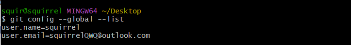

当然也可以直接修改对应的配置文件，手动config配置


```shell
初始化仓库：
$ git init
其实就是在项目所在目录下创建了一个 .git 文件，该文件包含了所有git操作所需的信息
要删除该本地仓库可以直接删除 .git 文件即可
```


##### 添加与查看

```shell
git add <file/dir>			\\ 注意，可反复多次使用，添加多个文件；
git add .					\\ 一次加入当前文件夹所有文件
git commit -m <message>		\\ 将文件提交至仓库，并使用 -m 选项输入描述信息
git commit -am <message>	\\可以这样子简写命令，add . + commit 一行搞定
git status					\\ 查看仓库目前状态
git diff <file>				\\ 详细查看仓库的变化
```


**git commit**：如果使用commit命令没有添加提示信息会导致此次commit操作失败

- 比如不使用-m选项会直接进入Git默认编辑器，强制要求你写上信息
  - 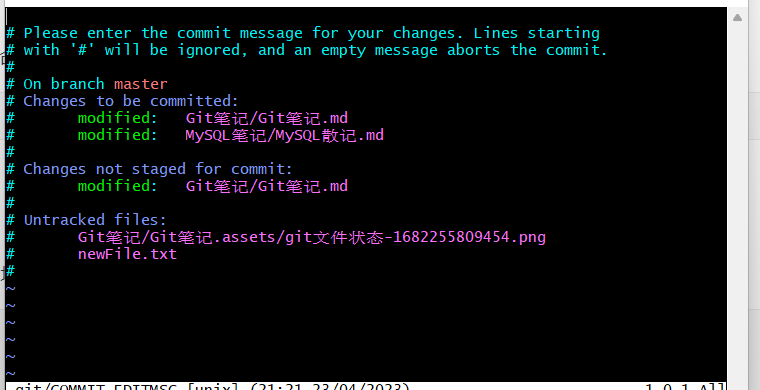
  - 若执迷不悟还是不写信息就退出vim会导致本次commit失败
  - 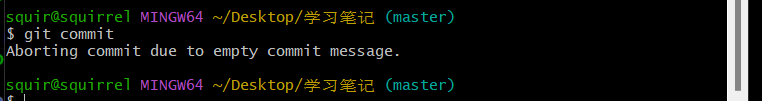


##### 版本穿梭

使用场景：每次提交后都表示本地仓库生成了一个新的版本，觉得当前版本不好想退回到以前的版本

```shell
版本查看
git log						\\ 查看仓库的历史版本（主要是各个commit的id和信息）
git log --pretty=oneline	\\ 只显示简略log信息
git log --pretty=oneline --abbrev-commit		\\只显示commit id的前几位
							\\ 次命令很长且经常使用所以可以为该命令取别名，同时git log命令可以有很多操作，具体操作以后在实际使用中再补充
git reflog					\\ 查看历史的所有commit操作

修改版本
git reset --hard <commit id>	
	\\ 其中commit id 可以在git log命令中查看也可以用 git reflog 查看历史命令
	\\ 同时commit id可以只输入前几位，git会自动查找给你补全	
```


git checkout sha1值		 \\\ 版本切换到对应的版本，此时处于游离状态

- 比如当前一次进行了1、2、3、4次提交，则HEAD指向最近一次提交的版本4，此时使用checkout穿梭到版本2
- 此时在版本2对某一文件进行修改必须提交，且此时对文件的操作不会影响到版本3、4


##### 撤销操作

撤销命令有如下几个

```
restore
reset
checkout
switch
```

其实每一次操作之后git都会给出对应的撤销命令是什么，如下面这个例子

- 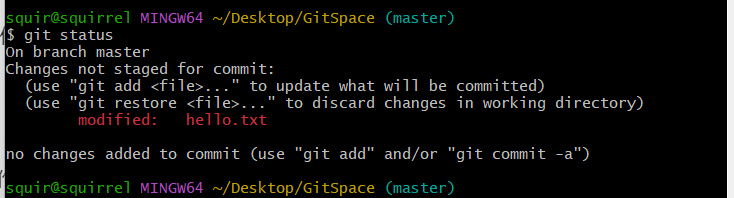
- 图中命令表示：hello.txt文件已修改但是未暂存，可以使用 git add将其暂存，也可以使用 git restore 撤销在工作目录中对其的修改
- 提醒一下，git给出了对应的命令提示，但实际上能达到相同目的的命令不止这些，比如 checkout或reset有时能等效替换git restore命令


**使用场景**：在文件提交前（文件可能在暂存区或工作区）发现操作有误想撤销操作

```
git checkout -- readme.txt
```

意思就是，把`readme.txt`文件在工作区的修改全部撤销，这里有两种情况：

- 一种是`readme.txt`自修改后还没有被放到暂存区，现在，撤销修改就回到和版本库一模一样的状态；

- 一种是`readme.txt`已经添加到暂存区后，又作了修改，现在，撤销修改就回到添加到暂存区后的状态。

总之，就是让这个文件回到最近一次`git commit`或`git add`时的状态。


场景1：当你改乱了工作区某个文件的内容，想直接丢弃工作区的修改时，用命令`git checkout -- file`。

场景2：当你不但改乱了工作区某个文件的内容，还添加到了暂存区时，想丢弃修改，分两步，第一步用命令`git reset HEAD <file>`，就回到了场景1，第二步按场景1操作。


##### 删除文件

删除已提交文件

```shell
方法一：使用git命令删除
$ git rm b.txt		\\b.txt是已提交的文件，此命令会令其放入暂存区（ls命令找不到文件）

$ git rm b.txt		\\彻底删除次文件需要执行这两个命令
$ git commit

方法二：使用操作系统命令删除
$ rm a.txt			\\a.txt是已提交的文件，此命令会令其放入工作区（ls命令找不到文件）

$ rm a.txt			\\彻底删除次文件需要执行这三个命令
$ git add/rm a.txt	\\意思是说：使用git add或git rm都可以
$ git commit

```

重命名已提交文件

```shell
方法一：git mv

方法二：mv
```


##### 忽略文件

让git忽略某些文件 .gitignore 文件（就是commit命令要忽略的文件）

详细介绍此文件：https://zhuanlan.zhihu.com/p/52885189


#### Git分支

##### 常用命令

```shell
创建、删除、查看
git branch <分支名>		\\ 新建分支
git branch -d <分支名>		\\ 删除分支(不能删除当前分支)
git branch				  \\ 查看分支，前面有*的就是当前分支

切换
git checkout <分支名>		\\ 切换分支
git checkout -b <分支名>	\\ 切换分支，若不存在则创建分支

```

小细节：一个分支如果进行写操作（增删改操作）且没有 add  commit 那么这个写操作所有分支共享


##### 分支合并

若一个分支进行了写操作（增删改）且进行了 add commit 那么这个分支就需要先合并再删除

若一个分支进行了写操作（增删改）但没有执行 add commit 那么这个分支可以直接删除，且写操作会被保留

```shell
合并分支
git merge <要合并的分支名>	 \\ 合并分支，把参数里面的分支合并到当前分支中
```

合并具体细节：


##### 保存现场

> stash

- 建议（规范）：在功能没开发完毕前，不要commit
- 规定（强制要求）：在没有commit之前，不能checkout切换分支，否则会报error

stash就是一个现场栈，保存现场后就可以愉快的切换分支，之后也可以切换回来回复现场

```shell
$ git stash						\\保存当前现场
$ git stash list				\\查看现场栈中元素
$ git stash pop					\\最近一次保存的现场出栈（恢复现场并删除栈中记录）
$ git stash apply				\\恢复最近一次现场（恢复现场但不删除栈中记录）
$ git stash drop stash@{0}		\\手动删除现场栈中的某一个现场

```


#### 远程仓库

远程仓库就是一些代码托管平台，比如：github、码云、gitlab等


##### SSH认证

> 可以把ssh密钥放在项目setting中也可以放在账户的setting中，下面是放在账户setting示例

1. 首先在github上新建仓库

2. 再配置密钥信息进行身份认证（具体可参见菜鸟教程：https://www.runoob.com/git/git-remote-repo.html）

   1. ```shell
      ssh-keygen -t rsa -C "squirrelQWQ@outlook.com"		\\先在本地创建一个ssh密钥
      ```

   2. 在github账户设置中添加该SSH密钥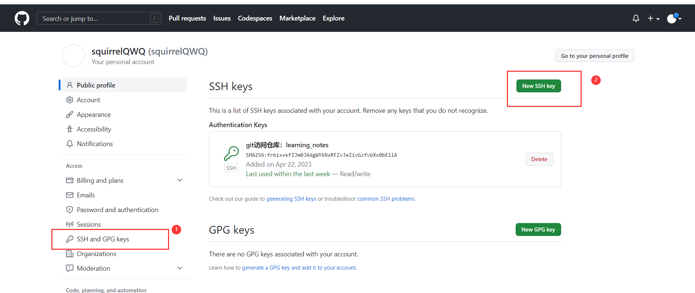

   3. 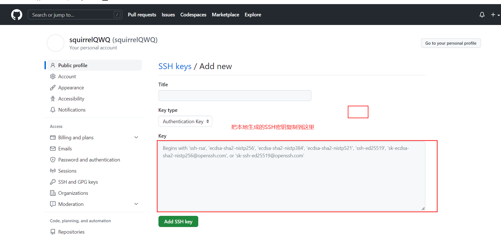


##### 添加远程

```shell
ssh-keygen -t rsa -C "squirrelQWQ@outlook.com"	  \\先在本地创建一个ssh密钥

$ git remote rm origin							  \\删除远程仓库origin	
$ git remote									  \\查看本地仓库关联的远程仓库（只显示仓库名称）
$ git remote -v									  \\查看本地仓库关联的远程仓库（显示仓库fetch和push链接）
$ git remote add origin git@github.com:squirrelQWQ/Learning_Notes.git	
												  \\添加远程仓库，并起名为origin
```

实际上添加远程仓库就是在本地新建了一个 origin/master分支（这个分支默认隐藏，称为：追踪分支）

```shell
$ git branch -a				\\可以用该命令来查看所有分支
* master
  remotes/origin/master

```


##### 拉取

```shell
$ git pull <远程主机名> <远程分支名>:<本地分支名>		\\从远程仓库获取代码并合并本地的版本
pull  = fetch + merge ， 也就是说pull操作实际上有两步
$ git pull origin master:master
$ git pull origin master						  \\将远程仓库origin获取master分支代码并和当前分支进行合并


```


##### 推送

```shell
$ git push <远程主机名> <本地分支名>:<远程分支名>		\\将本地分支上传到远程分支并合并
$ git push origin master						  \\将本地仓库提交到origin的master上（本地分支名与远程分支名相同，则可以省略冒号：）

$ git push -u origin master			\\第一次使用push命令可以这样操作，意思是说吧origin和master绑定在一起
$ git push							\\使用-u绑定一次之后的push操作可以不写参数

```


##### 本地与远程冲突


### VIM

VIM 常用的有四个模式，：

- 正常模式 (Normal-mode)	
  - 使用vim打开文件默认就是这个模式
- 插入模式 (Insert-mode)
- 命令模式 (Command-mode)
- 可视模式 (Visual-mode)


#### 插入模式

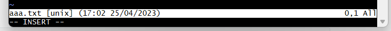

进入插入模式：i

推出插入模式：Esc


#### 命令模式

> 进入命令模式：:

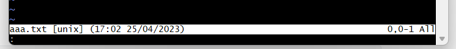

##### 常用命令

```shell
set number		\\显示行号
set nonumber	\\取消显示行号
8				\\光标移到8行，光标快速移动到某一行：直接输入行号
wq				\\保存并推出：
8,12d			\\表示删除行：[8,12]
/hello			\\查找文字：hello ,查到以后，输入键盘上的 n 寻找下一个匹配，N 寻找上一个匹配。


```


