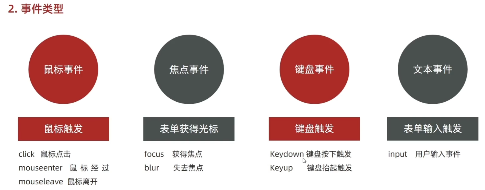

### 初识JS

JavaScript：运行在客户端的脚本语言

也可以使用Node.js在服务器上运行js

JS是解释型语言，一行一行的进行“解释”，所以可能会卡住


浏览器由两部分组成：

- 渲染引擎：解析HTML和CSS，俗称内核，比如chrome中的blink
- JS引擎：也叫JS解释器，比如chrome中的V8


**组成**

JS的组成

js语法：

DOM对象：网页文档对象模型

BOM对象：浏览器对象模型


**分类**

JS按书写位置不同有不同分类

行内JS：就像属性一样，比如 onclink

内嵌JS：就是html中的 \<script\> 标签

外部JS：就是用 src 引入js文件


### 基础语法

##### 输入输出

prompt()

alert()

console.log()


##### 变量

声明变量：var和let

仅声明但未初始化的变量值：undefined

未声明也可以直接使用（会变全局变量）

变量名<font color="brown">大小写敏感</font>，仅包含数字、字母、_、$ 这四种东西


##### 数据类型

JS属于弱类型语言（动态语言），变量的类型是不确定的，所以不用提前声明变量类型，其类型在程序运行中会被自动确定（根据赋值的类型来确定变量类型）。

**简单数据类型：**Number、Boolean、String、Undefined、Null

Number：isNaN函数

String：都有length属性，+拼接

**类型转换：**表单和prompt默认得到的都是字符串类型

**转为数字型**：

- parseInt(string)
- praseFloat(string)

**浮点数不能进行比较**


##### 运算

特别的运算符：

- 全等：===
- 不全等：!==

逻辑运算的短路


##### 数组

```javascript
var arr = [1,2,"靓仔",true];	//字面量的方式创建数组，显然js中列表可以包含任意类型
var arr = new array();		//创建对象的方式来新建数组
```

下标从0开始

**伪数组**

1. 输出也是 [ ] 的形式
2. 具有数组的.length属性
3. 按照索引的方式存储
4. 没有数组的其它方法，比如pop(),push()


##### 函数

JS中函数形参和实参的数目可以不匹配

- 形参少于实参，只取到形参的个数
- 形参多于实参，多余的形参默认未undefined

没写return时，默认返回undefined

**arguments**

> 是一个内置的对象，所有函数都有

1. 仅函数内部可以访问
2. 可以通过索引进行访问（相当于它就是一个数组，里面存放的是所有的实参数）
3. 其与形参无关，是由实参决定的，其.length值在函数调用时就决定好了
4. arguments中的值和已经“赋值”的形参之间是“实时绑定的”，也就是说改一个另一个也同时发生改变
5. 特殊的属性，callee，这个属性就是函数本身，在匿名函数中有用

**匿名函数**

```javascript
function fun1(){};		//使用关键字定义函数	
var fun2 = function(){};	//匿名函数（函数表达式）
```

其使用方法就和声明变量差不多，注意这里的fun2是一个变量，这个函数并没有名字

使用时就用：fun2()这样调用就行


##### 作用域

> ES5没有块级作用域 { } ，ES6有块级作用域

全局作用域：整个script标签或者单独的js文件

局部作用域：（函数作用域）函数内部就是局部作用域

全局变量：在全局作用域声明的变量，以及**在函数中没有申明直接赋值的变量**

局部变量：

全局变量：浏览器关闭时才销毁

局部变量：程序结束时就销毁


##### 预解析

浏览器引擎运行JS分两步：预解析、代码执行

- 预解析：
  - 变量提升：JavaScript引擎会将变量的声明提升到作用域（函数作用域或全局作用域）的顶部，但初始化（赋值）保持在原来的位置。
  - 函数提升： 与变量提升类似，函数的声明也会在预解析阶段被提升到作用域的顶部。这意味着你可以在函数声明之前调用函数。
- 


##### 对象

> js中对象分三种：自定义对象、内置对象、浏览器对象

**创建对象：**

```javascript
var obj01{};
var obj02{
    username:'靓仔',
        age:18,				//属性的赋值使用的是 冒号: “键值对”
    sayName:function(){		//匿名函数的方式声明方法
        console.log(this.username);
    }
};

//方位对象的属性和方法
console.log(obj02.username);
console.log(obj02[age]);		//属性可以用键值对的方式进行访问
obj02.sayName();

//使用构造函数的方法来构建对象
function Person(name, age) {
    this.name = name;
    this.age = age;
    
    this.greet = function() {
        console.log('Hello, my name is ' + this.name);
    };
}

let bob = new Person('Bob', 25);
```


- 使用字面量 { } 创建对象

- 使用 new Object(); 创建对象

- 使用构造函数的方式创建对象（javascript中的构造函数约等于“类”）

  

**遍历对象**

对象中的属性和方法是无序的，可以使用 for in 循环进行遍历对象


##### 内置对象

Math、Date、Array、String


### API

##### 获取DOM元素

js获取DOM元素可以使用CSS选择器进行选择

document.querySelector('css选择器')

获取到DOM对象后就可以修改对象的属性从而达到修改html元素的效果

##### 修改DOM对象属性

innerText：纯文本，不解析标签

innerHTML：解析标签

常见属性：href、title、src等

操作样式：

- 通过style
- classname：修改元素的class从而修改样式
- classList：修改对象的class从而修改样式（add、remove、toggle）


##### 自定义属性

> js中属性分两种，如style、value等都是标准属性，此外H5还支持自定义属性

注意：自定义属性一律以”data-“开头（非强制但通用）


##### 定时器

间歇函数：setInterval(函数，间隔毫秒数)

> 这个函数一经启动就不会自己停止，会一直执行下去，得用clearInterval(n)函数停止

```javascript
function fn(){
	console.log("这是fn函数")
}
let n = setInterval(fn,1000)	//启动定时器，它将每隔1秒执行一次fn函数

clearInterval(n)		//关闭定时器

```

每个定时器都有一个独一无二的编号（就是定时器函数的返回值，一个数值id）


##### 事件监听

元素对象.addEventListener('事件类型',要执行的函数)

事件监听三个要素：

- 事件源：dom元素
- 事件类型：比如鼠标单击（click），鼠标经过（mouseover）
- 事件调用的函数




##### 事件对象

> 简单来说就是js提供的记录事件详细信息的一个对象

事件绑定的回调函数中的第一个参数就是事件对象，一般写做e

```javascript
元素.addEventListener('click',function(e){
	console.log(e)
})
```

