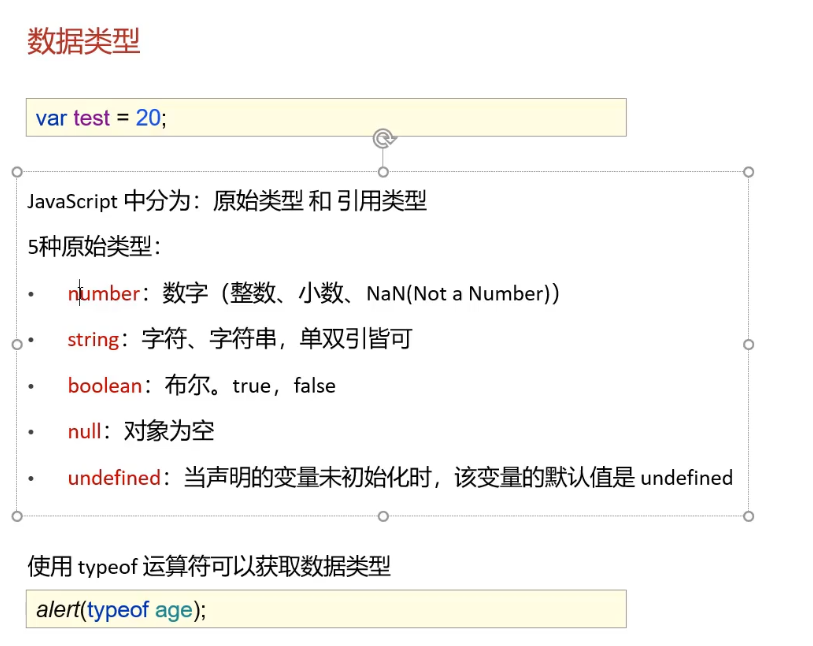
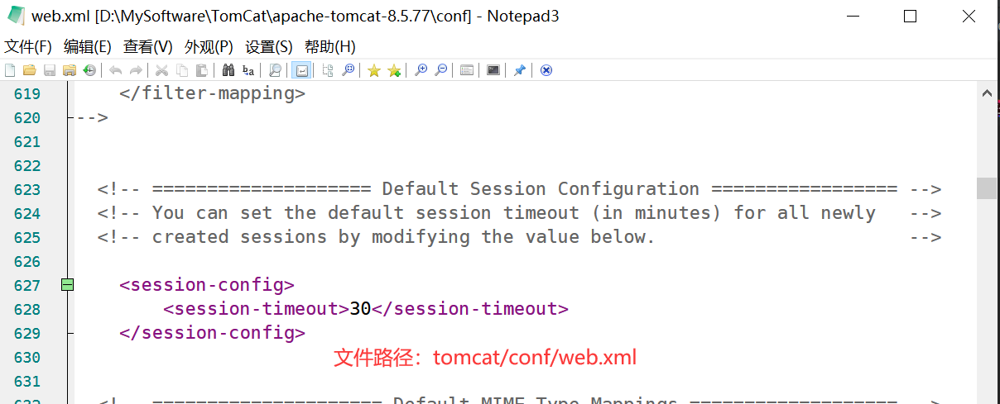
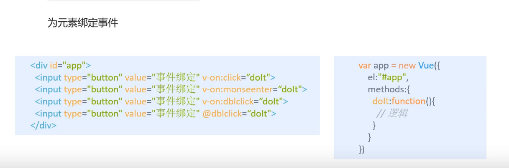

### TomCat

> 下载安装：https://blog.csdn.net/qq_52113008/article/details/121765123

安装目录下webapps里面放的就是web项目


其中temp工程里面的文件如下图：


#### 关于war包

web项目直接拷贝到tomcat的webapps目录页可以实现访问但是速度较慢，故一般把项目打包成war包，tomcat会自动解析war包

把war包放入webapps目录下就是项目的部署


### HTTP

##### 请求行

请求方式：**Get，Post**，head，delete，put等

- get：请求能够携带的参数较少，大小有限制，会在浏览器url行显示数据内容，不安全，但高效
- post：请求携带的参数无限制，大小无限制，不会在浏览器url显示数据内容，安全，相对低效

### Maven

##### 主要功能：

- 提供了一套标准化的项目结构
- 提供了一套标准化的构建流程（编译，测试，打包，发布...）
- 提供了一套依赖管理机制

##### 文件结构


##### maven仓库

- 本地仓库：即在本机的一个文件夹
- 远程仓库：
  - 中央仓库（全球唯一，但是服务器在国外）：https://mvnrepository.com/
  - 远程私服仓库：企业自己弄的仓库

根据**"坐标"**从远程仓库下载对应jar包放入本地仓库（且"坐标"是通用的，便于不同项目复用jar包）

**maven核心配置文件：**settings.xml（里面的配置都是全局配置，也就是说所有的maven项目配置都与该文件符合）

**坐标示例：**

```xml
<!-- https://mvnrepository.com/artifact/org.mybatis/mybatis -->
<dependency>
    <groupId>org.mybatis</groupId>
    <artifactId>mybatis</artifactId>
    <version>3.5.7</version>
</dependency>

```

##### 我的maven配置

- 路径：D:\MySoftware\IDEA\IntelliJ IDEA 2021.3.2\plugins\maven\lib\maven3

- 本地仓库路径：D:\MySoftware\IDEA\IntelliJ IDEA 2021.3.2\plugins\maven\lib\maven3\mvn_resp

- 远程仓库（阿里）：

  - ```xml
    <mirrors>
        <mirror>
          <id>alimaven</id>
          <name>aliyun maven</name>
          <url>http://maven.aliyun.com/nexus/content/groups/public/</url>
          <mirrorOf>central</mirrorOf>        
        </mirror>
      </mirrors>
    ```

##### 仓库访问的优先级


##### 项目工程分类


#### Maven基本命令

- compile：编译
- clean：清理
- test：测试
- package：打包
- install：安装

##### POM模式，Maven工程关系

up：Java学习宝典

视频链接：https://www.bilibili.com/video/BV1ey4y1V7qV?p=17&spm_id_from=pageDriver

##### 依赖范围：


### MyBatis

> 持久层框架，官网：https://mybatis.org/mybatis-3/zh/sqlmap-xml.html

#### 简单流程：

<font color="9DBADF">xxxMapper.xml </font>中存放sql语句

<font color="9DBADF">xxxMapper </font>中写出对应的方法名称


#### 关于参数

文件 <font color="9DBADF">xxxMapper.xml </font>中的sql语句参数 #{} 要与对应接口<font color="9DBADF">xxxMapper </font>中函数的参数@Param("")要保持一致

##### sqlSession执行sql的两种方式示例：


#### 动态SQL

使用**动态SQL**来应对用户只输入部分参数的情况

mybatis参数传递：https://www.bilibili.com/video/BV1Qf4y1T7Hx?p=59&spm_id_from=pageDriver


### HTML

##### 表单from

- action：指定表单数据提交的URL
  - 表单项数据要想被提交，则必须指定其name属性
- method：指定表单提交的方式
  - get：默认值
    - 请求参数会拼接在URL后面
    - url的长度又限制4KB左右
  - post
    - 请求参数会在http请求协议的请求体中
    - 请求参数长度无限制

#### 表单项

```html
<input>：表单项，通过type属性控制输入形式
<select>：定义下拉列表，<option>定义列表项
<textarea>：文本域
```


#### HTTP


HTTP状态码大全以及解释：https://cloud.tencent.com/developer/chapter/13553


### Javascript

#### 引入方式

- 与CSS按序生效不一样，javascript的代码位置可以任意放

- 内部脚本：在HTML内部使用<script>标签
  - 一般都放在body内的底部
- 外部脚本：和css类似可以单独搞个文件
  - 写个标签，加上src属性引用文件

#### 基础语法

##### 书写语法

- 区分大小写
- 每行结尾分号可有可无
- 注释：和c一样
- 大括号 { } 表示代码块

**输出语句**

```html
<script>
    window.alert("Hello js~");      //弹出警告框
    document.write("Hello js~");    //写入HTML
    console.log("hello js~");       //写入控制台
</script>
```

**变量**

使用 var 关键字来声明变量

- var 定义的变量作用域是全局
- var定义的变量可以重复定义
- let声明的变量只在当前代码块内生效，不允许重复声明
- const：定义常量


**数据类型**



字符：用 " "  或者 ‘ ’都可以

**运算符**

除了“===”其余运算符和java  ，c语言一摸一样

**流程控制语句**

和java，c语言一摸一样

**函数**


#### 常用对象

```javascript
数组：
var name = new Array();
var name = [1,2,3];
特点：
	相当于java中的集合：变长变类型（即一个数组可以多种类型数据）

字符串方法：
与python一样：字符串用 '' 和括起来""都可以
var str = "hello";
去除字符串两端空白字符：trim()
```

自定义对象：


#### BOM

Browser Object Model 浏览器对象模型

Window：浏览器窗口


Navigator：浏览器

Screen：屏幕

History：历史记录对象

Location：地址栏对象

#### DOM

Document Object Model 文档对象模型

关于JS中的 $含义：https://blog.csdn.net/qq_42618969/article/details/88569385

简单来说就是下面这个图：


用来简化代码

#### 事件监听

绑定事件的方式：

```html
方式一：通过HTML标签中的事件属性进行绑定
<input type="button" onclick="on">
<script>
    function on(){
        alert("绑定方式一")
    }
</script>

方式二：通过DOM元素属性绑定
<input type="button" id="bin">
<script>
    ducument.getElementById("bin").onclick=function(){
        alert("绑定方式二")
    }
</script>

```


### Servlet

关于它是什么有什么用：https://www.zhihu.com/question/21416727/answer/339012081

简单来说就是一个接口，提供了规范，具体参与解析TCP等协议的是tomcat（服务器软件）

servlet理解和介绍：

https://www.zhihu.com/people/huangsunting/posts/posts_by_votes?page=2

https://www.zhihu.com/search?q=servlet%EF%BC%88%E4%B8%8A%EF%BC%89&type=content&sort=upvoted_count

#### 创建

继承HttpServlet类，（常用）

实现Servlet接口（了解即可）

#### 配置


#### HttpServletRequest


##### 获取请求数据

```java
请求行：
    以我的SignIn页面为例（使用post方式），得到的结果如下
String getMethod();			获取请求方式：			      POST
String getContextPat();		获取虚拟目录（项目访问路径）：	 /webDemo_2_war
StringBuffer getRequestURL();	获取URL（统一资源定位符）：http://localhost:8080/webDemo_2_war/sign_in
String getRequestURI();		获取URI（统一资源标识符）：	   /webDemo_2_war/sign_in
String getQueryString();	获取请求参数（只对GET方式有用） null
请求头：
String getHeader(String name);	根据请求头名称，获取值
请求体：
ServletInputStream getInputStream();	获取字节输入流 可以用于获取POST方式的请求参数
BufferedReader getReader();				获取字符输入流
    
    
通用的请求参数获取方式：（即GET和POST都可以用）
tomcat把所有的输入以键值对的形式，存放在Map集合中：Map<String , String[]> 
    
Map<String, String[]> getParameterMap();	获取所有参数Map集合
String[] getParameterValues();			   根据名称获取参数值
String getParameter();					   根据名称获取参数值
```

用户输入参数乱码问题：https://www.bilibili.com/video/BV1Qf4y1T7Hx?p=104&spm_id_from=pageDriver

##### 请求转发：

简单来说就是服务器接收到客户端请求后，由”资源A“执行部分功能，再交由”资源B“实现另一部分功能，再返回给客户端响应

其中资源一和资源二都是服务器本地的资源


```java
req.getRequestDispatcher("/SignUp").forward(req , resp);
"/SignUp"就是资源B的路径
req实际上就是资源A与资源B之间共享数据的封装对象
```


#### HttpServletResponse


##### 设置响应数据


设置字符流数据

设置字节流数据


重定向与请求转发对比：https://blog.csdn.net/qq_40121580/article/details/102664342

##### 重定向


实际开发中：

```java
resp.sendRedirect("资源B的路径");
一句话搞定上图中两步
```

##### 重定向与转发的对比：


| 重定向                                       | 请求转发                                        |
| -------------------------------------------- | ----------------------------------------------- |
| 浏览器地址栏路径发生变化                     | 浏览器地址栏路径不发生变化                      |
| 可以重定向到任意位置（服务器内部、外部均可） | 只能转发到当前服务器的内部资源                  |
| 两次请求，不能在多个资源使用request共享数据  | 一次请求，可以在转发的资源间使用request共享数据 |

##### 路径问题

路径给浏览器使用：需要加虚拟目录（显然，浏览器不知道项目的访问路径）

路径给服务端使用：不需要加虚拟目录（显然，服务器知道项目的访问路径）

##### **关于虚拟目录**：

整个项目都是要放入Tomcat安装目录下的webapp文件夹之下，虚拟目录就是项目的名称

例如：


### JSP

Java Server Pages，java服务端页面

浏览器只能显示静态页面，但是编写的JSP文件里面包含HTML和java代码，故该文件会被容器Tomcat解析，生成servlet，并生成对应静态页面发给浏览器，从而浏览器能正常显示页面。

jsp三种脚本：

```html
<%></%>		其中内容会被servlet中的out.write();所输出
<%=></%>	其中内容会被servlet中的out.print();所输出
<%!></%!>	其中内容会放入servlet的成员变量、方法的区域
```

##### EL表达式

功能：只能用于前端页面获取后端存储在域中的数据，不使用内置的EL对象，默认从四大域从小到大开始匹配。

且后台放在域中的数据以键值对的形式存放，

语法：${expression}

例子：${brands}  ：获取域中存储的key值为brands的数据

JavaWeb中的四大域对象：

- page：当前的页面有效
- request：当前的请求有效
- session：当前会话有效
- application：当前应用有效

el表达式获取数据，会依次从这4个域中寻找

可参考博客：https://blog.csdn.net/w_linux/article/details/79850223

##### JSTL标签

JSP标准标签库，使用标签取代JSP页面上的Java代码

```html
foreach循环示例：
<c:forEach begin="0" end="10" step="1" var="i"></c:forEach>
<c:forEach items="${brands}" var="brand" varStatus="order">
    两种循环方式都可以
```


##### MVC模式

M：Model，业务模型，处理业务

V：View，视图，界面展示

C：Controller，控制器，处理请求，调用模型和试图

##### 三层架构：

**表现层：**

- web层：接受前台的数据并封装成实体对象，调用service层函数，返回jsp页面内容并显示

**业务逻辑：**

- service层：调用DAO层的函数实现业务逻辑（使用crud来实现前台的需求功能），将功能封装为函数供web层调用

**数据访问层：**

- DAO层：mybatis 连接数据库，编写各类SQL语句并封装为各式函数供给service层调用

### 会话跟踪

会话：用户访问web服务器，建立会话，一次会话可以有多个请求

会话跟踪：维护浏览器状态的方法，服务器需要识别多次请求是否来自同一个会话，以便于同一个会话中的不同请求之间共享数据

原因：HTTP协议是无状态的，服务器将接收到的每一次请求都视为新的请求，故需要会话跟踪技术来实现会话数据共享

客户端会话跟踪技术：Cookie

服务端会话跟踪技术：Session

二者区别就是判别信息的存放位置不同，Cookie放在客户端浏览器，Session放在服务器

#### Cookie

浏览器发送请求时会把本地存储的所有cookie都发给服务器，所以服务器要在这个列表中遍历找到对应cookie


#### Session


##### Session原理：

当在servlet里面创建了session对象，tomcat会自动的把改session的ID当做cookie的值传给浏览器，浏览器的下一次请求就可以使用该cookie表明是同一个会话


##### Session钝化、活化：

服务器重启后，session中的数据是否存在？

- 钝化：在服务器正常关闭后，Tomcat会自动将Session数据写入硬盘文件中
- 活化：再次启动服务器后，从文件中加载数据到Session中

##### Session销毁：

- 默认情况下，无操作，30分钟自动销毁
  - 
- 调用Session对象的 invalidate() 方法

#### 小结


### AJAX

作用：

- 与服务器进行数据交换：通过AJAX可以给服务器发送请求，并获取服务器响应的数据
  - 可以使用HTML+AJAX来替换JSP页面
- 异步交互：可以在不重新加载整个页面的情况下，与服务器交换数据并更新部分网页的技术

```java
获取表单submit方式提交的数据： 
	request.getParameter(); 
	但不能用于接收JSON数据（该方法底层就是切割字符串，与JSON格式套不上）
        
接收ajax发送的JSON数据：
    BufferedReader br = request.getReader();
	String params = br.readLine();
	不管JSON有多长，都是一行，故可以直接读取一行，然后再转为对应java对象进行接收
    
 
```

#### axios

是对AJAX的封装，使用起来更便捷


### Vue

- 是一套前端框架，免除原生Javascript的DOM操作，简化书写

- 基于MVVM(Model-View-ViewModel)思想，实现数据的双向绑定，将编程的关注点放在数据上

- https://cn.vuejs.org


```javascript
前端获取Vue对象数据示例： 
<div id="app">
    {{ message }}<br>
    {{school[0]}}<br>
    {{student.name}}
</div>

Vue对象：
var app = new Vue({
        el: '#app',			
     //实例挂载，使用元素选择器，下面的data在选中的元素中（包括其后代元素）中有效，用来表示作用范围的
        data: {
            message: 'Hello Vue!',
            student:{"name":"张三","id":1},
            school:["东","南","西","北"]
        }
    })
```

#### Vue指令

内容绑定、事件绑定

- v-text
- v-html
- v-on
- 

显示切换，属性绑定

列表循环，表单元素绑定

vue开发思路：当要改变页面内容时，不是修改DOM元素，而是绑定元素后，修改数据，从而改变页面内容

```html
<div id="app">
    <input type="button" value="绑定事件" @click="fun"></input>
    <h3>{{food}}</h3>
</div>


<script>
    var app = new Vue({
        el: '#app',
        data:{
          food:"西红柿"
        },
        methods:{
            fun:function (){
                this.food += "酸酸甜甜   ";
            }
        }
    })
</script>
```

v-show：修改元素的display属性

v-id：直接表示DOM元素是否渲染

v-bind：设置元素的属性，如src、title、class等

v-model：双向绑定数据，（尤其可以用在获取表单中数据）

### Element

Element:是饿了么公司前端开发团队提供的一套基于Vue的网站组件库，用于快速构建网页


