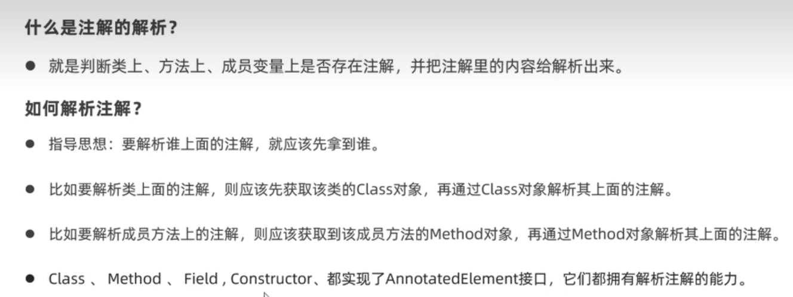

### 反射

反射简单理解：反射就是不new这个类的实例对象，却拿到这个类的所有成员变量和成员方法的一种骚操作


反射分下面这几个步骤：

1. 加载类，即获取字节码（获取Class对象）
2. 获取类的构造器           （获取Constructor对象）
3. 获取类的成员变量       （获取Field对象）
4. 获取类的成员方法       （获取Methed对象）


>  <font color='red'>反射的核心应用就是设计框架</font>

解释：反射可以在对对象一无所知的情况下获取其所有方法和变量，所以它可以用来设计一些对所有类通用的操作，即：设计框架


##### 博客

讲人话的介绍反射：https://www.cnblogs.com/chanshuyi/p/head_first_of_reflection.html


### 注解

> （Annotation）

注解简单理解：注解就是java代码里的特殊标记，用以通知其它程序依据注解信息来决定怎么执行该程序

- 比如：@Override 就是通知 JVM 要检查该方法是否符合重写的规范
- 比如：@Test 就是 Junit 这个框架的注解，用来告诉 Junit 有@Test注解的方法是一个测试方法，应该执行

XML也可以向其它程序提供信息，不过使用注解替代XML是一种趋势，mybatis是如此，spring也是如此


**自定义注解**

```java
public @interface myAnnotation {
    int aaa();			// 注解的属性在定义时要加上括号
    boolean bbb() default true;	// default功能如其名，给注解的属性加默认值
    String[] value();
}


// 使用注解

@myAnnotation(aaa="孙悟空",ccc={"唐僧","猪八戒"})
public class test(){
    @myAnnotation(aaa="宋江",bbb=false,ccc={"林冲","鲁智深"})
    public void test1(){
        
    }
    
}
// 当注解里只有一个属性，按照管理属性名都取value，且使用该注解时不用指明属性名
```


**注解的本质**

- 注解的本质是一个接口，Java中所有注解都是继承了Annocation接口
- @注解(.....)   使用接口的这句代码，其实就是一个实现类对象，实现了该注解以及Annocation接口


**元注解**

元注解：修饰注解的注解

- @Target			设定注解使用范围，比如用在 方法、变量 上
- @Retention      设定注解的生存周期
- @Documented
- @Inherited


**解析注解**

简单理解：解析注解就是拿到判断有无注解，获取注解的属性值，依据属性值做出相应操作




##### 博客

比较全面的介绍注解：https://www.cnblogs.com/ziph/p/13056092.html


