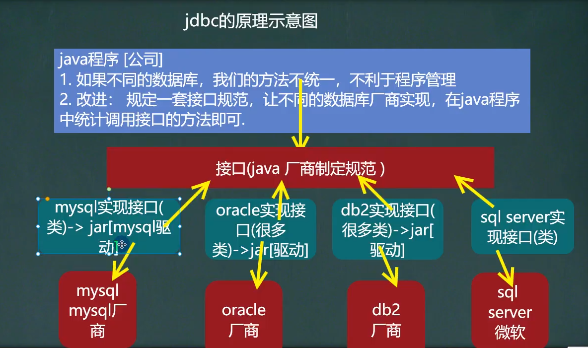
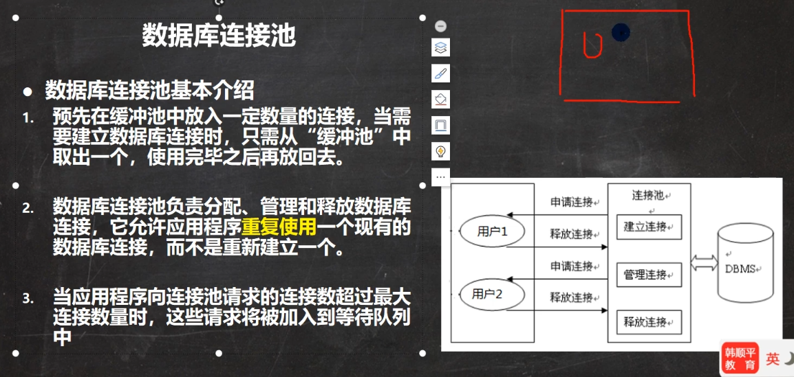
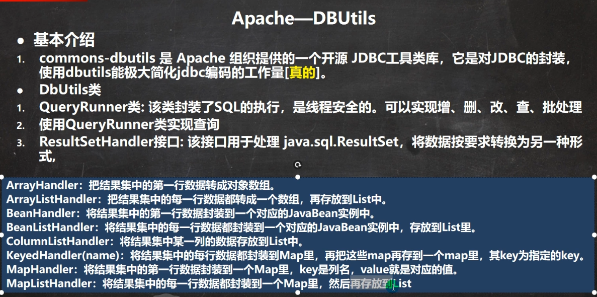
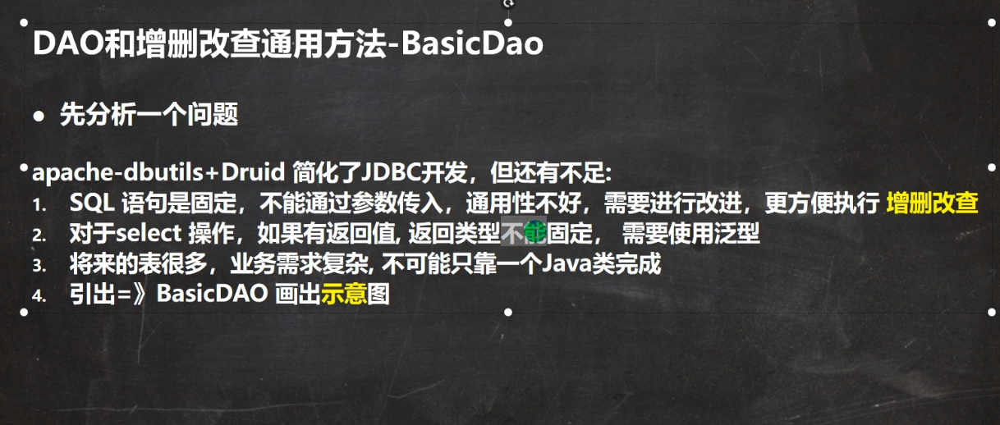

> B站韩顺平：https://www.bilibili.com/video/BV1zv41157NC?p=2&spm_id_from=pageDriver

### 介绍

SUN公司设置的为了java统一连接各种数据库的一套接口（规范），由各个数据库厂商自行实现接口（即写出实现类，并打包成jar，称为驱动）



### 简单流程

1. 注册驱动
2. 建立连接（本质就是socket连接）：Connection
3. 获得执行sql语句的对象：Statement 与 PreparedStatement
   1. 实际上Statement狗都不用，会有sql注入危险

4. 执行sql语句
5. 获取结果：ResultSet
6. 释放连接

##### 简单示例

```java
package JDBClearn;

import java.sql.Connection;
import java.sql.DriverManager;
import java.sql.SQLException;
import java.sql.Statement;

public class JDBCtext01 {
    public static void main(String[] args) throws ClassNotFoundException, SQLException {
//        注册驱动,
//        实际上该行不写也可以，在导入的jar驱动包里META-INF/services/java.sql.Driver有对应类，会自动加载（前提条件：mysql驱动5.1.6以后，jdk1.5以后），
//建议写上，显得目标明确
//        Class.forName("com.mysql.cj.jdbc.Driver");

        String url = "jdbc:mysql://localhost:3306/shop?useUnicode=true&characterEncoding=utf8&useSSL=true";
        String username = "root";
        String password = "123456";

//        获取连接
        Connection connection =  DriverManager.getConnection(url,username,password);

        String sql = "select * from fruits";

//        获取执行sql的对象
        Statement statement = connection.createStatement();

//        执行sql
        int count = statement.executeUpdate(sql);

        System.out.println("执行成功，受到影响的行数："+count);
//        释放资源
        statement.close();
        connection.close();
    }
}
```

##### 推荐写法：

使用properties类来读取配置文件：像url，username，password等的值都放到配置文件里，这样使得修改更加灵活且脱离程序

properties介绍：https://www.cnblogs.com/bakari/p/3562244.html

### API介绍

##### ResultSet

获取查询语句的结果集合

通常这么获取

```java
while(resultSet.next()){
                Account account = new Account();
                int id = resultSet.getInt("id");
                String name = resultSet.getString("name");
                BigDecimal cash =  resultSet.getBigDecimal("cash");

                account.setId(id);
                account.setName(name);
                account.setCash(cash);

                list.add(account);
            }

//其中account是根据查询语句每一列的数据来创建的类
```

##### PreparedStatement

- 防止SQL注入，进行预编译加快速度

##### 批处理

> https://www.bilibili.com/video/BV1zv41157NC?p=19

没时间，先不学，等要用到了再学


### 数据库连接池



JDBC的数据连接池使用javax.sql.DataSource来表示，DataSource是一个接口

学习：老牌：C3P0，目前使用：Druid

#### Apache-DBUtils

问题：

- 关闭connection后resultSet就不能用了，会造成资源浪费
- 结果集不利于数据的管理和使用，它是一次性的，且每一个数据类型不明



DBUtils封装了在建立连接后对数据库的操作，主要有三个核心功能：

- QueryRunner类提供对SQL语句操作的API。

- ResultSetHandler接口用于定义查询操作后，如何封装结果集。

- DBUtils工具类定义了关闭资源与事务处理的方法。


#### BasicDAO介绍



#### 概念理解：

> DAO：data access object（访问数据库表的对象）

- 一个表对应一个DAO，还对应一个接受数据的类（javabean、domain或者叫pojo）

- 而各个表的操作有重复的部分，把重复的部分提取出来，弄一个新的DAO（BasicDAO）从而实现代码复用

#### 一个简单的设计文件结构

工程：com.daoLearn.dao_

- com.daoLearn.dao_.utils		//存放工具类的包
- com.daoLearn.dao_.domain  //存放javabean的包
- com.daoLearn.dao_.dao        //存放XXXDAO的包
- com.daoLearn.dao_.test        //存测试类的包


