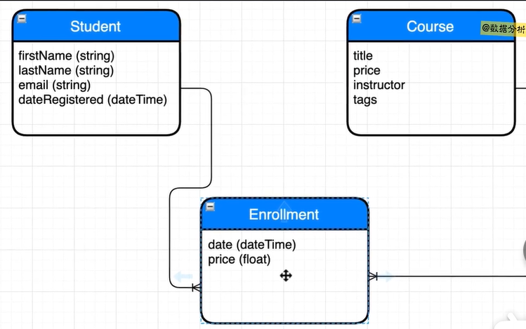

### 三值逻辑

#### 几个概念

**数据类型：**比如：char，varchar等等，NULL可以说是一种特殊的类型，表示为“空”

当讨论NULL时可以分为俩类：不知道 + 不适用（不过这两类在数据库中的表现都是NULL）

- 不知道：比如TOM的电话号码不知道，这种就属于不知道的NULL
- 不适用：比如TOM的电话号码是红色，这种属于不适用的NULL

**真值：**在诸如C、JAVA等语言中真值只有true + false ，但是在SQL中真值有三个：true + false + unknown

​			SQl中的三值逻辑会导致一系列连锁反应


#### 几个问题

##### 逻辑运算

> 进行逻辑运算时，没有unknown参与的运算，其结果和其它语言一样

```mysql
-- NOT运算
NOT unknown -> unknown

-- AND运算
true 	AND unknown -> unknown
false 	AND unknown -> false
unknown AND unknown -> unknown

-- OR运算
true 	OR unknown -> true
false 	OR unknown -> unknown
unknown OR unknown -> unknown


-- 可以用以下语句进行验证，仅判定结果为true时能输出“恭喜”
-- WHERE语句仅true的判定有效，false和unknown无效
-- NOT在下面语句中用于区分false和unknown
select "恭喜" AS result
WHERE NOT (false AND NULL)
;
```


##### 比较谓词

谓词就是一种特殊的函数（类似java中返回值为boolean的函数），但SQL是三值逻辑，故谓词的返回值有**true** + **false** + **unknown** 这三种情况

```mysql
-- 第一类，只要NULL参与其中机会返回 unknown，而unknown是不会使WHERE子句判定成功
=
<
>
<>	-- 在一些版本中也写做 != ,但是这不是标准SQL，不推荐使用
>=
<=

-- 第二类
LIKE
BETWEEN

-- 第三类（虽然由几个单词组成但是她们是一个整体，是一个谓词）
IS NULL
IS NOT NULL

-- 第四类
IN
EXISTS
/*
	特别注意:IN和EXISTS可以互换着使用
			NOT IN 和 NOT EXISTS不可以换着使用(具体原因：google)
*/

-- mysql提供了一个特有的运算符
<=>


```


##### 子句

> 以下三个子句都仅在判定式为true的情况下返回结果

**WHRER子句：**WHERE子句只会返回 true 的结果，判定为 false 、unknown 的结果不会返回

**HAVING子句：**

**CASE子句：**


##### 函数

> 大部分函数都是判别式为true是一类，false+unknown是一类

```mysql
IF(参数1 , 参数2 , 参数3)
	-- 类似c语言的三目运算符：
	-- 参数1为TRUE则返回参数2
	-- 参数1为非TRUE(FALSE或者UNKNOW)则返回参数3
```


##### 参考博客

SQL三值逻辑：https://www.jb51.net/article/212623.htm

SQL谓词：https://www.developerastrid.com/sql/sql-predicates/


### 书写与执行顺序

> select语句中各关键字的书写和执行顺序

```mysql
书写顺序：

SELECT → FROM → JOIN → ON → WHERE → GROUP BY → HAVING → ORDER BY→ LIMIT

执行顺序：

FROM → ON → JOIN → WHERE → GROUP BY → AVG、SUM等 → HAVING → SELECT → DISTINCT → ORDER BY→ LIMIT

执行顺序：
1.from 加载from关键词后的表，计算笛卡尔积，生成虚拟表vt1
2.筛选关联表中满足on表达式的数据，保留主表数据，生成虚拟表vt2
join表示要关联的表，on代表连接条件
3.外连接，执行on会将主表中不符合on条件的数据也加载进来作为外部行
4.from子句涉及多张表，则重复1-3，直至所有的表都加载完毕，更新虚拟表vt3
5.执行where表达式，筛选数据生成表达式vt5
6.执行group by子句分组，分组会把子句组合成唯一值，且每个唯一值只包含一行，生成虚拟表vt5
这一步开始才可以使用select中的别名，它返回的是一个游标，而不是一张表，
在where中不可以使用select中的别名，而having却可以。
7.执行聚合函数，生成虚拟表vt6
8.执行having，筛选数据并生成vt7
9.执行select，筛选vt7数据并生成vt8
10.执行distinct，去重vt8并生成vt9
11.order by 排序vt9 耗费资源
12执行limit并返回
-----------------------------------
mysql书写顺序和执行顺序
https://blog.51cto.com/u_15127655/4357411
```


### 并发处理

> 默认情况下mysql会把每个单独的sql语句包装为一个事务进行提交

#### 几种错误

**脏读 Dirty read：**一个事务A读到了另一个未提交事务B修改过的数据

- 可能事务B接下来会进行回滚或者会话终端导致修改不成功，这样事务A就读到了不应该存在的数据
- 危害：读取的数据不是数据库中存储的实际数据，接下来基于此读取的操作都可能出错
- 脏读仅在“读未提交”隔离级别可能出现


**不可重复读 Non-repeating reads：**事务A进行多次读取，但是由于事务B的多次修改和提交导致事务A多次读取的结果不同

- 不可重复读现象违背了"隔离性"，即事务B的提交影响到了事务A的执行效果
- 危害：想象以下你查了2次tom的性别，第一次是男，第二次是女，就跟TM装了鬼一样，接下来依据其性别的操作结果都不可预期，所以很危险
- 在“读未提交”和“读已提交”隔离级别可能出现


**幻读 phantom reads：**事务A进行两次读取操作，第二次的读取结果比第一次少了或者多了记录

- 和不可重复读一样，违背了"隔离性"，即事务B的提交影响到了事务A的执行效果
- 危害：想象事务A两次查询三年二班人数有多少，第一次是40人，第二次变成了42人，你就说疑惑不疑惑吧，其危害和不可重复读差不多
- 


> <font color='red'>不可重复读</font>是另一个事务的<font color='red'>update</font>操作引起的，<font color='red'>幻读</font>是另一个事务的<font color='red'>insert、delete</font>操作引起的


**丢失更新 Lost Updates：**两个事务更新同一行，后提交的事务会覆盖先提交事务的更新，（就相当于先提交的事务没有执行过一样）


#### 隔离级别

> mysql的事务隔离级别有四个，由低到高分别为：读未提交，读已提交，可重复读，可串行化


**读未提交 read uncommitted：**事务 A 可以读取到事务 B 修改过但未提交的数据。

- 相当于事务之间执行顺序没有任何限制
- 可能发生脏读、不可重复读和幻读问题，一般很少使用此隔离级别。


**读已提交 read committed：**事务 B 只能在事务 A 修改过并且已提交后才能读取到事务 B 修改的数据。

- 读已提交隔离级别解决了脏读的问题，但可能发生不可重复读和幻读问题，一般很少使用此隔离级别。


**可重复读 repeateble read：**在可重复读隔离级别下，事务 B 只能在事务 A 修改过数据并提交后，自己也提交事务后，才能读取到事务 B 修改的数据。（<font color='red'>mysql默认隔离级别</font>）

- 可重复读隔离级别解决了脏读和不可重复读的问题，但可能发生幻读问题。


- 提问：为什么上了写锁（写操作），别的事务还可以读操作？


- 因为 InnoDB 有 MVCC 机制（多版本并发控制），可以使用快照读，而不会被阻塞。


**可串行化 serializable：**


##### 四种隔离级别比较

|          | 脏读 | 不可重复读 | 幻读 | 丢失更新 |
| -------- | ---- | ---------- | ---- | -------- |
| 读未提交 | 可能 | 可能       | 可能 | 可能     |
| 读已提交 | 不会 | 可能       | 可能 | 可能     |
| 可重复读 | 不会 | 不会       | 可能 | 不会     |
| 可串行化 | 不会 | 不会       | 不会 | 不会     |

##### 事务ACID

讲的特别好，且有例子附带理解：https://www.cnblogs.com/cciejh/p/acid.html


### 数据库设计

#### 三大范式

> 关系型数据库有很多范式，但是三大范式就能覆盖99%以上使用场景

- 范式（Normal form）的程度越高各表间的联系越少，数据库冗余程度越少，当然范式也不是越高越好，过高的范式最后变成每个表仅含一个列（这TM还有各屁用），一般设计到3NF即可。

- 高级别范式是在低级别范式的基础上增加约束，简单来说：2NF一定是1NF，3NF一定是2NF


##### 第一范式 1FN

> 要求数据库表的每一列都是不可分割的原子数据项。

- 比如：外国佬的名字分first_name he last_name 这两就不能放在同一列中，必须拆分成两列

  

##### 第二范式 2FN

> 在1NF的基础上，非码属性必须完全依赖于候选码（在1NF基础上消除非主属性对主码的部分函数依赖，所有非主属性都要依赖主属性，直接依赖或者间接依赖都可）
>

- 第二范式要求表中的所有列（属性）和该表所代表的实体直接相关
  - 比如：用户名称就不能放在订单表中，而应该放在用户表中
- 维基百科描述：一个表如果有仅有单列主键则一定符合第二范式，若有复合主键则不一定符合第二范式

##### 第三范式 3FN

> 在2NF基础上，任何非主属性不依赖于其它非主属性（在2NF基础上消除传递依赖，所有非主属性直接依赖主属性）

- Mosh解释：第三范式就是表中任何一列不能是由表中其它几列派生
  - 比如：balance = invoice_total - payment_total	故表中就不应该包含balance ， invoice_total ， payment_total这三列，仅需2列即可
  - 又比如：first_name + last_name = full_name    故表中不该包含这三列（显然保留first_name , last_name这两列是人类会做的事情，而不是保留另2列）
- 


##### Mosh的建议

<font color='red'>**Mosh的实用建议：**真实开发过程中不需要管什么第一第二范式，你只需要尽量的减少数据库中数据的冗余！！！</font>

- 具体做法就是当发现数据有大量冗余时，依据各实体之间的关系划分成不同的表即可
- 建数据库的时候一定要：先从逻辑或概念模型开始，不要直接跳到建表！！！否则你建的表一般情况下都很垃圾

<font color='red'>不要对所有的东西都建模，实际开发的需求千奇百怪，并不是所有场景都要这么一套一套的建模，一切都应随机应变！！！</font>

- 比如用户可能有曾用名，只要这玩意儿对你的需求没影响你设计数据库就不该考虑这玩意儿
- 用户随时会搬家，但是别人以前住哪对你的购物网站没有任何关系，你就不要考虑这些乱七八糟的事，只要记录用户目前地址即可


概念模型示例：

> 实体名+各列名+实体间关系（1对1，1对多等）


逻辑模型示例：

> 在概念模型基础上再进一步拆分出逻辑实体，同时添加数据类型




### 索引

**主键索引**（聚簇索引）：简单来说主键索引就是数据以B+树的形式来组织，同时各个数据页排序的依据就是主键值（故称为主键索引）


貌似讲的不错但是并不全面的博客：https://juejin.cn/post/6931901822231642125


**索引排序**：https://blog.csdn.net/ryb7899/article/details/5580624


### 可以但不推荐

1. mysql可以使用隐式连接(Implicit Join)但是不建议这么做
2. mysql的outer join中不推荐使用right join（即只用left join），left join和right join混用的话，会使你的sql查询语句变得难以理解
3. Natural Joins 可以但是不推荐使用，它可能导致未知的结果，故了解即可
4. 


### 对比区别

##### char和varchar

- char(50)若用户输入不足50字符，mysql会填充剩下空间，导致空间浪费

- varchar(50)只是给字符数设定上限，mysql不会自动填充，推荐使用


### 基础语法

参考博客：

SELECT语法：https://www.developerastrid.com/sql/sql-select-where/

