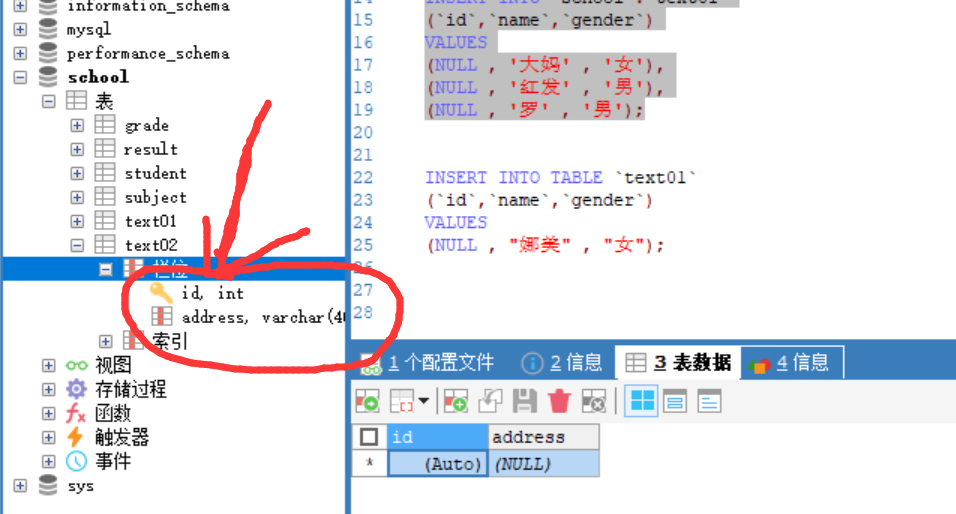

### 关于

<font color="red">该文件中所有代码：【】内的内容是可选内容</font>

数据库不用驼峰命名（不区分大小写），使用“_”来分隔

---


### 数据库分类

- 关系型数据库（SQL）：MySQL，Oracle，SQL Server，DB2，SQLite
- 非关系型数据库（noSQL）：Redis，MongDB

MySQL安装教程：https://www.cnblogs.com/itcui/p/15511683.html

### 启动数据库

使用默认安装的情况下mysql开机自启

**方法一：**win+r --> services.msc


手动开启或关闭服务

**方法二：**管理员模式打开命令行窗口

开启服务命令：net stop mysql80

关闭服务命令：net start mysql80


### 连接数据库

##### **方法一**：

使用mysql自带的命令行接口


##### **方法二**：

使用windows命令行

```sql
mysql -u root -ppassword --root用户连接数据库，密码为ppassword

update mysql.user set authenttication_string=password('123456') where user='root' and Host='localhost';  --修改用户密码
flush privileges;	--刷新权限

---------------------------------------

--所有语句都使用“;”结尾
show databases;	--查看所有的数据库

mysql>use school	--切换数据库use数据库名

show tables;	--查看数据库中所有表
describe student;	--显示数据库中所有的表的信息

create database westos; --创建一个数据库

exit;  --推出连接

--   单行注释（SQL的注释，使用工具有些也支持#）
/*
sql多行注释
*/
```

---


### SQL基础

##### 分类：

DDL定义、DML操作、DQL查询、DCL控制

Data Definition Language
Data Manipulation Language
Data Query Language
Data Control Language

<font color='red'>mysql关键字不区分大小写，列名也不区分大小写</font>

#### 字段类型

##### 数值

- 整形
  - tinyint	1个字节
  - smallint    2个字节
  - mediumint   3个字节
  - **int     4个字节**
  - bigint   8个字节
- 浮点型
  - float       4个字节
  - double    8个字节
  - decimal  字符串形式的浮点数 金融计算的时候，一般都是使用decimal

##### 字符串

- char	字符串固定大小的   0~255
- **varchar  可变字符串   0~65535 常用的String**
- tinytext    微型文本   2^8 - 1
- **text    文本串     2^16 -1**

##### 时间日期（java.util.Date）

- data    YYYY-MM-DD   日期格式
- time   HH:mm:ss   时间格式
- **datatime YYYY-MM-DD HH:mm:ss  最常用的时间格式**
- **timestamp   时间戳  1970.1.1到现在的毫秒数(全球统一)**
- year  年份表示

null

==不要使用null参与运算，否则结果一定是null（无意义）==

#### 字段属性

Unsigned

- 无符号整数，不能为负数

zerofill

- 0填充的
- 不足的位数，使用0来填充    int(3)，5-->005

自增

- 通常理解为自增，自动在上一条记录的基础上+1（默认）
- 通常用来设计主键
- 可以自定义设计主键的起始值和步长

NULL / not null

- 设置为not null 如果不给它赋值，就会报错
- 设置为NULL，如果不填值，默认就是null

默认

- 字面意思。。。（设置默认值）

##### ==补充==每一个必须要包含以下字段（规范）

```
id 主键
`version`	乐观锁
is_delete	伪删除
gmt_create	创建时间
gmt_update	修改时间
```


### SQL语句练习

#### 规范

```sql
--表的名称和字段尽量使用``括起来
--字符串使用  ’‘  或 ""  括起来
--所有语句后面加 , 最后一个不用加
--一般一个表只有一个主键
```

#### 操作数据库

创建数据库

```sql
CREATE DATABASE 【IF NOT EXISTS】 temp;		--创建数据库temp

```

删除数据库

```sql
drop database `temp`;
```

使用数据库

```sql
--若表名或者字段名是一个特殊字符，就需要``
USE `school`	
```

查看数据库

```sql
show databases	--查看所有的数据库
```

<font color="brown">tips：实际工作中，数据库级别的操作并不常用，故了解即可</font>

##### 建表

创建一个表，SQL代码格式：

```sql
create table [if not exists] `表名`(
	`字段名` 列类型 [属性] [索引] [注释],
    `字段名` 列类型 [属性] [索引] [注释],
   	......
    `字段名` 列类型 [属性] [索引] [注释]
)[表类型][字符集设置][注释]
```

创建表代码示例：

```sql
--建议主键primary key 单独写一行，便于一眼看出主键是谁
--字段尽量使用 `` 括起来
CREATE TABLE IF NOT EXISTS `student`(
	`id` INT(10) NOT NULL AUTO_INCREMENT COMMENT '学号',
	`name` VARCHAR(30) NOT NULL DEFAULT '匿名' COMMENT '姓名',
	`pwd` VARCHAR(20) NOT NULL DEFAULT '123456' COMMENT '密码',
	`gender` VARCHAR(4) NOT NULL DEFAULT '男' COMMENT '性别',
	`birthday` DATETIME DEFAULT NULL COMMENT '出身日期',
	`address` VARCHAR(100) DEFAULT NULL COMMENT '家庭住址' ,
	`email` VARCHAR(50) DEFAULT NULL COMMENT '邮箱',
	PRIMARY KEY (`id`)
)ENGINE=INNODB DEFAULT CHARSET=utf8
```

##### 常用命令（逆向查看创建的SQL语句）：

```sql
show create database school	--查看创建数据库的语句
show create table student	--查看student数据表的定义语句
desc student	--查看表的结构
```


#### 数据库引擎

INNODB	当前默认使用

MYISAM	早先年使用的

|            | MYISAM | InnoDB        |
| ---------- | ------ | ------------- |
| 事务处理   | 不支持 | 支持          |
| 数据行锁定 | 不支持 | 支持          |
| 外键约束   | 不支持 | 支持          |
| 全文索引   | 支持   | 不支持        |
| 表空间大小 | 较小   | 较大（约2倍） |

经验（适用场合）：

- 使用MyISAM：节约空间及响应速度
- 使用InnoDB：安全，事务处理及多用户操作数据表

### MySQL数据管理

约束：非空not null ， 主键 ，外键，默认，唯一性

约束参考博客：https://blog.csdn.net/qq_42402854/article/details/84714934 

我们可为数据库,数据表,数据列设定不同的字符集，设定方法 :

- 创建时通过命令来设置 , 如 : CREATE TABLE 表名()CHARSET = utf8;
- 如无设定 , 则根据MySQL数据库配置文件 my.ini 中的参数设定（不推荐，因为影响可移植性）

#### 外键：

- A 表引用B表，则称A为从表，称B为主表
- 删除时必须先删除从表，再删除主表
- 外键约束写再A表中
- **实际开发中在数据库层面实现外键，而在程序层面实现**，故数据库外键了解即可


#### 插入（insert）

语法：

```
INSERT INTO 表名[(字段1,字段2,字段3,...)] VALUES('值1','值2','值3')
```

**注意 :** 

- 字段或值之间用英文逗号隔开 .
- ' 字段1,字段2...' 该部分可省略 , 但添加的值务必与表结构,数据列,顺序相对应,且数量一致 .
- 可同时插入多条数据 , values 后用英文逗号隔开 .

```sql
-- 使用语句如何增加语句?
-- 语法 : INSERT INTO 表名[(字段1,字段2,字段3,...)] VALUES('值1','值2','值3')
INSERT INTO grade(gradename) VALUES ('大一');

-- 主键自增,那能否省略呢?
INSERT INTO grade VALUES ('大二');

-- 查询:INSERT INTO grade VALUE ('大二')错误代码：1136
Column count doesn`t match value count at row 1

-- 结论:'字段1,字段2...'该部分可省略 , 但添加的值务必与表结构,数据列,顺序相对应,且数量一致.

-- 一次插入多条数据
INSERT INTO grade(gradename) VALUES ('大三'),('大四');

--多行插入建议写法：其中id为主键，且设置了自增
INSERT INTO `school`.`text01`
(`id`,`name`,`gender`)
VALUES
(NULL , '大妈' , '女'),
(NULL , '红发' , '男'),
(NULL , '罗' , '男');
```

注意：字段名容易写错，建议双击左侧的“栏位”防止手写出错



#### 修改（updata）

语法

```sql
UPDATE 表名 SET column_name=value [,column_name2=value2,...] [WHERE condition];
```

**注意 :** 

- column_name 为要更改的数据列
- value 为修改后的数据 , 可以为变量 , 具体指 , 表达式或者嵌套的SELECT结果
- condition 为筛选条件 , 如不指定则修改该表的所有列数据

##### where条件子句

测试：

```sql
-- 修改年级信息
UPDATE grade SET gradename = '高中' WHERE gradeid = 1;
```

#### 删除（delete）

语法

```sql
DELETE FROM 表名 [WHERE condition];
```

<font color=red>注意：condition为筛选条件 , 如不指定则删除该表的所有列数据</font>

```sql
-- 删除最后一个数据
DELETE FROM grade WHERE gradeid = 5
```

##### truncate 清空一个表

注意：区别于DELETE命令

- 相同 : 都能删除数据 , 不删除表结构 , 但TRUNCATE速度更快

- 不同 :

- - 使用TRUNCATE TABLE 重新设置AUTO_INCREMENT计数器
  - 使用TRUNCATE TABLE不会对事务有影响 （事务后面会说）

### 查找（select）

##### 语法

```
SELECT [ALL | DISTINCT]
{* | table.* | [table.field1[as alias1][,table.field2[as alias2]][,...]]}
FROM table_name [as table_alias]
  [left | right | inner join table_name2]  -- 联合查询
  [WHERE ...]  -- 指定结果需满足的条件
  [GROUP BY ...]  -- 指定结果按照哪几个字段来分组
  [HAVING]  -- 过滤分组的记录必须满足的次要条件
  [ORDER BY ...]  -- 指定查询记录按一个或多个条件排序
  [LIMIT {[offset,]row_count | row_countOFFSET offset}];
   -- 指定查询的记录从哪条至哪条
```

**注意 : [ ] 括号代表可选的 , { }括号代表必选得**

#### 多表联结

> 可参考博客：https://blog.csdn.net/lemon_tree12138/article/details/50921193

##### 内连接：

> inner join（其中inner可以省略）

当对同一个表进行查询，语句只写了join没写on，就相当与把表做笛卡尔集

```sql
对grade表做笛卡尔集（搭配where语句使用）
    SELECT*
    FROM grade AS a
    , grade AS b
    ;
等价于（搭配ON语句使用）
    SELECT*
    FROM grade AS a
    JOIN grade AS b
    ;

```


##### 外连接：

> left outer join  或 right outer join（其中outer可以省略）

left join：以左表为主表（即左表的数据都会选中，右表符合on的记录会被选中，不然自动用null填充）

right join：以右表为主表（即右表的数据都会选中，左表符合on的记录会被选中，不然会用null填充）

##### EHERE 和 ON

数据库在通过连接两张或多张表来返回记录时，都会生成一张中间的临时表，然后再将这张临时表返回给用户。 在使用left jion时，on和where条件的区别如下：

1. on条件是在生成临时表时使用的条件，它不管on中的条件是否为真，都会返回左边表中的记录。
2. where条件是在临时表生成好后，再对临时表进行过滤的条件。这时已经没有left join的含义（必须返回左边表的记录）了，条件不为真的就全部过滤掉
2. 在实际查询中二者可以一起用，先用on，再用where

#### 自连接

#### 分页和排序

> 排序：order by

语法：order by ASC(升序) / DESC（降序）

ASC：ascend

DESC：descend

> 分页：limit

语法：limit [起始页号] [页面大小]

#### 子查询

本质：在where语句中嵌套一个查询语句（可以一直套娃）

顺序：由里及外

### MySQL常用函数

```sql
select ABS(-1);			--绝对值
select CEILING(4.5);	--向上取整

--字符串函数
select concat('爱你','一万年')			--拼接字符串

select 
```


### MySQL聚合函数

| 函数名称 | 功能   |
| -------- | ------ |
| count()  | 计数   |
| sum()    | 求和   |
| avg()    | 均值   |
| max()    | 最大值 |
| min()    | 最小值 |

count(`列名`)

count(*)

count(1)

### 事务

#### ACID原则：

- **原子性：**一个事务（transaction）中的所有操作，要么全部完成，要么全部不完成，不会结束在中间某个环节。事务在执行过程中发生错误，会被回滚（Rollback）到事务开始前的状态，就像这个事务从来没有执行过一样。
- **一致性：**在事务开始之前和事务结束以后，数据库的完整性没有被破坏。这表示写入的资料必须完全符合所有的预设规则，这包含资料的精确度、串联性以及后续数据库可以自发性地完成预定的工作。
- **隔离性：**数据库允许多个并发事务同时对其数据进行读写和修改的能力，隔离性可以防止多个事务并发执行时由于交叉执行而导致数据的不一致。事务隔离分为不同级别，包括读未提交（Read uncommitted）、读提交（read committed）、可重复读（repeatable  read）和串行化（Serializable）。
- **持久性：**事务处理结束后，对数据的修改就是永久的，即便系统故障也不会丢失。事务一旦提交就不可逆。

> mysql默认开启事务提交

```sql
-- 使用set语句来改变自动提交模式
SET autocommit = 0;   /*关闭*/
SET autocommit = 1;   /*开启*/

-- 注意:
--- 1.MySQL中默认是自动提交
--- 2.使用事务时应先关闭自动提交

-- 开始一个事务,标记事务的起始点
START TRANSACTION  

-- 提交一个事务给数据库
COMMIT

-- 将事务回滚,数据回到本次事务的初始状态
ROLLBACK

-- 还原MySQL数据库的自动提交
SET autocommit =1;

-- 保存点
SAVEPOINT 保存点名称 -- 设置一个事务保存点
ROLLBACK TO SAVEPOINT 保存点名称 -- 回滚到保存点
RELEASE SAVEPOINT 保存点名称 -- 删除保存点
```


### 索引

优质博客：http://blog.codinglabs.org/articles/index-condition-pushdown.html

##### 索引分类

- 主键索引
  - 唯一的标识，不可重复，在一个表里只能有一列作为主键
  
  - ```sql
    
    ```
  
  - 
- 唯一索引
  
  - 避免重复的列出现，可以重复，在一个表里可以有多列作为唯一索引
- 常规索引
  
  - 
- 全文索引

```
索引分类
1.普通索引index :加速查找
2.唯一索引
    主键索引：primary key ：加速查找+约束（不为空且唯一）
    唯一索引：unique：加速查找+约束 （唯一）
3.联合索引
    -primary key(id,name):联合主键索引
    -unique(id,name):联合唯一索引
    -index(id,name):联合普通索引
4.全文索引fulltext :用于搜索很长一篇文章的时候，效果最好。
5.空间索引spatial :了解就好，几乎不用
```

#### 索引原则

- 索引不是越多越好
- 不要对进程变动数据加索引
- 小数据量的表不需要加索引
- 索引一般加在常用来查询的字段上

### 数据库备份


### 权限管理


### 三大范式

##### 第一范式（1NF）

原子性：每一列都是不可分割的

##### 第二范式（2NF）

前提：满足第二范式

属性完全依赖于主键（每个表只描述一件事情）

##### 第三范式（3NF）

前提：满足第二范式

属性不依赖于其他非主属性，属性直接依赖于主键。

##### 关于性能：

> 关联查询的表不得超过三张表

为满足某种商业目标 , 数据库性能比规范化数据库更重要

在数据规范化的同时 , 要综合考虑数据库的性能

通过在给定的表中添加额外的字段,以大量减少需要从中搜索信息所需的时间

通过在给定的表中插入计算列,以方便查询

