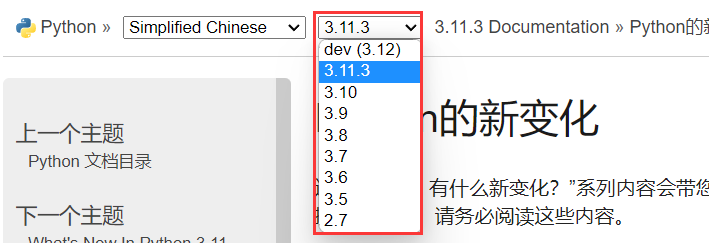
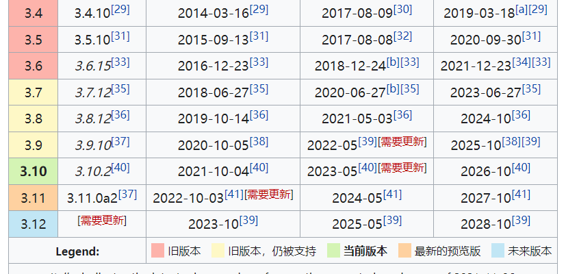
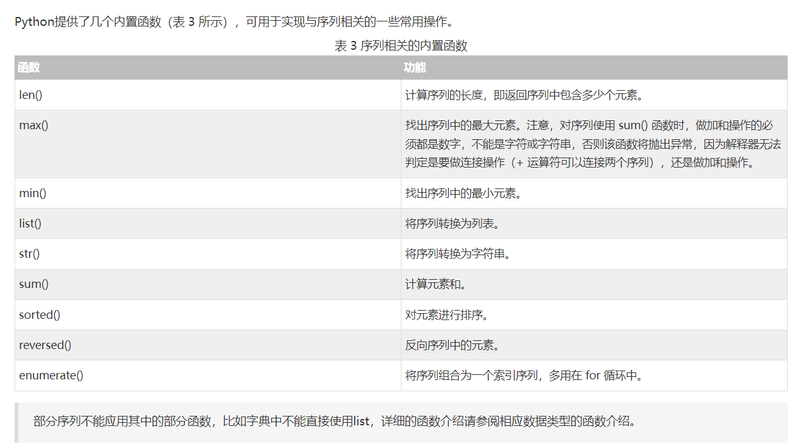
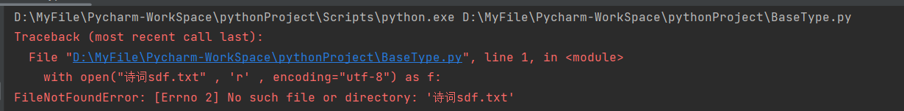
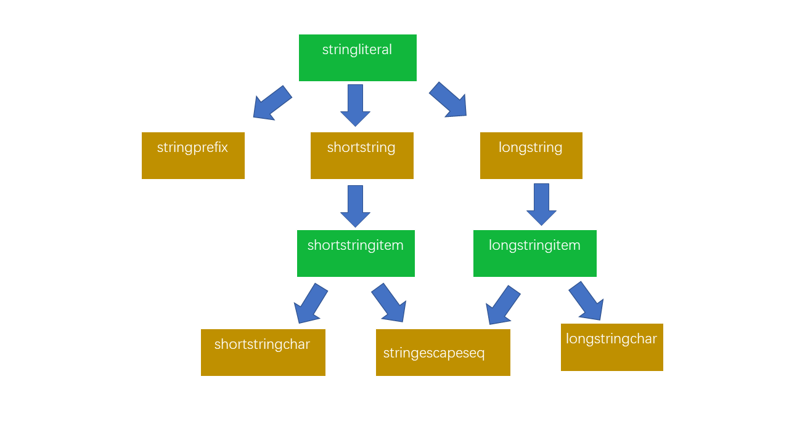
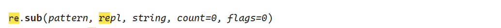
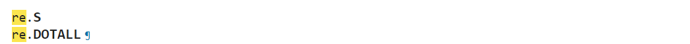
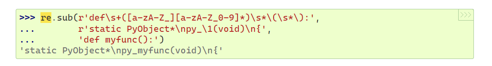
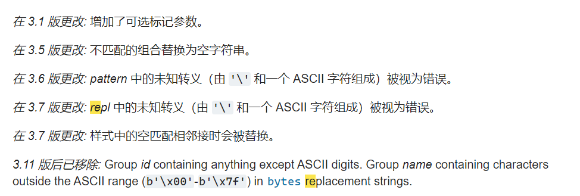

菜鸟教程yyds：https://www.runoob.com/python3/python3-tutorial.html

遇事不决，官方文档：https://docs.python.org/zh-cn/3.10/whatsnew/index.html

### 关于版本

python版本大体可分为三个阶段：

- python1.0，远古时期的python，对现在的学习而言：没卵用，无需了解
- python2.0，这个是python的**第一个正式发布**的版本，且很多linux系统自带python2.0
- python3.0，这个版本**不兼容python2.0**，所以可以理解python3.0和2.0是两个不同的语言

我学习所安装的是python3.10，所以下文中的笔记也许会和网络上的有些冲突，也不用奇怪



（截图时间：2023年5月8号）可以看到python官方文档都只有这些版本，所以就连文档都没有的python版本就无需花时间去了解！！！

本笔记中所有代码均基于python3.10（我电脑装的就是这个版本）





### python3基础

python3的一大特点就是简单，很多东西不再那么细分，比如整数就只用int，不像c语言细分为short、int、long、long long

<font color=#b407e4>**说明：以下代码中参数不一定是函数的全部参数，只写出部分必要的参数，想看详细参数自查官方文档：https://docs.python.org/zh-cn/3/library/os.html**</font>

### 数据类型

#### 预备知识

##### 变量

python变量是没有类型的，也就是说在定义变量时不用像c、java那样指明类型，编译器会自动辨认出变量的类型。

比如可以像下面这样操作

```python
str = "hello"
print(f"str内容为：{str}")
print(f"str类型为：{type(str)}")
str = 123
print(f"str内容为：{str}")
print(f"str类型为：{type(str)}")

执行结果如下：
'''
str内容为：hello
str类型为：<class 'str'>
str内容为：123
str类型为：<class 'int'>
'''
str这个变量既可以表示字符串也可以表示数字
```

由此可见python中的变量就像一个万能的指针可以指向任意类型的数据，它自己本身没有类型或者说是一种特殊的类型。

<font color=#b407e4>**注意：Python大小写敏感**</font>


##### 局部变量和全局变量

- 局部变量就是定义在函数中的变量，其作用域仅在函数体中有效

  - 在函数体中定义全局变量用关键词 global，此关键字详细使用效果：

  - ```python
    def fun01():
        num01 = 111
        print(f"id(num01) = {id(num01)}")
    
    num01 = 111111
    print(f"id(num01) = {id(num01)}")
    fun01()
    '''
    id(num01) = 2141168989584   #这是全局变量num01的id
    id(num01) = 2141167947440   #这是局部变量num01的id，可以看出二者id不同说明是两个独立的变量
    '''
    
    #****************************************************************************************************
    def fun02():
        # global num02 = 222    #这么写是错误的，在函数里定义全局变量不能初始化
        global num02            #这么写就是在函数里创建全局变量，哪怕函数结束了num02依旧存在
        num02 = 222
    
    
    fun02()
    print(f"num02={num02}")     #结果：num02=222 ， 也就是说在函数内定义的全局变量在函数结束后依旧存在，还能正常使用
    
    
    #****************************************************************************************************
    def fun03():
        global num03        #这就相当于说明：我接下来在fun03中使用的num03是一个全局变量
        print(f"id(num03) = {id(num03)}")
        num03 = 333
        print(f"id(num03) = {id(num03)}")
    
    
    num03 = 333333
    print(f"id(num03) = {id(num03)}")
    fun03()
    print(f"id(num03) = {id(num03)}")
    print(f"num03={num03}")     #结果：num03=333 ， 由于在fun03之前已经定义了全局变量num03所以fun03()里面的num03和此处的num03是同一个
    
    '''
    id(num03) = 1805577352816   #函数体外定义的num03的id值
    id(num03) = 1805577352816   #函数题内使用global关键字表明函数体内num03就是函数体外的那一个（二者是同一个变量）
    id(num03) = 1805577352592   #在函数体内对num03做修改
    id(num03) = 1805577352592   #结果显示函数体内的修改能影响到函数体外的全局变量num03
    '''
    #****************************************************************************************************
    '''
    def fun04():
        num04 = 444         #这样写会报错：name 'num04' is assigned to before global declaration
        global num04        #意思就是说：你先定义局部变量num04有搞一个全局变量num04那这两个名字不久冲突了，你后续使用num04是要用哪个？
                            # python，貌似没有用来区分二者的关键字（也就是说python作者并不允许你这么搞）
    '''
    
    ```

- 全局变量就是定义在函数之外的变量、


##### 类型

python的类型有如下这些：

| 整数   | 浮点数 | 布尔类型 | 字符串 | 列表 | 元组   | 字典 | 集合 |
| ------ | ------ | -------- | ------ | ---- | ------ | ---- | ---- |
| 不可变 | 不可变 | 不可变   | 不可变 | 可变 | 不可变 | 可变 | 可变 |
|        |        |          | 序列   | 序列 | 序列   | 序列 | 序列 |


学习数据类型无非就是一下几点;

- 类型定义与初始化
- 类型常用函数（增删改查）
- 类型特点（使用场景）
- 类型的特殊操作

其实后四个可以叫容器类型

- **不可变数据（3 个）：**Number（数字）、String（字符串）、Tuple（元组）；
  - 不可变数据进行“修改”后变量的id就会改变
- **可变数据（3 个）：**List（列表）、Dictionary（字典）、Set（集合）。
  - 不可变数据进行“修改”后变量的id不会改变

##### 类型判断

可以使用函数 type() 来判断类型

```python
num_type = 1000             # 整数
float_type = 999.0          # 浮点数
bool_type = True            # 布尔类型
str_type = "hello word"     # 字符串

print("num_type的类型是：\t"   + str(type(num_type)))		#类型转换再用+拼接两个字符串输出
print("float_type的类型是：\t" + str(type(float_type)))
print("bool_type的类型是：\t"  , type(bool_type))			#直接用,隔开两个东西一起输出
print("str_type的类型是：\t"   , type(str_type))

#执行结果如下：
'''
    num_type的类型是：	<class 'int'>
    float_type的类型是：	<class 'float'>
    bool_type的类型是：	 <class 'bool'>
    str_type的类型是：	 <class 'str'>
'''
```

#### 数值

数值包括：整数、浮点数、布尔类型、复数

##### 整数

python3整数只有int这一种，没有long或者其他类型

```python
print(0x1234)     		#十六进制表示的整数
print(type(0x1234))
print(0x12_34)			#可以在整数中嵌套任意个 _
print(100_000_000 == 100000000)
print(10_000)

#执行结果如下
"""
4660
<class 'int'>
4660
True
10000
"""
```

##### 浮点数

```python
#浮点数的科学表示法
print(1.2e3,end='\t1.2e3表示 1.2 * 10^3')		#print函数默认末尾有个换行，也可以用 end= 来指定末尾的内容

#执行结果
'''
1200.0	1.2e3表示 1.2 * 10^3
'''
```


##### 布尔类型

python中：True == 1 、False == 0

- 注意python大小写敏感
- 逻辑运算与或非：and or not   (python没有异或等其他逻辑运算)

<font color=#b407e4>**注意：python中if判断中的None等价于False，所以常常可以 if 搭配函数一起使用**</font>


##### 数值运算

```python
#除法和地板除
print(10/3)
print(10//3)	#地板除的结果永远是整数（听名字就知道是向下取整）
print(10%3)
print(2**3)		#python的指数运算和c不一样，使用**

#运行结果
'''
3.3333333333333335
3
1
8
'''
```


#### 字符串

python中没有所谓的char、string的区别，统一都用字符串定义和初始化

- 单引号: `'允许包含有 "双" 引号'`
- 双引号: `"允许嵌入 '单' 引号"`
- 三重引号: `'''三重单引号'''`, `"""三重双引号"""`

- ```python
  str01 = 'str01'
  str02 = "str02"
  str03 = '''str03        # 这么干的好处是字符串初始化可以有多行，相当于str03 = ”str03\n“
          '''
  str04 = r"""str03        # 这么干的好处是字符串初始化可以有多行，相当于str03 = ”str03\n“
          """
  
  print(str01)
  print(str02)
  print(str03)			#str03和str04这种写法和多行注释一样，只不过将注释赋值给了某个变量
  print(str04)
  
  运行结果：
  '''
  str01
  str02
  str03        # 这么干的好处是字符串初始化可以有多行，相当于str03 = ”str03
  “
  
  str03        # 这么干的好处是字符串初始化可以有多行，相当于str03 = ”str03\n“
  '''
  ```

##### 字符串格式化

- 使用 占位符和% 、使用 标记f和{} 、也可以直接对表达式进行格式化

- ```python
  # 字符串之间可以直接用 + 进行拼接
  #也可以使用格式化方式与其他类型数据拼接，和c中的printf()类似,其中占位符和c语言也类似
  name = "流水忆落花"
  age = 12
  salary = 100.1
  massage01 = "名字：%s\n年龄：%d\n薪水：%f"%(name , age , salary)
  print(massage01)
  
  输出结果：
  '''
  名字：流水忆落花
  年龄：12
  薪水：100.100000
  '''
  
  #也可以使用快速格式化	使用标记 f和{}
  massage02 = f"名字：{name}\n年龄：{age}\n薪水：{salary}"		#massage02和massage01的内容一摸一样
  print(massage02)
  
  #直接对表达式进行格式化
  print("1*1 = %d" % (1*1))
  print(f"1*1 = {1*1}")
  print("python中的字符串类型叫：%s" % type('字符串'))
  
  输出结果：
  '''
  1*1 = 1
  1*1 = 1
  python中的字符串类型叫：<class 'str'>
  '''
  ```

##### 字符串输出

- ```python
  print('hello' + "world")    # ''和""都可以表示字符串,和java一样可以用+来进行字符串拼接
  print("hello\tworld\n")     # 和C语言一样可以使用各种转义字符:\t \n
  print(r"hello\tworld\n")    # 在""前面加上r表示字符串中所有转义字符都失效
  print("hello\\tworld\\n")   # 与加上r的字符串是一样的效果
  print("I'm 流水忆落花")       # 在”“里面可以正常输出'.同样的也可以在''中正常输出"
  
  #执行结果
  '''
  helloworld
  hello	world
  
  hello\tworld\n
  hello\tworld\n
  I'm 流水忆落花
  '''
  ```


##### 常用函数

```python
#类型转换
str()		#将其他类型的数据转换为字符串类型。
int()
float()
ord()
chr()

#大小写转换
string.upper()			#将字符串全部转换为大写字母。
string.lower()			#将字符串全部转换为小写字母。
string.swapcase()		#大写变小写同时小写变大写
string.title()			#将字符串中的单词首字母大写，并返回结果字符串。
string.capitalize()		#将字符串的第一个字符大写，并返回结果字符串。

#其他修改
string.strip([chars])	#去除字符串两端指定字符集（或空格）并返回去除后的字符串。如果未指定字符集，则默认去除空格。
string.lstrip([chars])	#去除字符串左侧指定字符集（或空格）并返回去除后的字符串。如果未指定字符集，则默认去除空格。
string.rstrip([chars])	#去除字符串右侧指定字符集（或空格）并返回去除后的字符串。如果未指定字符集，则默认去除空格。
string.split([sep[, maxsplit]])			
						#将字符串按照指定分隔符进行分割，并返回分割后的字符串列表。可选参数maxsplit用于指定分割的最大次数。
string.join(iterable)	#将一个可迭代对象中的元素连接为一个字符串，并返回连接后的字符串。
string.replace(old, new[, count])		
						#将字符串中所有的旧子串替换为新子串，并返回替换后的字符串。可选参数count用于指定替换的最大次数。
string.center(width[, fillchar])		
						#返回指定宽度的居中字符串，并用指定字符（或空格）填充两侧不足的部分。


#查找
string.rfind()
string.lfind()
string.find(substring, start=0, end=len(str))		
						#在字符串中查找指定子串，并返回其第一次出现的位置。可选参数start和end用于指定搜索范围，如果未指定则默认搜索整个字符串。

'''判断'''
string.isalnum()	#判断字符串是否只包含字母和数字，并返回布尔值。
string.isalpha()	#判断字符串是否只包含字母，并返回布尔值。
string.isdigit()	#判断字符串是否只包含数字，并返回布尔值。
string.islower()	#判断字符串中的字母是否全部为小写，并返回布尔值。
string.isupper()	#判断字符串中的字母是否全部为大写，并返回布尔值。
string.startswith(prefix[, start[, end]])		
					#判断字符串是否以指定前缀开头，返回布尔值。可选参数start和end用于指定搜索范围，如果未指定则默认搜索整个字符串。
string.endswith(suffix[, start[, end]])		
					#判断字符串是否以指定后缀结尾，返回布尔值。可选参数start和end用于指定搜索范围，如果未指定则默认搜索整个字符串。

#其他函数
len(str)			#返回字符串的长度。
string.count()

```


#### 数据容器

各类容器可用的方法w3cschool讲的很好，无需重复记录

原来w3cschool就是对官方文档的摘录：https://docs.python.org/zh-cn/3/library/stdtypes.html#sequence-types-list-tuple-range


字符串也是一种数据容器，不过它只能存放字符这一种类型的数据

##### 列表 List [ ]

```python
增
list.append(obj)		#末尾添加新的对象
list.insert(index, obj)	#在列表的index的地方插入一个对象
list.extend(seq)		#在列表末尾一次性追加另一个序列中的多个值（用新列表扩展原来的列表）

删
list.pop([index=-1])	#移除列表中的一个元素（默认最后一个元素），并且返回该元素的值
list.remove(obj)		#移除列表中某个值的第一个匹配项
del list[index]			#删除下标index的元素

改
list.reverse()			#反向排列列表中元素
list.sort( key=None, reverse=False)	#对原列表进行排序

查
list.count(obj)			#统计某个元素在列表中出现的次数
list.index(obj)			#从列表中找出某个值第一个匹配项的索引位置

list.clear()			#清空列表
list.copy()				#复制列表
```


##### 字典 dict {k:v}

key和value可以是任意类型，但key不能是字典

```python
增
删
改
查
dict.list()			#返回字典所有键
dict.clear()		#删除字典内所有元素
dict.copy()			#返回一个字典的浅复制
dict.fromkeys()		#创建一个新字典，以序列seq中元素做字典的键，val为字典所有键对应的初始值
dict.get(key, default=None)			#返回指定键的值，如果值不在字典中返回default值
dict.items()		#以列表返回可遍历的(键, 值) 元组数组
dict.keys()			#以列表返回一个字典所有的键
dict.setdefault(key, default=None)	#和get()类似, 但如果键不存在于字典中，将会添加键并将值设为default
dict.update(dict2)	#把字典dict2的键/值对更新到dict里
dict.values()		#以列表返回字典中的所有值
```


##### 元组 tuple （ ）

元组中的内容不可修改，但是可以删除根据原元组的内容新建元组从而达到删除的目的

可以简单理解元组就是一个只读列表

```python
若元组中只有单个元素需要再元素后添加逗号
t = ("hello",)		#如果不加这个,那么定义的将会是一个字符串
tuple(seq)					#将列表转换为元组。	
operator(tuple1,tuple2)		#较两个元组元素
```

若是元组里面有个list元素，则list中的数据可以修改


##### 集合 set { }

python集合符合数学概念：无序、不重复

###### 集合的运算

<font color=#b407e4>**注意：集合使用操作符运算要求被操作对象都是集合，而使用函数的话函数中参数可以是任何可迭代对象**</font>

| 操作符             | 等价函数                             | 含义解释                                             |
| ------------------ | ------------------------------------ | ---------------------------------------------------- |
| a-b                | set.difference(*others)              | a集合中b没有的元素                                   |
| a\|b               | set.union(*others)                   | 并集                                                 |
| a&b                | set.intersection(*others)            | 交集                                                 |
| a^b                | set.symmetric_difference(*other*)    | a独有或b独有元素                                     |
| set\|=other\|...   | set.update(**others*)                | 更新集合，添加来自 others 中的所有元素。             |
| set &= other & ... | intersection_update(**others*)       | 更新集合，只保留其中在所有 others 中也存在的元素。   |
| set-=other\|...    | difference_update(**others*)         | 更新集合，移除其中也存在于 others 中的元素。         |
| set ^= other       | symmetric_difference_update(*other*) | 更新集合，只保留存在于集合的一方而非共同存在的元素。 |

说明：参数中*other表示参数可以接受任意多个


###### **集合的判断**

| **set <= other** | **issubset**(*other*)   | 检测是否集合set中的每个元素都在 *other* 之中。               |
| ---------------- | ----------------------- | ------------------------------------------------------------ |
| **set < other**  | **issubset**(*other*)   | 检测集合set是否为 *other* 的真子集，即 `set <= other and set != other`。 |
| **set >= other** | **issuperset**(*other*) | 检测是否 *other* 中的每个元素都在集合set之中。               |
| **set > other**  | **issuperset**(*other*) | 检测集合是否为 *other* 的真超集，即 `set >= other and set != other`。 |


###### 集合其它函数

```python
add(elem)		#将元素 elem 添加到集合中。
remove(elem)	#从集合中移除元素 elem。 如果 elem 不存在于集合中则会引发 KeyError。
discard(elem)	#如果元素 elem 存在于集合中则将其移除。
pop()			#从集合中移除并返回任意一个元素。 如果集合为空则会引发 KeyError。
clear()			#从集合中移除所有元素。
isdisjoint(other)	#如果集合中没有与 other 共有的元素则返回 True。 当且仅当两个集合的交集为空集合时，两者为不相交集合。
```


#### 序列操作

w3cschool总结的很不错：https://www.w3cschool.cn/python3/python3-sequence.html

序列就是有序

<font color=#b407e4>**注意：字典和集合不支持索引、切片、相加、相乘操作**</font>

##### 切片

> 切片(slice)是对序列型对象(如`list`, `string`, `tuple`)的一种高级索引方法。

讲的十分清晰！！！：https://blog.csdn.net/downing114/article/details/70445468

在此博客基础上补充：

- [start_index : end_index : step]	#表示遍历 [start_index , end_index) 即：左闭右开区间

- 正、负向索引可以混用

- step > 0 表示从 start_index 向右遍历
- step < 0 表示从start_index 向左遍历

##### 索引

就是支持使用下标访问，如：list[1]

##### 相加

类型相同的序列才能进行相加

##### 乘法

##### 成员资格

简单来说就是能够用 in 关键字判断元素是否存在


##### 通用函数




### python特有概念

#### 生成器


#### 迭代器

生成器和迭代器：https://www.cnblogs.com/wj-1314/p/8490822.html#!comments


查看python版本：python --version

安装目录中的python.exe就是python的解释器

#### 和C、Java区别

- python使用缩进来表示代码块而非 { }

- python语句一般都是一行，所以每一个语句末尾不需要写 ; 来表示语句结束

  - 多行语句，也可以使用\来表示语句有多行

  - ```python
    salary = 3 + \
        4 + \
        5
    print(salary)	#运行结果为12
    ```

  - 在 [], {}, 或 () 中的多行语句，不需要使用反斜杠 ，例如：

    ```python
    total = ['item_one', 'item_two', 'item_three',
            'item_four', 'item_five']
    ```

- python中变量不用显示申明类型，直接赋值即可

  - ```python
    int num = 3;	\\这是c语言或者java的写法
    num = 3			#这是python的写法
    ```

在python中：变量是没有类型的！


#### 注释

```python
# 这是单行注释

"""
	这是多行注释
"""

'''
	这也是多行注释(可以但不建议,还是统一用双引号)
'''
```

#### 输入输出

就是两个函数：print() 和 input()

input

- ​	菜鸟教程讲的比较详细：https://www.runoob.com/python3/python3-func-input.html

- 以换行为结束符
- 返回值仅为str类型，想输入其他类型数据可以进行类型转换


### 分支

就是if else 不过python中 else if 写为 elif （和c、java的写法都不同）

```python
age = 20
if age >= 6:			#别忘了 :
    print("第一个判断")
    print('teenager')
elif age >= 18:
    print("第二个判断")
    print('adult')
else:
    print("第三个判断")
    print('kid')
    
输出结果
'''
第一个判断
teenager
'''
```


### 循环

比较好的介绍python循环：https://www.runoob.com/python3/python3-loop.html

python循环就两种：while和for (没有do while、goto这种)

- 两种循环都可以配合else语句
- for循环
  - for循环通常搭配 in 或者 range() 实现遍历操作


### 函数

##### 函数定义

```python
def 函数名(传参):
	函数体
	return 返回值

再次说明：python中变量是没有类型的（也就是说变量可以指向任意类型的数据），下面这么写是完全可以的
a = [1,2,3]
a = "Runoob"
```

##### 可更改(mutable)与不可更改(immutable)对象

在 python 中，strings, tuples, 和 numbers 是不可更改的对象，而 list,dict 等则是可以修改的对象。

- **不可变类型：**变量赋值 **a=5** 后再赋值 **a=10**，这里实际是新生成一个 int 值对象 10，再让 a 指向它，而 5 被丢弃，不是改变 a 的值，相当于新生成了 a。
- **可变类型：**变量赋值 **la=[1,2,3,4]** 后再赋值 **la[2]=5** 则是将 list la 的第三个元素值更改，本身la没有动，只是其内部的一部分值被修改了。

python 函数的参数传递：

- **不可变类型：**类似 C++ 的值传递，如整数、字符串、元组。如 fun(a)，传递的只是 a 的值，没有影响 a 对象本身。如果在 fun(a) 内部修改 a 的值，则是新生成一个 a 的对象。
- **可变类型：**类似 C++ 的引用传递，如 列表，字典。如 fun(la)，则是将 la 真正的传过去，修改后 fun 外部的 la 也会受影响

python 中一切都是对象，严格意义我们不能说值传递还是引用传递，我们应该说传不可变对象和传可变对象。


##### 函数参数类型

- 必需参数

- 关键字参数

- 默认参数

  - 带默认值的参数，定义时一定要在右侧

  - ```python
    def fun(p1 , p2=123 , p3):	#这样写就会报错，因为默认值参数不在右侧
    ```

- 不定长参数
  - *表示元组（习惯叫\*args）
  - *\*表示字典（习惯上叫\*\*kwargs）
    - 若为字典调用函数时参数必须为k:v键值对的形式

函数也可以作为参数（这一点在c语言中也有，比如sort函数）


##### 参数中的 * 和 /

直接看别人的解释：https://www.zhihu.com/question/287097169

最权威的还得是官方文档：https://docs.python.org/zh-cn/3.8/tutorial/controlflow.html#special-parameters


##### 返回值

python可以多返回值，实际上是将多个返回值合并为一个元组

```python
def fun():
	return 123,"hello"

str = fun()
print(f"str的类型是{type(str)}，str = {str}")
a,b = fun()			# 可以以这种方式来获取多个返回值
print(f"a的类型是{type(a)}，a = {a}")
print(f"b的类型是{type(b)}，b = {b}")

'''运行结果：
str的类型是<class 'tuple'>，str = (123, 'hello')
a的类型是<class 'int'>，a = 123
b的类型是<class 'str'>，b = hello
'''
```

python 函数默认返回 None ， 在 if 语句中 None 等价于 False。

python库函数中很多都是返回一个对象作为结果，有时没有返回的东西就返回None（比如正则对象的match()方法）


##### 匿名函数

> 就是使用 lambda 关键字定义匿名函数，其作用就是简化代码，就是一个语法糖

lambda 形式参数:函数体


### 文件操作

文件操作无非是一下几步

#### 打开文件

```python
f = open(filePath , mode , encoding)					 # 打开文件，但是需要补上close函数
f.close()
with open("诗词.txt" , 'r' , encoding="utf-8") as f:		#推荐写法，这样不用再手动写close函数
    print(f.read())
```

##### filePath

- 可以用相对路径（相对于py脚本文件的位置）
  - with open("诗词.txt" , 'r' , encoding="utf-8") as f:
- 也可以用绝对路径
  - with open("D:\MyFile\Pycharm-WorkSpace\pythonProject\诗词.txt" , 'r' , encoding="utf-8") as f:


##### 打开模式

| 模式          | 文件类型 | 文件存在                                   | 文件不存在 |
| ------------- | -------- | ------------------------------------------ | ---------- |
| r（默认模式） | 文本文件 | 打开文件，读写位置在文件开头               | 报错       |
| w             | 文本文件 | **清空文件内容**并打开，读写位置在文件开头 | 创建       |
| a             | 文本文件 | 打开文件，读写位置在文件末尾               | 创建       |
|               |          |                                            |            |


#### 读写文件

##### 读取文件

```python
with open("诗词.txt" , 'r' , encoding="utf-8") as f:	# 读取诗词.txt并按行输出

f.read()		# 读取整个文件内容，返回字符串
f.read(num)		# 读取文件num字节内容，返回字符串
f.readline()	# 读取一行，返回字符串
f.readlines()	# 读取所有行，并返回一个列表（即返回结果有多个字符串，故以列表形式进行打包）
for line in f:	# 按行遍历
	
```

可以看到：所有读取的结果都是一个或多个字符串（列表）


##### 读写位置

- file文件默认维护一个读写位置，它指向你当前操作的位置（作用就好比：记录磁盘的磁头目前所在位置）

- 该指针初始指向文件最开头
  
  - 使用 readline()后，该指针就会移动到下一行开头
  
- 查看和修改文件读写位置：

  - ```python
    f.tell()				#获取文件读写位置
    f.seek(offset, from)	#修改文件读写位置
    	from参数用于指定文件的读写位置，该参数的取值有：0、1、2，它们代表的含义分别如下：
    	0：表示在开始位置读写；
    	1：表示在当前位置读写；
    	2：表示在末尾位置读写。
    ```


##### 写入文件

```python
f.write(str)	# 将str写入内存的缓冲区中
f.flush()		# 将内存缓冲区中的内容写入磁盘
f.close() 		# close()内置了flush()
```


### 异常

#### 捕获异常

就像java的try-catch

##### 捕获异常

```
try:
	可能出错的代码
except:
	出错后执行的代码
[else:]							# else是可选项
	若不出错则执行的代码
[finally:]						# finally是可选项
	不管有没有异常都要执行
```


##### 捕获指定异常

```
try：
	代码1
except error as e:			# 这里的error不是由你瞎写的，而是python已经定义好的error类型，比如：FileNotFoundError
	如果发生指定的error则执行的代码
except (error01 , error02):	# 可以指定多个异常，不过得用元组的形式来给出
	如果发生上述异常则执行的代码
```




和java一样，python的异常也会一层一层的向上传递，控制台输出的那一长串报错就是函数栈


### Python官方文档

#### BNF范式（巴科斯范式）

> 可以理解为是专门用来<u>描述</u>（定义）语言的<u>元语言</u>（意思是说它就是最底层的描述）

BNF是最基础的一种，还有扩展的：ABNF，EBNF

##### BNF语法

```
::= 	//翻译成人话就是：“定义为”
<A> 	//A为必选项
“A” 	//A是一个术语，不用翻译
'A'		//A是一个术语，不用翻译
[A]		//A是可选项
{A}		//A是重复项，可出现任意次数，包括0次
A*		//A是重复项，可出现任意次数，包括0次
A+		//A可出现1次或多次
(A B)	//A和B被组合在一起
A|B		//A、B是并列选项，只能选一个
```

<font color=#b407e4>**说明：上面的语法仅为我收集的一些，可以看到同一个意思可能有不同的表达，我也不知道这是BNF本来如此还是不同地方的BNF语法不同**</font>


##### 一个例子

这是[Python文档](https://docs.python.org/zh-cn/3/reference/lexical_analysis.html#literals)中对字符串字面量的BNF定义：

```BNF
stringliteral   ::=  [stringprefix](shortstring | longstring)		
stringprefix    ::=  "r" | "u" | "R" | "U" | "f" | "F"
                     | "fr" | "Fr" | "fR" | "FR" | "rf" | "rF" | "Rf" | "RF"
shortstring     ::=  "'" shortstringitem* "'" | '"' shortstringitem* '"'
longstring      ::=  "'''" longstringitem* "'''" | '"""' longstringitem* '"""'
shortstringitem ::=  shortstringchar | stringescapeseq
longstringitem  ::=  longstringchar | stringescapeseq
shortstringchar ::=  <any source character except "\" or newline or the quote>
longstringchar  ::=  <any source character except "\">
stringescapeseq ::=  "\" <any source character>
```

​		这段BNF描述了一个字符串字面量（stringliteral）的语法。字符串字面量可以是短字符串（shortstring）或长字符串（longstring），并且可以有一个前缀（stringprefix）。

​		前缀可以包括"r"、"u"、"R"、"U"、"f"、"F"、"fr"、"Fr"、"fR"、"FR"、"rf"、"rF"、"Rf"、"RF"中的任何一个，用于指示是否启用原始字符串（raw string）、unicode字符串、格式化字符串（formatted string）。

​		短字符串可以由单引号（'）或双引号（"）包围，其中shortstringitem表示字符串里面的任意字符，但不能包含单引号或双引号，需要通过转义字符（\）来实现。长字符串可以由三个单引号（'''）或三个双引号（""")包围，其中longstringitem表示字符串里面的任意字符，除了反斜杠（\）字符本身。因此，长字符串可以跨越多行而不需要使用换行符。

​		stringescapeseq表示转义序列，由反斜杠（\）后面的任何字符组成。

**分析:**

BNF的递归描述方式类似于“写作文的总分结构”，上面是“总”，下面是“分”。上来就说明字符串字面量是什么，然后又进一步解释第一句定义中所用到的名词，不断套娃。



**逐句解释**

- ```
  stringliteral   ::=  [stringprefix](shortstring | longstring)	
  ```

  - `stringliteral`这就是个英文单词，意为：字符串类型字面量
  - 翻译成人话：字符串字面量，由一个可选的前缀（`stringprefix`）和一个短字符串（`shortstring`）或长字符串（`longstring`）组成

  
  
- ```
  stringprefix    ::=  "r" | "u" | "R" | "U" | "f" | "F"
                       | "fr" | "Fr" | "fR" | "FR" | "rf" | "rF" | "Rf" | "RF"
  ```

  - 这句话就是进一步解释前缀（stringprefix）的含义
  - 翻译成人话：stringprefix可以是 r、u、R、U、...、RF中的任意一个

  
  
- ```
  shortstring     ::=  "'" shortstringitem* "'" | '"' shortstringitem* '"'
  ```

  - 这句话进一步解释短字符串（`shortstring` ）的含义
  - 翻译成人话：`shortstring` 表示短字符串，由一对单引号或双引号括起来，并由0个或多个 `shortstringitem` 组成

  

- ```
  longstring      ::=  "'''" longstringitem* "'''" | '"""' longstringitem* '"""'
  ```

  - 翻译成人话：`longstring` 表示长字符串，由一对三重单引号或双引号括起来，并由0个或多个 `longstringitem` 组成
  
- ```
  shortstringitem ::=  shortstringchar | stringescapeseq
  ```

  - 翻译成人话：`shortstringitem` 表示短字符串中的一项，可以是 `shortstringchar` 或 `stringescapeseq`
  
- ```
  longstringitem  ::=  longstringchar | stringescapeseq
  ```

  - 翻译成人话：`longstringitem` 表示长字符串中的一项，可以是 `longstringchar` 或 `stringescapeseq`
  
- ```
  shortstringchar ::=  <any source character except "\" or newline or the quote>
  ```

  - 翻译成人话：`shortstringchar` 表示短字符串中的普通字符，不包括反斜杆和换行符等特殊字符
  
- ```
  longstringchar  ::=  <any source character except "\">
  ```

  - 翻译成人话：`longstringchar` 表示长字符串中的普通字符，不包括反斜杆
  
- ```
  stringescapeseq ::=  "\" <any source character>
  ```

  - 翻译成人话：`stringescapeseq` 表示转义序列，以反斜杆开头并紧跟一个字符。可以用来表示一些特殊字符，如 `\n` 表示换行符


#### 特殊的名称

```python
 __all__
 __init__()
```


#### 描写方式

python文档对函数或常量的描述大体分如下几个部分

- **名称**：函数名/变量名 + 函数完整参数 + 函数别名/变量别名
  - 
  - 
- **功能描述**
- **代码演示**：演示环境都是python自带的shell
  - 
- **修改历史**
  - 


