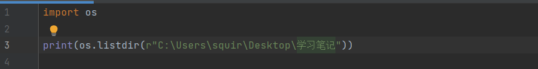
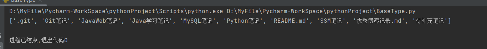
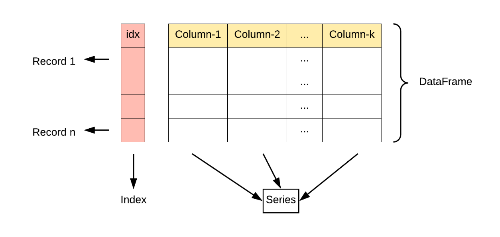

一个比较系统的python教程（基本上就是缩减+汉化的python官方文档）：http://www.ityouknow.com/python.html

## 说明

学python库无非就是一下几点：

- 这个库主要功能是干嘛的？
- 这个库提供了哪些变量和函数？
- 这个库的变量和函数具体使用方法
- 有没有使用的注意事项？

Python模块是一个Python文件，以.py结尾，Python包就是包含多个模块的文件夹（包含\_\_init\_\_.py文件）

在pycharm中可以 按ctrl+鼠标点击模块名进入模块.py文件 


## python标准库

标准库就是安装python所带的库，就像c语言安装mingw自带stdio.h一样


### os

> 本模块提供了一种使用与操作系统相关的功能的便捷式途径

<font color=#b407e4>**说明：以下代码中参数不一定是函数的全部参数，只写出部分必要的参数，想看详细参数自查官方文档：https://docs.python.org/zh-cn/3/library/os.html**</font>

#### 系统相关

> 等什么时候用到了再写

#### 文件和目录相关

<font color=#b407e4>**说明：一般来说下面所用到的路径参数都是字符串，不过有些也支持：文件描述符、类路径对象、bytes类型**</font>

##### 常用函数列表

```python
# 扫描目录
os.walk(top)			#遍历以top为根目录的所有条目
os.listdir(path='.')	#返回path中所有条目组成的列表(.和..两个目录除外)

# 创建和删除
os.mkdir(name)			#创建目录path
os.makedirs(name)		#递归创建目录
os.remove(path)			#仅用于删除文件
os.rmdir(path)			#仅用于删除目录
os.removedirs(name)		#递归删除目录
os.rename(src,dst)		#文件或目录重命名

# 路径类型判断
os.path.exists(path)	#判断dir是否存在
os.path.isabs(path)		#判断dir是否为绝对路径
os.path.isfile(path)	#判断是否为文件或者指向文件的符号链接（快捷方式）
os.path.isdir(path)		#判断是否为目录或者指向目录的符号链接

# 其它工具
os.getcwd()					#获取当前路径
os.path.join(path,*paths)	#拼接参数为一个地址（使用该方式能够跨平台，不用考虑路径分隔符）
os.path.split(path)			#将路径 path 拆分为一对，即 (head, tail)
```

##### os.listdir(path=’.‘)

- 返回一个列表，里面记录path目录下的所有条目名称（包括目录和文件），不扫描子目录中内容
- path如果是文件，则会报错
- 运行示例：
  - 
  - 
  - 可以看到结果中既有文件夹名也有文件名，且都用字符串形式表示


##### os.path.split(path)

- 将路径 path 拆分为一对，即 (head, tail)，其中，tail 是路径的最后一部分，而 head 里是除最后部分外的所有内容。
  - 如果 path 以斜杠结尾，则 tail 将为空。
  - 如果 path 中没有斜杠，head 将为空。
  - 如果 path 为空，则 head 和 tail 均为空。
- tail 部分不会包含斜杠，head 末尾的斜杠会被去掉，除非它是根目录（即它仅包含一个或多个斜杠）。
- 在所有情况下，join(head, tail) 指向的位置都与 path 相同（但字符串可能不同）。


#### 进程相关

>等什么时候用到了再补充


### sys

> 该模块提供了一些变量和函数。这些变量可能被解释器使用，也可能由解释器提供。这些函数会影响解释器。说人话就是这个库提供与解释器的交互


### re

> 本模块提供了与 Perl 语言类似的正则表达式匹配操作。（主要针对字符串而非字节串）


##### 三个概念

在Python的re库中，正则表达式、正则表达式对象和匹配对象是三个不同的概念，它们分别表示了不同的内容。

1. 正则表达式 正则表达式是一种用来描述字符串结构的语法规则，它由各种字符和特殊符号组成。在re库中，我们使用字符串来表示正则表达式。
2. 正则表达式对象 正则表达式对象是在编译正则表达式时生成的一个对象，它包含了正则表达式的模式以及一些可选的标志位。我们可以使用re.compile函数来创建正则表达式对象。
3. 匹配对象 当对一个字符串进行匹配时，如果匹配成功，就会返回一个匹配对象。这个匹配对象包含了匹配到的结果以及一些相关信息，比如匹配的开始位置和结束位置等。我们可以使用re.match或者re.search等函数来进行匹配，并得到匹配对象。

>  构建正则表达式对象需要正则表达式作为参数，而正则表达式对象调用匹配函数的结果会以匹配对象的方式给出

##### 例子

```python
import re
str = r'!\[.*]\((.*)\)'
text = "我在windows上修改了一个.md文件，使用git add发生如下警告："
pattern = re.compile(str)
match = pattern.search(text)

'''
str的类型是:    <class 'str'>, 			它的内容是：!\[.*]\((.*)\)
pattern的类型是:<class 're.Pattern'> , 	它的内容是：re.compile('!\\[.*]\\((.*)\\)')
match的类型是:  <class 're.Match'>, 	它的内容是：<re.Match object; span=(37, 50), match=''>
'''
```

上面这段这段代码中：

- str：就是以字符串形式表示的正则表达式
- pattern：就是编译创建的正则对象
- match：就是正则对象调用匹配函数返回的匹配对象


#### 语法

> 就是如何用字符来书写一个正则表达式


#### 常量

> re库定义好了一些常量（标志），用做方法的参数，从而控制如何进行匹配（比如：是否要忽略模式串的大小写？）

| 常量简写 | 常量全称      | 常量作用           |
| -------- | ------------- | ------------------ |
| re.I     | re.IGNORECASE | 忽略大小写进行匹配 |
| re.M     | re.MULTILINE  |                    |
| re.S     | re.DOTALL     |                    |
| re.L     | re.LOCALE     |                    |
| re.A     | re.ASCII      |                    |
| re.X     | re.VERBOSE    |                    |


#### 函数

> 罗列了正则表达式对象的常用方法

```python
re.compile(pattern, flags=0)		#依据正则表达式和标志（即：re库中定义的常量）生成正则表达式对象
re.search(pattern, string, flags=0)	#在字符串中搜索匹配正则表达式的第一个位置并返回MatchObject对象。
    								#如果没有匹配项，则返回None
re.match(pattern, string, flags=0)	#尝试从字符串开头匹配正则表达式，并返回MatchObject对象。
    								#如果没有匹配项，则返回None。
re.split(pattern, string, maxsplit=0, flags=0)
									#根据正则表达式对字符串进行分割，并返回分割后的子字符串列表。
    								#maxsplit参数控制最大分割次数。
re.fullmatch(pattern, string, flags=0)
									#尝试从字符串开头到结尾完全匹配正则表达式，并返回MatchObject对象。
    								#如果没有匹配项，则返回None。
re.findall(pattern, string, flags=0)#查找字符串中所有与正则表达式匹配的非重叠子串，并以列表形式返回。
re.sub(pattern, repl, string, count=0, flags=0)
									#使用repl替换字符串中与正则表达式匹配的部分，返回替换后的字符串。
    								#count参数控制替换次数，0表示全部替换。
re.finditer(pattern, string, flags=0)
									#查找字符串中所有与正则表达式匹配的非重叠子串，并以迭代器形式返回MatchObject对象。
re.escape(pattern)					#转义正则表达式中的特殊字符，返回转义后的字符串。
```


#### 匹配对象

> 正则对象的匹配方法会返回一个匹配对象（Match）作为结果


#### 例子


### zipfile

>  这个模块提供了创建、读取、写入、添加及列出 ZIP 文件的工具。

具体来说这个模块通过一个zipfile类来实现各种功能，通过这个类提供的方法可以创建其他几个重要的对象：ZipFile对象、Path对象、PyZipFile对象、ZipInfo对象（每个对象就是不同功能的封装）


#### ZipFile对象

这个对象就和文件对象差不多，不过它还提供了对zip文件的解压等操作


### PIL

Python Imaging Library 一个处理处理图片的库（但是有个更强的家伙，opencv）

## python非标准库


### pandas

#### 文件

> pandas支持打开多种类型文件，具体方法以read_开头，比如：read_csv


#### DataFrame

> 用于存储多列数据集(DataFrame可以说是由一组Series组成)

使用pandas打开文件默认都是DataFrame类型，可以使用方法将其转换为Series类型

打开文件时甚至可以选择打开哪几列（usecols参数）

##### 基本介绍

DataFrame是一个二维表，长得和execel表一样，它有：index、column，value组成

其中的每一列都可以看作是一个Series





#### Series

> 存储单列数据集

直接看视频讲解:[Pandas 之 Series 简介（完结）_哔哩哔哩_bilibili](https://www.bilibili.com/video/BV1kF411N7eq/?spm_id_from=333.337.search-card.all.click&vd_source=553038a6aa71e8272f6ae73b38f60f80)

##### 基本介绍

它包含三个东西：value、lable、index

它是存储数据的一个类型，而且存储进去的数据都会带有一个lable标签，实际上它的value都是使用NumPy中的ndarray来存储的。

可以通过lable来访问数据value，也可以通过index索引来访问value（也就是说Series是有序的）。

##### 创建

> 可是使用list、dict、tuple 等类型作为初始参数来创建Series

Series中缺失的值会用Numpy中的nan（not a number）类型来补全


##### 属性

- values(是一个ndarray类型)
- index
- dtype
- size
- shape（返回元组，但是Series是一维的）
- is_unique（数据值是否有重复）
- is_monotonic（数值是否递增）


##### 特有方法

- .head()
- .tail()


##### 统计类方法

- .count(skipna=False)
- .sum()
- .cumsum()
- .pct_change()
- .mean()
- .median()
- .std()
- .max()
- .min()
- .describe()
- sample()
- unique()
- nunique()

可用的参数

- skipna = False
  - 大部分操作都忽略nan进行，可以设置参数skipna=False来让数据操作不忽略缺失值nan
- min_count = 3
  - 当Series中数值不少于3个时才进行运算
- 


##### 算数运算

> 是的，它可以进行+，-，*，/（加减乘除）的操作


##### 广播

#####  python内置函数

```python
len(s)
type()
dir()
list()
dict()
each in s	# 这是判断each在不在s的index里
each in s.values # 判断each在不在s的data中


```


##### 排序

> 下列的方法都是不修改原Series的，都是返回一个新的副本

- .sort_values()
- .sort_index()
- .nlargest(10)  # 获得最大的10个值
- .value_counts()
- 分箱参数（数据比较多可以分组后进行操作）
- .apply() # 可以再每个Series的值上执行函数


### numpy


### Matplotlib


### SciPy


### scikit-learn


