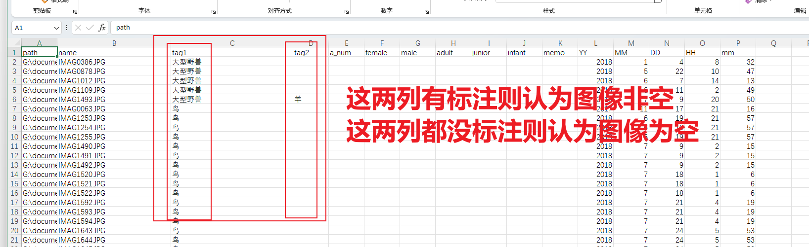
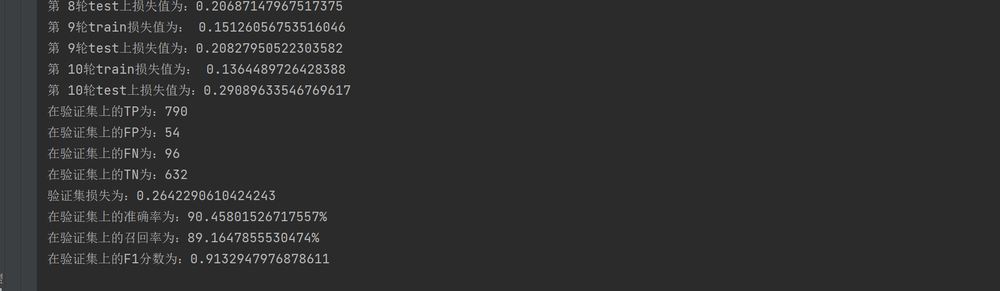
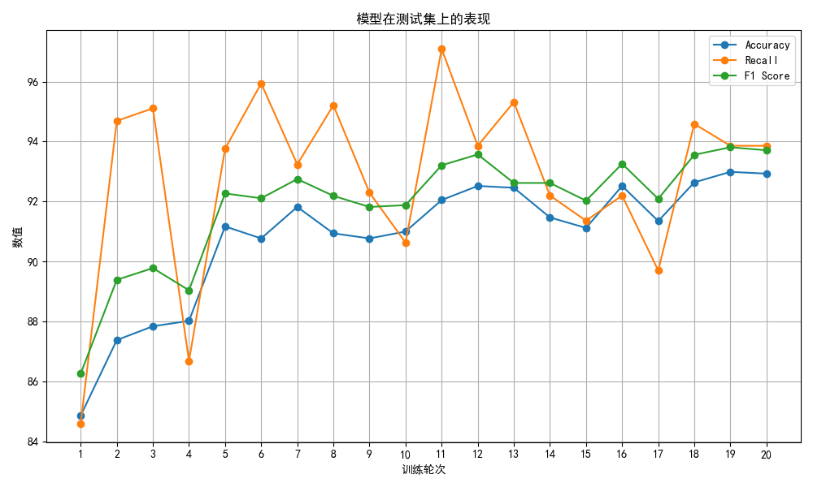
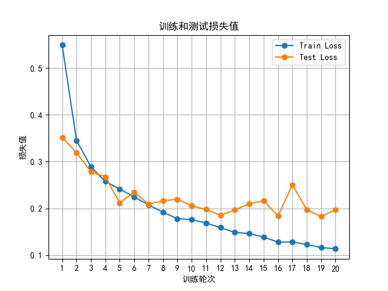

使用resnet50和resnet101两个模型，在LSM数据集上用pytorch预训练好的参数进行了图像空和非空的判定实验。

#### 实验细节

用的标签是文件夹下的csv文件

#### resnet50实验结果

先使用resnet50做的实验，使用LS001~LS015这几个文件夹中的照片，大概1600张，分8-1-1的训练测试验证比例。实验的结果如下图：

#### resnet101实验

使用LS001~LS024这几个文件夹，大概17000张图像，也是用的8-1-1比例

- train数据规模: 13688
- test数据规模: 1711
- val数据规模: 1711

##### 思考

以上实验我都还没有进行调参，从初步运行出的结果来看，使用imagenet上预训练好的参数，模型在测试集上的准确率也能达到92%，我感觉这个数值已经很高了，相信如果调一下参数效果还能更好，从下面损失值来看大概9轮模型就已经过拟合。

#### 总结

- 上述实验我还只是在自己电脑上跑，没有用到服务器。目前正在尝试把代码丢到4080上跑，但是还有问题代码还不能跑起来。

- 上面用到的数据比较少，原因有两个

  - 第一：上面只是代码放在自己电脑上跑，作为实验，数据太多我电脑有点不好搞

  - 第二：上面用到的数据我都用肉眼观察了一遍，我LSM文件夹里面的有些没有标注完全，比如LS002、LS018。还有些文件夹里面包含有视频比如LS019。所以我想肉眼大致过一遍数据，对数据集做一步筛选，感觉没问题的再用。

- 上面只是一次初步的实验主要目的是让代码能正确运行，很多参数都没有调整，所以我觉得偶然因素还很大，后续应该加大数据量，同时多修改几次参数（比如划分数据集的规则、学习率、batch_size等）减少偶然因素的影响。

    

  ##### 后续

  1. 我想调好代码把它丢到服务器上跑，至于标签我想可以用牛镱潼学姐的01标注和文件夹里面的csv标注两个都试一试。

  2. 再多看看LSM照片，熟悉熟悉数据集做一步筛选，争取下次在服务器上用整个LSM数据集来做实验。

  3. 学习迁移学习的概念，做实验写代码实现。

     

