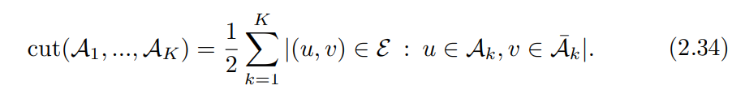

# 图表示学习

**Graph Representation Learning**

**William L. Hamilton** 

McGill University 

2020

作者主页网址：https://www.cs.mcgill.ca/~wlh/

英文原文网址：https://www.cs.mcgill.ca/~wlh/grl_book/

### 摘要

​		从电信网络到量子化学，图形结构数据在自然和社会科学中无处不在。如果我们想要能够从此类数据中学习、推理和概括的系统，那么将关系归纳偏差构建到深度学习架构中是至关重要的。 近年来，图表示学习的研究激增，包括深度图嵌入技术、卷积神经网络对图结构数据的泛化以及受信念传播启发的神经消息传递方法。 图表示学习的这些进步已经在许多领域产生了新的最先进的结果，包括化学合成、3D 视觉、推荐系统、问答和社交网络分析。 

​		本书的目标是提供图表示学习的综合和概述。 我们首先讨论图表示学习的目标，以及图论和网络分析的关键方法基础。 在此之后，我们介绍和回顾了学习节点嵌入的方法，包括基于随机游走的方法和知识图谱的应用。 然后，我们对非常成功的图神经网络 (GNN) 形式主义进行了技术综合和介绍，该形式主义已成为使用图数据进行深度学习的主要且快速发展的范式。 本书最后综合了图形深度生成模型(图形表示学习的一个新生的、但正在迅速增长的子集)的最新进展。

### 目录

### 序言

​		在过去的七年里，图表示学习领域以令人难以置信的速度发展，有时甚至是笨拙的。 我第一次接触这个领域是在 2013 年，当时我还是一名研究生，当时许多研究人员开始研究用于“嵌入”图结构数据的深度学习方法。 自 2013 年以来，图表示学习领域见证了令人印象深刻的崛起和扩展——从标准图神经网络范式的发展到图结构数据的深度生成模型的新生工作。 该领域已经从一小部分研究相对小众主题的研究人员转变为深度学习增长最快的子领域之一。

​		然而，随着该领域的发展，我们对图表示学习的方法和理论的理解也随着时间的推移而向后延伸。 我们现在可以将流行的“节点嵌入”方法视为经典降维工作的易于理解的扩展。 我们现在对图神经网络是如何从谱图论、调和分析、变分推理和图同构理论等历史悠久的丰富工作中独立地进化的有了理解和欣赏。 这本书是我尝试以一种实用的方式综合和总结这些方法论的主线。 我希望向读者介绍该领域的当前实践，同时还将这种实践与机器学习及其他领域更广泛的历史研究联系起来。 

**目标读者**   本书适用于机器学习领域的研究生水平研究人员或高级本科生。 图结构数据和图属性的讨论相对独立。 但是，这本书确实假设具有机器学习背景并熟悉现代深度学习方法（例如卷积和递归神经网络）。 一般来说本书所要求的机器学习和深度学习知识读者可以从教科书中获取，如：Goodfellow等人的《Deep Learning Book》

William L. Hamilton 

August 2020

### 致谢

​		在过去的几年里，我有幸与许多杰出的合作者在与图表示学习相关的主题上合作——他们中的许多人对这一新兴领域做出了开创性的贡献。我非常感谢所有这些合作者和朋友:我在斯坦福大学、麦吉尔大学、多伦多大学和其他地方的同事;我在麦吉尔大学的研究生们——他们教给我的教学写作的价值比任何人都多;以及我的博士导师Dan Jurafsky和Jure Leskovec，他们鼓励并为我的研究开辟了这条道路。

​		我还非常感谢麦吉尔大学 2020 年冬季研究生研讨会的学生们。这些学生是这本书的早期“测试者”，如果没有他们的反馈和勇气，这本书就不会存在。同样，Petar Veliˇckovi´c 提供的非常详细的反馈，以及 Mari´a CV Nascimento、Jian Tang、Alex Ferrer Campo、Seyed Mohammad Sadegh Mahdavi、Yawei Li、Xiaofeng ` Chen 和 Gabriele Corso 的评论是在修改手稿时非常宝贵。 

​		没有一本书是凭空写成的。这本书是多年来与许多杰出同事合作的结晶——更不用说我的妻子和伴侣艾米数月来的支持了。可以肯定地说，如果没有他们的支持，这本书是不可能写成的。当然，任何错误都是我一个人的。 

William L. Hamilton 

August 2020

## 第一章    介绍

​		图是一种普遍存在的数据结构，也是描述复杂系统的通用语言。
在最一般的视图中，图只是对象(即节点)的集合，以及这些对象对之间的一组交互(即边)。
例如，要将社交网络编码为一个图，我们可以使用节点来表示个体，使用边来表示两个个体是朋友(图1.1)。
在生物领域，我们可以用图中的节点来表示蛋白质，用边来表示各种生物相互作用，如蛋白质之间的动力学相互作用。

​		图是一种无处不在的数据结构，也是一种描述复杂系统的通用语言。 在最一般的观点中，图只是对象（即节点）的集合，以及这些对象对之间的一组交互（即边）。 例如，为了将社交网络编码为图，我们可以使用节点来表示个人，并使用边来表示两个人是朋友（图 1.1）。 在生物领域中，我们可以使用图中的节点来表示蛋白质，并使用边来表示各种生物相互作用，例如蛋白质之间的动力学相互作用。 

    
<!-- 将图片和文字居中 -->
        
         		<!-- 换行 -->
        图1.1		  <!-- 标题 -->
    

​		图1.1:著名的Zachary空手道俱乐部网络代表了Wayne W. Zachary从1970年到1972年研究的空手道俱乐部成员之间的友谊关系。如果两个人在俱乐部之外进行社交活动，就会有一种联系。在Zachary的研究中，俱乐部分裂成两个派系——以节点0和节点33为中心，Zachary能够根据图的结构正确地预测哪些节点会属于每个派系[Zachary, 1977]。

​		图形式主义的强大之处在于它关注点之间的关系（而不是单个点的属性），以及它的普遍性。 相同的图形形式可用于表示社交网络、药物和蛋白质之间的相互作用、分子中原子之间的相互作用或电信网络中终端之间的连接——仅举几个例子。 

​		然而，图表不仅仅提供了一个优雅的理论框架。它们提供了一个数学基础，我们可以在此基础上分析、理解和学习现实世界的复杂系统。在过去的 25 年中，可供研究人员使用的图形结构化数据的数量和质量都显着提高。随着大型社交网络平台的出现，对交互作用进行建模的大规模科学计划、食物网、分子图结构数据库以及数十亿互联网络设备，不乏有意义的图形数据可供给研究人员进行分析。挑战在于释放这些数据的潜力。 

​		这本书是关于我们如何使用机器学习来应对这一挑战的。 当然，机器学习并不是分析图数据的唯一可能方法。但是，鉴于我们寻求分析的图数据集的规模和复杂性不断增加，很明显机器学习将有助于提升我们建模、分析和理解图形数据的能力。 

### 1.1	图是什么？

​		在我们讨论图上的机器学习之前，有必要对“图数据”的确切含义进行更正式的描述。形式上，图 G = (V, E) 由一组节点 V 和这些节点之间的一组边 E 定义。我们将一条从节点 u ∈ V 到节点 v ∈ V 的边表示为 (u, v) ∈ E。 在许多情况下，我们只关心简单图，其中每对节点之间最多有一条边，节点与其自身之间没有边，并且边都是无向的，即 (u, v) ∈ E ↔ (v, u) ∈ E。 

​		表示图的一种方便方法是通过邻接矩阵 A ∈ $R^{|V|×|V|}$。为了用邻接矩阵表示图，我们对图中的节点进行排序，以便每个节点都索引邻接矩阵中的特定行和列。然后我们可以将边的存在表示为该矩阵中的条目：如果 (u, v) ∈ E 则 A[u, v] = 1，否则 A[u, v] = 0。如果图只包含无向边，那么 A 将是一个对称矩阵，但如果图是有向的（即边方向很重要），那么 A 不一定是对称的。 一些图也可以有加权边，其中邻接矩阵中的条目是任意实值而不是 {0, 1}。例如，蛋白质-蛋白质相互作用图中的加权边缘可能表明两种蛋白质之间关联的强度。

#### 1.1.1	多关系图

​		除了无向边、有向边和加权边之间的区别之外，我们还将考虑具有不同类型边的图。 例如，在表示药物-药物相互作用的图表中，我们可能希望不同的边对应于同时服用两种药物时可能发生的不同副作用。 在这些情况下，我们可以扩展边符号以包含边或关系类型 τ，例如 (u, τ, v) ∈ E，并且我们可以为每个边类型定义一个邻接矩阵 Aτ。 我们称这样的图为多关系图，整个图可以用邻接张量 A ∈ $R^{ |V|×|R|×|V|}$ 来概括，其中 R 是关系集。 多关系图的两个重要子集通常称为异构图和多路图。 

##### **Heterogeneous graphs** 

​		在异构图中，节点也充满了类型，这意味着我们可以将节点集合划分为不相交的集合 $V$ = $V_1$ ∪ $V_2$ ∪ ... ∪ $V_k$ 其中 $V_i$ ∩ $V_j$ = ∅, ∀i $\neq$ j。异构图中的边通常根据节点类型满足约束，最常见的是某些边只连接某些类型的节点的约束，即 (u, $τ_i$ , v) ∈ E → u ∈ $V_j$ , v ∈ $V_k$。例如，在异构生物医学图中，可能有一种节点代表蛋白质，一种节点代表药物，一种节点代表疾病。代表“治疗”的边缘只会出现在药物节点和疾病节点之间。类似地，代表“多种药物副作用”的边缘只会出现在两个药物节点之间。多部图是异构图的一个众所周知的特例，其中边只能连接具有不同类型的节点，即 (u, $τ_i$ , v) ∈ E → u ∈ $V_j$ , v ∈ $V_k$ ∧ j $\neq$k .

##### **Multiplex graphs**  

​		在多路图中，我们假设图可以分解为一组 k 层。 假设每个节点属于每一层，每一层对应一个唯一的关系，表示该层的层内边缘类型。 我们还假设可以存在层间边缘类型，它们跨层连接相同的节点。 多路图最好通过示例来理解。 例如，在多路交通网络中，每个节点可能代表一个城市，每一层可能代表不同的交通方式（例如，航空旅行或火车旅行）。 然后，层内边缘将表示通过不同交通方式连接的城市，而层间边缘表示在特定城市内切换交通方式的可能性。 

#### 1.1.2	特征信息

​		最后，在许多情况下，我们还拥有与图表相关联的属性或特征信息（例如，与社交网络中的用户相关联的个人资料图片）。 大多数情况下，这些是我们使用实值矩阵 X ∈ $R^ {|V |×m }$表示的节点级属性，其中我们假设节点的顺序与邻接矩阵中的顺序一致。 在异构图中，我们通常假设每种不同类型的节点都有自己不同类型的属性。 在极少数情况下，我们还会考虑除了离散边类型之外还具有实值边特征的图，在某些情况下，我们甚至会将实值特征与整个图相关联。

##### **图还是网络？**

​		在本书中，我们使用术语“图表”，但是您将看到许多其他资源使用术语“网络”来描述相同类型的数据。在某些地方，我们会同时使用这两个术语(例如，社会网络或生物网络)。那么，哪一项是正确的?在很多时候，这个术语的差异是历史和文化的:术语“图”似乎在机器学习社区更流行，但“网络”历来在数据挖掘和(不出意料的)网络科学社区流行。我们在这本书中使用了这两个术语，但我们也对这些术语的用法进行了区分。我们使用术语图来描述抽象的数据结构，这是本书的重点，但我们也会经常使用术语网络来描述这个数据结构的具体的、真实的实例(例如，社交网络)。这种术语上的区别与这些术语目前的流行用法相吻合。网络分析通常关注真实世界数据的属性，而图论关注数学图抽象的理论属性。

[^]: 也许在某种程度上是由于与“神经网络”的术语冲突

### 1.2	基于图的机器学习

​		机器学习本质上是一门问题驱动的学科。为了解决特定的任务，我们试图建立能够从数据中学习的模型，机器学习模型通常根据它们试图解决的任务类型进行分类：它是一个有监督的任务，目标是预测给定输入数据点的目标输出吗？它是否是一项无监督的任务，目标是推断数据中的模式，如点簇？

​		机器学习与图没有什么不同，但通常的有监督和无监督分类在图形方面并不一定是最有用的。在本节中，我们简要概述了图形数据上最重要和研究最深入的机器学习任务。正如我们将看到的，“监督”问题在图形数据中很流行，但图形上的机器学习问题往往模糊了传统机器学习类别之间的界限。 

#### 1.2.1	节点分类

​		假设我们有一个拥有数百万用户的大型社交网络数据集，但我们知道这些用户中有相当一部分实际上是机器人。 识别这些机器人可能很重要，原因有很多：公司可能不想向机器人做广告，或者机器人实际上可能违反了社交网络的服务条款。 手动检查每个用户以确定他们是否是机器人会非常昂贵，因此理想情况下，我们希望有一个模型可以仅给定少量手动标记的示例，将用户分类为机器人（或不是机器人）

​		这是一个典型的节点分类,目的是预测标签$y_u$，该标签可能是一种类型,类别,或与节点 $u \in V$相联系的特征，当我们只有给定训练集节点$V_{train} \subset V$ 真实标签。节点分类也许是最受欢迎的机器学习任务图数据,特别是近几年。社交网络之外的节点分类的例子包括在作用域中的蛋白质功能分类*[Hamilton等人，2017b]*和基于超链接或引文图的文档主题分类*[Kipf和Welling, 2016a]*。通常，我们假设我们只拥有一个图中非常小的节点子集的标签信息(例如，从一个小的手动标签示例集合中分类社交网络中的机器人)。然而，也有涉及许多标记节点和/或需要跨断开连接图进行泛化的节点分类实例（例如，对不同物种相互作用组中蛋白质的功能进行分类）。

​		乍一看，节点分类似乎是标准监督分类的一个直接变体，但实际上二者有着巨大区别。最重要的区别在于，图中的节点不是**独立同分布**的*（i.i.d.）*。通常，当我们建立有监督的机器学习模型时，我们假设每个数据点在统计上独立于所有其他数据点；否则，我们可能需要对所有输入点之间的依赖关系进行建模。我们还假设数据点是相同分布的；否则，我们无法保证我们的模型可以推广到新的数据点。节点分类完全破坏了这个*（i.i.d.）*。我们不是对一组独立同分布的数据进行建模数据点进行建模，而是对一组互连的节点进行建模。

​		事实上，许多最成功的节点分类方法背后的关键是显式地利用节点之间的连接。一个特别流行的想法是利用同态性，即节点在图中与其邻居共享属性的趋势*[McPherson et al.，2001]*。例如，人们倾向于与拥有相同兴趣或家境的人建立友谊。基于同质化的概念，我们可以建立一个机器学习模型，尝试将相似的标签分配给图中的相邻节点*[Zhou等人，2004]*。除同源性外，还有一些概念，如结构等效*[Donnat et al.，2018]*，即具有相似局部邻域结构的节点将具有相似的标签，以及假设节点将优先连接到具有不同标签的节点的异质性。*（例如，在许多社交网络中，性别是显示异质性的一个属性）*当我们建立节点分类模型时，我们希望利用这些概念并对节点之间的关系建模，而不是简单地将节点作为独立的数据点。

##### **监督还是半监督？**

​		由于节点分类问题的非典型特带你，研究人员通常将其称为半监督*[Yang et al., 2016]*。之所以使用这个术语，是因为当我们训练节点分类模型时，我们通常可以访问完整的图，包括所有未标记（例如，测试）节点。我们唯一缺少的是测试节点的标签。但是，我们仍然可以使用测试节点的信息（例如：图中邻居节点的特征）在训练过程中改进我们的模型。这与监督学习不同，在监督学习中未标记的数据点在训练期间完全不可见的。

​		用于在训练期间结合标记和未标记数据的模型的通用术语是半监督学习，因此该术语经常用于参考节点分类任务是可以理解的。 然而，重要的是要注意，半监督学习的标准公式仍然需要 **独立同分布** 假设，这不适用于节点分类。 图上的机器学习任务不容易符合我们的标准类别！ 

#### 1.2.2	关系预测

​		节点分类可以有效的根据节点与图中其他节点的关系来推断节点的信息。但是如果我们忽略了这些关系信息呢?如果我们只知道一些蛋白质存在于特定细胞中的蛋白质相互作用，但我们想对我们遗漏的相互作用做出一个很好的猜测，会怎么样?我们能用机器学习来推断图中节点之间的边吗?
​		该任务有许多名称，如链接预测、图完成和关系推理，这取决于特定的应用程序领域。我们把它简单地称为关系预测。与节点分类一样，它是一种更流行的图形数据机器学习任务，在现实世界中有无数的应用:在社交平台上向用户推荐内容*[Ying et al.， 2018a]*，预测药物副作用*[Zitnik et al.， 2018]*，或在关系数据库中推断新事实*[Bordes et al.， 2013]*——所有这些任务都可以被视为关系预测的特殊情况。

​		启发式算法可以实现强大的性能 [L¨u and Zhou, 2011]。另一方面，在更复杂的多关系图数据集中，例如编码数百种不同生物相互作用的生物医学知识图，关系预测可能需要复杂的推理和推理策略 [Nickel et al., 2016]。与节点分类一样，关系预测模糊了传统机器学习类别的边界——通常被称为有监督和无监督——它需要特定于图域的归纳偏差。此外，与节点分类一样，关系预测也有许多变体，包括在单个固定图上进行预测的设置 [L¨u and Zhou, 2011]，以及必须跨多个不相交的关系预测的设置图表 [Teru et al., 2020]。 

​		关系预测的标准设置是给定一组节点 $V$ 和这些节点之间的不完整边集 $E_{train}  \subset E$。我们的目标是使用这些部分信息来推断缺失的边 $E$ \ $E_{train}$。这项任务的复杂性在很大程度上取决于我们正在检查的图形数据的类型。例如，在简单的图中，例如仅编码“友谊”关系的社交网络，有基于两个节点共享多少邻居的简单启发式算法可以实现强大的性能 *[L¨u and Zhou, 2011]*。另一方面，在更复杂的多关系图数据集中，例如编码数百种不同生物相互作用的生物医学知识图，关系预测可能需要复杂的推理和推理策略 *[Nickel et al., 2016]*。与节点分类一样，关系预测模糊了传统机器学习类别的边界——通常被同时称为有监督和无监督——它需要特定于图域的归纳偏差。此外，与节点分类一样，关系预测也有许多变体，包括在单个固定图上进行预测的设置 *[L¨u and Zhou, 2011]*，以及必须跨多个不相交的关系预测的设置图表 *[Teru et al., 2020]*。

#### 1.2.3	聚类和社区检测

​		节点分类和关系预测都需要推断图数据的缺失信息，在许多方面，这两个任务都是有监督学习的图的类似物。另一方面，社区检测是无监督聚类的图形模拟。
​		假设我们可以访问 Google Scholar 中的所有引文信息，并且我们制作了一个协作图，将两个共同撰写论文的研究者连接起来。如果我们要研究这个网络，我们是否期望发现一个稠密的“毛球”，在这个“毛球”中，每个人都同样有可能与其他每个人合作?更有可能的情况是，图将被分割成不同的节点集群，按研究区域、机构或其他人口因素分组在一起。换句话说，我们期望这个网络——像许多真实世界的网络一样——呈现出一种社区结构，其中的节点更有可能与属于同一社区的节点形成边。

​		这是社区检测任务的基本直觉。社区检测的挑战在于仅给出输入图$G = (V, E)$就能推断出潜在的社区结构。社区检测的许多实际应用包括发现遗传交互网络中的功能模块s *[Agrawal et al., 2018]*以及揭露金融交易网络中的欺诈用户群体*[Pandit et al., 2007]*。

#### 1.2.4	图分类、回归和聚类

​		最后一类关于图数据的流行机器学习应用涉及到整个图的分类、回归或聚类问题。例如，给定一个表示分子结构的图，我们可能想要建立一个回归模型，可以预测该分子的毒性或溶解度*[Gilmer et al., 2017].*。或者，我们可能想要建立一个分类模型，通过分析一个计算机程序的语法和数据流的基于图的表示来检测该程序是否为恶意程序 *[Li et al., 2019]*。在这些图分类或回归应用程序中，我们寻求对图数据进行学习，但不是对单个图的各个组件（即节点或边）进行预测，而是给定一个由多个不同图组成的数据集，并且 我们的目标是针对每个图做出独立的预测。 在图聚类的相关任务中，目标是学习图对之间相似性的无监督度量。

​		在所有关于图的机器学习任务中，图回归和分类可能是标准监督学习最直接的类似物。 每个图都是一个 i.i.d。 与标签关联的数据点，目标是使用一组标记的训练点来学习从数据点（即图形）到标签的映射。 以类似的方式，图聚类是图数据无监督聚类的直接扩展。 然而，这些图级任务的挑战是如何定义考虑到每个数据点内的关系结构的有用特征 

## 第二章 	背景和传统方法

​		在我们介绍图的表示学习和深度学习的概念之前，有必要给出一些方法背景和背景。在现代深度学习方法出现之前，有哪些方法被用于图上的机器学习?在本章中，我们将对传统的学习方法进行简要和集中的介绍，并提供指针和参考，以更彻底地处理这些方法。这一背景章节也将用于介绍图表分析的关键概念，这些概念将构成后面章节的基础。
​		我们的参观将大致与不同类型的学习任务的图形。我们将首先讨论基本的图统计、内核方法以及它们在节点和图分类任务中的使用。在此之后，我们将中介绍和讨论度量节点邻域之间重叠的各种方法，这些方法为关系预测提供了强大的启发式基础。最后，我们将简要介绍使用图拉普拉斯算子的谱聚类来结束本背景部分。谱聚类是图上聚类或社区检测中研究得最充分的算法之一，我们对这一技术的讨论还将介绍本书中反复出现的关键数学概念。

### 2.1	图统计和内核方法

使用图数据进行分类的传统方法遵循深度学习出现之前流行的标准机器学习范式。 我们首先根据启发式函数或领域知识提取一些统计数据或特征，然后将这些特征用作标准机器学习分类器（例如逻辑回归）的输入。 在本节中，我们将首先介绍一些重要的节点级特征和统计信息，然后我们将讨论如何将这些节点级统计信息推广到图级统计信息，并扩展到在图上设计内核方法。 我们的目标是引入各种启发式统计和图形属性，它们通常用作应用于图形的传统机器学习管道中的特征 

    
<!-- 将图片和文字居中 -->
        
         		<!-- 换行 -->
        图2.1		  <!-- 标题 -->
    

#### 2.1.1	节点级统计信息和特征

​		在Jackson[2010]之后，我们将用一个简单(但著名)的社会网络:15世纪佛罗伦萨婚姻网络(图2.1)来推动我们对节点级统计数据和特征的讨论。这个社交网络因Padgett和Ansell[1993]的工作而闻名，他们用这个网络来说明美第奇家族(图中靠近中间的位置)权力的崛起，美第奇家族开始主宰佛罗伦萨的政治。在美第奇时代，政治婚姻是巩固权力的重要方式，所以这种婚姻关系网络在很大程度上反映了当时的政治结构。
​		出于我们的目的，我们将从机器学习的角度来考虑这个网络和美第奇家族的崛起，并提出一个问题:机器学习模型可以使用哪些特征或统计数据来预测美第奇家族的崛起?换句话说，美第奇节点的哪些特性或统计数据将其与图的其他部分区别开来?更普遍地说，我们可以用什么有用的属性和统计信息来描述这个图中的节点呢?
​		原则上，我们下面讨论的属性和统计可以用作节点分类模型的特征(例如，作为逻辑回归模型的输入)。当然，我们无法在像佛罗伦萨婚姻网络这样小的图上实际训练机器学习模型。 然而，考虑可用于区分这样一个真实世界网络中的节点的各种特征仍然是具有说明意义的，我们讨论的属性通常在各种节点分类任务中都很有用。 

##### **节点的度**

​		最明显、最直接的节点特征是度，通常表示为$d_u$，表示节点$u∈V$，简单地计算与节点相关的边数:

​		注意，在有向图和加权图的情况下，可以区分不同的度概念。比如：通过对式(2.1)中的行或列求和，对应出边或入边。一般来说，节点的度是一个需要考虑的基本统计数据，在应用于节点级任务的传统机器学习模型中，它通常是最具信息量的特征之一。
​		在我们用来说明佛罗伦萨婚姻的图表中，我们可以看到，度确实是一个很好的特征来区分美第奇家族，因为他们在图表中拥有最高的度。然而，他们的度仅比两个最接近的家族——斯特罗齐家族和瓜达格尼家族高出2到3。是否有其他或更多的区别性特征可以帮助美第奇家族从图的其他部分中区分出来?

##### **节点中心**

​		节点的度只是衡量一个节点有多少邻居，但这并不足以衡量一个节点在图中的重要性。在许多情况下——比如我们的佛罗伦萨婚姻的例子图——我们可以从附加的和更强大的节点重要性的测量中受益。为了获得更有效的重要性度量，我们可以考虑称为节点中心性*(centrality)*的各种度量，这些度量可以在各种各样的节点分类任务中形成有用的特征。
​		一个流行的和重要的测量中心性是所谓的特征向量中心性。而度只是简单地衡量每个节点有多少邻居，特征向量中心性也考虑了节点邻居的重要性。特别地，我们通过一个递归关系定义一个节点的特征向量中心性$e_u$，其中节点的中心性与其邻居的平均中心性成正比:

​		其中$\lambda$是常数。将这个方程重写为向量符号，用$e$作为节点中心度的向量，我们可以看到这个递归定义了邻接矩阵的标准特征向量方程

​		换句话说，满足等式 2.2中的递归的中心性测度对应于邻接矩阵的特征向量。假设我们要求正的中心性值，我们可以应用Perron-Frobenius 原理进一步确定中心性值向量$e$是由$A$的最大特征值对应的特征向量给出[Newman, 2016]。
​		特征向量中心性的一个观点是，它排列了一个节点在图上无限长的随机漫步中被访问的可能性。这种观点可以通过考虑使用幂次迭代来获得特征向量的中心性值来说明。也就是说，由于$\lambda$是$A$的主要特征向量，我们可以通过幂次迭代来计算$e$

​		如果我们从向量$e^{(0)} =(1,1，…， 1)^T$，则可以看出第一次迭代后$e^{(1)}$将包含所有节点的度数。一般来说，在迭代t ≥ 1时，$e^{(t)}$将包含到达每个节点的长度t路径的数量。因此，通过无限次迭代这个过程，我们可以得到一个分数，这个分数与在无限长的路径上访问一个节点的次数成正比。这种节点重要性、随机游走和图邻接矩阵的频谱之间的联系将在本书接下来的章节中经常出现。
​		回到我们的佛罗伦萨婚姻网络的例子，如果我们计算这个图上的特征向量中心性值，我们再次看到美第奇家族是最有影响力的，其标准化值为0.43，而第二高的值为0.36。当然，我们还可以使用其他的中心性度量方法来描述这张图中的节点——其中一些甚至更能体现美第奇家族的影响。
这包括中间中心性*（betweeness centrality）*(测量一个节点在两个其他节点之间最短路径上的频率)和接近中心性*(closeness centrality)*(测量一个节点和所有其他节点之间的平均最短路径长度)。Newman[2018]详细回顾了这些措施和更多措施。

##### **聚类系数**

​		衡量重要性的方法，如度和中心性，显然对区分著名的美第奇家族与佛罗伦萨婚姻网络的其他成员是有用的。但是对于区分图中其他节点有用的特性是什么呢?例如，图中的Peruzzi节点和Guadagni节点具有非常相似的度(3 vs . 4)和相似的特征向量中心度(0.28 vs . 0.29)。然而，看看图2.1中的图表，这两个家族之间有明显的区别。佩鲁济家族是一个相对紧密的家族集群，而瓜达尼家族的角色更像“星形”。

​		这种重要的结构区别可以使用聚类系数的变化来衡量，聚类系数衡量的是节点局部邻域中闭合三角形的比例。 聚类系数的流行局部变量计算如下 [Watts and Strogatz, 1998]： 

​		这个等式中的分子计算节点u的邻居之间的边数(其中我们用$N _{(u)} = [{v∈V: (u, v)∈E}]$来表示节点的邻域)。分母计算$u$的邻域中有多少对节点。
​		聚类系数的名称来源于这样一个事实:它度量一个节点的邻域的聚类紧密程度。聚类系数为1意味着所有$u$的邻居也是彼此的邻居。在我们的佛罗伦萨婚姻图中，我们可以看到一些节点是高度聚集的。比如： Peruzzi节点的聚类系数为0.66，而Guadagni节点等其他节点的聚类系数为0。与中心性一样，聚类系数也有许多变化(例如，考虑到有向图)，Newman[2018]也详细回顾了这些变化。在整个社会和生物科学中，真实世界的网络有一个有趣而重要的特性，即它们往往具有远高于随机取样边缘的聚类系数[Watts和Strogatz, 1998]。

#### 2.1.2	闭合三角形、自我图和图案

**Graph-level features and graph kernels**

​		到目前为止，我们已经讨论了节点级别的各种统计数据和属性，它们可以用作节点级别分类任务的特征。 但是，如果我们的目标是进行图级分类呢？ 例如，假设我们有一个代表分子的图形数据集，我们的目标是根据它们的图形结构对这些分子的溶解度进行分类。 我们将如何做到这一点？ 在本节中，我们将简要介绍为此类任务提取图级特征的方法。 

​		我们在这里介绍的许多方法都属于图核方法的一般分类，这是一种为图设计特征的方法，或可以用于机器学习模型的隐式核函数。在这个大范围内，我们将只讨论其中的一小部分方法，我们将重点关注提取显式特征表示的方法，而不是定义图之间隐式内核(即相似性度量)的方法。我们将感兴趣的读者引向Kriege等人[2020]和Vishwanathan等人[2010]，以了解这一领域的详细调查。

##### **节点包**（Bag of nodes）

定义图级特性的最简单方法是聚合节点级统计信息。例如，可以根据图中节点的度、中心性和聚类系数计算直方图或其他汇总统计信息。这些聚合的信息可以用作图级描述。这种方法的缺点是，它完全基于局部节点级别的信息，可能会错过图中的重要全局属性

##### **Weisfeiler-Lehman 内核** 

​		改进基本节点包方法的一种方法是使用迭代邻域聚集策略*(iterative neighborhood aggregation)*。这些方法的想法是提取包含更多信息的节点级特征，而不仅仅是它们的局部自我图，然后将这些更丰富的特征聚合到图级表示中。
​		也许这些策略中最重要和最著名的是Weisfeiler-Lehman (WL)算法和内核*[Shervashidze et al., 2011, Weisfeiler and Lehman, 1968]*。WL算法背后的基本思想如下:

1. 首先，我们给每个节点分配一个初始标签$l^{(0)}(v)$。
在大多数图中，这个标签就是节点的度，即$l^{(0)}(v) = d_v ∀ v∈V$。

2. 接下来，我们通过节点邻域内的节点标签来迭代的给每一个节点分配新标签：

  

  其中双括号用于表示多集，HASH 函数将每个唯一的多集映射到唯一的新标签。

3. 在运行 K 次重新标记迭代（即步骤 2）之后，我们现在为每个节点提供了一个标签 $l^{(K)}(v)$，它总结了其 K-hop 邻居的结构。 然后，我们可以计算这些标签上的直方图或其他汇总统计数据，作为图的特征表示。 换句话说，WL 内核是通过测量两个图的结果标签集之间的差异来计算的。 

    
<!-- 将图片和文字居中 -->
        
         		<!-- 换行 -->
        图 2.2：可以出现在一个简单图中的四个不同的 size-3 graphlets 		  <!-- 标题 -->
    

​		WL核具有重要的理论性质，已被广泛研究和应用。例如，一种常用的近似图同构的方法是在经过K轮的WL算法后，检查两个图是否具有相同的标签集，这种方法已知可以解决广泛的图集的同构问题[Shervashidze et al.， 2011]。

##### **Graphlets 和基于路径的方法**

​		最后，就像我们在讨论节点级特性时一样，定义特性的一个有效且强大的策略是简单地计算不同的小子图结构的出现次数，在这个上下文中通常称为graphlet。在形式上，graphlet内核涉及枚举特定大小的所有可能的图结构，并计算它们在整个图中出现的次数。(图2.2显示了大小为3的各种graphlet)。这种方法的挑战在于，计算这些图形是一个组合困难的问题*（combinatorially difficult problem）*，尽管目前已经提出了许多近似方法[Shervashidze和Borgwardt, 2009]。

枚举所有可能的graphlet的另一种方法是使用基于路径的方法。
在这些方法中，无需列举graphlet，只需检查图中出现的不同类型的路径。
例如,鹿岛等提出的随机漫步内核。[2003]包括跑步跑 dom遍历图,然后计算不同程度的发生序列,3虽然Borgwardt的最短路径的内核和Kriegel[2005]在面对类似的想法,但是只使用节点之间的最短路径(而不是比随机漫步)。
正如我们将在本书的第3章中看到的，char基于行走和路径描述图的想法是一个强大的想法，因为它可以提取丰富的结构信息，同时避免许多图数据的组合陷阱。

枚举所有可能的 graphlet 的替代方法是使用基于路径的方法。 在这些方法中，不是枚举graphlet，而是简单地检查图中出现的不同类型的路径。 例如，Kashima 等人提出的随机游走内核*（Kashima et al. [2003]）* 。 涉及在图上运行随机游走，然后计算不同度数序列的出现，而 Borgwardt 和 Kriegel  的最短路径内核涉及类似的想法*( Borgwardt and Kriegel [2005])* ，但仅使用之间的最短路径 节点（而不是随机游走）。 正如我们将在本书的第 3 章中看到的那样，这种基于游走和路径对图进行表征的想法非常强大，因为它可以提取丰富的结构信息，同时避免了图数据的许多组合缺陷。 

### 2.2	社区重叠检测

**（Neighborhood Overlap Detection）**

​		在上一节中，我们介绍了提取关于单个节点或整个图的特征或统计信息的各种方法。这些节点级和图级统计信息对许多分类任务都很有用。然而，它们受到限制，因为它们不量化节点之间的关系。例如，上一节中讨论的统计数据对于关系预测任务不是很有用，我们的目标是预测两个节点之间的一条边的存在(图2.3)。
​		在本节中，我们将考虑节点对之间的邻域重叠的各种统计措施，它们量化了节点对相关的程度。例如，最简单的邻居重叠测度就是计算两个节点共享的邻居数量:

​		其中，我们用$S[u, v]$表示量化节点$u$和$v$之间关系的值，并且让$S∈R ^{| v |×| v |}$表示汇总所有两两节点统计信息的相似矩阵。
​		尽管在本节讨论的任何统计方法中都没有涉及“机器学习”，但它们仍然是非常有用和强大的关系预测基线。给定邻域重叠统计量$S[u, v]$，一种常见的策略是假设一条边$(u, v)$的存在可能性与$S[u, v]$成正比:

​		因此，为了使用邻域重叠度量来完成关系预测任务，只需设置一个阈值来确定何时预测一条边的存在。注意，在关系预测设置中，我们通常假设我们只知道真实边的子集$E_{train}\subset E$。我们希望在测试边集上计算的节点-节点相似性度量能够准确预测测试(即不可见)边的存在(图2.3)。

    
<!-- 将图片和文字居中 -->
        
         		<!-- 换行 -->
        图2.3		  <!-- 标题 -->
    

​		局部重叠统计只是两个节点共享的共有邻居数的函数，即$|N (u)∩N (v)|$。例如，Sorensen索引定义了一个节点节点邻域的矩阵$S_{Sorenson} ∈ R ^{|V|×|V|}$，如下：

​		图2.3:用于训练的全图和下采样图的说明。在训练模型或计算重叠统计时，将训练图中的红色虚线边缘去除。通过预测这些红色虚线边存在能力来评估模型。
​		它通过节点度数的总和来规范化公共邻居的计数。进行某种规范化是非常重要的。否则，重叠度量将高度偏向于预测大度节点的边缘。其他类似的方法包括索尔顿指数(Salton index)，它通常是$u$和$v$的度的乘积，即。

以及Jaccard重叠*（the Jaccard overlap）*

​		通常，这些度量方法寻求量化邻居节点之间的重叠，同时最小化由于节点度造成的任何偏差。在文献*[L¨u和Zhou, 2011]*中，这种方法还有许多进一步的变化。

​		除了简单地计算共同邻居的数量之外，还有一些措施试图以某种方式考虑共同邻居的重要性。 资源分配 (RA) 索引*（The Resource Allocation  index）*计算公共邻居的反度数 

而 Adamic-Adar (AA) 指数使用度数的反对数执行类似的计算：

​		这两种方法都赋予了低度共同邻居更多的权重，直观的看，共享的低度邻居比共享的高度邻居更具信息量。

#### 2.2.2	全局重叠度量

**（Global overlap measures）**

局部重叠度量对于链接预测来说是非常有效的启发式方法，即使与先进的深度学习方法相比，也常常能获得竞争性能 *[Perozzi et al., 2014]*。然而，局部方法由于仅考虑局部节点邻域而受到限制。例如，两个节点可能在它们的邻域中没有局部重叠，但仍然是图中相同社区的成员。全局重叠统计试图将这种关系考虑在内。

##### **Katz index**

Katz指数是最基本的全局重叠统计。为了计算Katz指数，我们只需计算一对节点之间所有长度的路径数:

其中$β∈R^+$是一个用户定义的参数，控制短路径和长路径的权重大小。$β < 1$ 的小值会降低长路径的重要性

##### **矩阵的几何序列**

**（Geometric series of matrices）** 

 Katz 索引是矩阵的几何序列的一个例子，其变体经常出现在图分析和图表示学习中。 矩阵的基本几何级数的解由以下定理给出： 

​	**定理 1.** 

​		令 $X$ 为实值方阵，令 $λ_1$ 表示 $X$ 的最大特征值。那么 
$$
(I - X)^{-1} = \sum^\infty_{i=0}{X^i}
$$
​		当且仅当$λ_1 < 1$且$(I−X)$非奇异时。

​		证明：令 $s_n = \sum^n_{i=0}{X^i}$，然后我们得到这个
$$
X_{S_n} = X\sum^n_{i=0}{X^i} \\     = \sum^{n+1}_{i=1}{X^i}
$$
​		并且：
$$
s_n - X{s_n} = \sum^{n}_{i=0}{X^i} - \sum^{n+1}_{i=1}{X^i}
$$

$$
s_n(I - X) = I - X^{n+1} \Rightarrow s_n = (I - X^{n+1})(I - X)^{-1}
$$

若$\lambda_1 < 1$ 可以得到极限：${\lim}\limits_{n\rightarrow\infty}{X^n} = 0$

$$
{\lim}\limits_{n\rightarrow\infty}{s_n} = {\lim}\limits_{n\rightarrow\infty}{(I - X^{n+1})}{(I - X)}^{-1} \\=I(I- X)^{-1}\\ = {(I - X)}^{-1}
$$
​		根据定理1，我们可以看到Katz指数的解:

​		其中$S_{Katz}∈R^{ |V|×|V|}$是node-node值相似的全矩阵。

##### **Leicht, Holme和Newman (LHN)的相似性**

Katz指数的一个问题是，它受节点度的影响很大。公式(2.14)在考虑高度节点时，总体相似度得分通常高于低度节点，因为高度节点通常会涉及更多路径。为了缓解这种情况, *（Leicht et al. [2006]）* 考虑两个节点之间实际观测路径数与期望路径数之比，提出一种改进的度量:

​		两个节点之间的路径数量是根据我们对随机模型下预期路径数量的预期进行归一化的。

​		为了计算期望$E[A^i]$，我们依赖于所谓的配置模型，该模型假设我们绘制了一个随机图，其度数与给定的图相同。在这个假设下，我们可以解析地计算：

我们使用了 $m = |E|$ 来表示图中边的总数。等式（2.17）指出，在随机配置模型下，边存在的可能性与两个节点度的乘积成正比。 这可以通过注意到有 $d_u$ 个边从 $u$ 出发并且这些边中的每一个都有 $\frac{d_v}{2m}$ 的机会以 $v$ 结尾。对于 $E[A^2 [u, v]]$，我们可以类似地计算

这是因为长度为2的路径可以通过任意中间顶点u，和这样一个路径的可能性成正比的可能性边缘留下v1击中u-given由dv1 du 2 m乘以概率优势让你点击v2-given由dv2 (du−1)2米(减去一个因为我们已经用完你的一个边缘的边缘从v1)。
不幸的是，当我们超出长度为3的路径时，在一个随机配置模型中，预期节点路径的解析计算就变得难以处理。
因此，为了获得更长的路径长度(即i > 2)的期望E[Ai]， Leicht等人[2006]依赖于最大特征值可以用来近似路径数量的增长这一事实。
特别地，如果我们定义pi∈R |V|为计算节点u和所有其他节点之间长度为i的路径的数量的向量，那么对于大的i也有这个

这是因为长度为 2 的路径可以通过任何中间顶点 $u$，并且这种路径的可能性与离开 $v_1$ 的边命中 $u$ 的可能性成正比（由 $\frac{d_{v_1}{d_u}}{2m}$ 给出）乘以概率 一条离开 $u$ 的边命中 $v_2$由$\frac{d_{v_2}{d_u - 1}}{2m}$ 给出（我们减去一个，因为我们已经用完了 $u$ 的一条边作为来自 $v_1$ 的传入边）。
不幸的是，当我们超出长度为 3 的路径时，在随机配置模型下对预期节点路径计数的分析计算变得难以处理。 因此，为了获得更长路径长度（即 i > 2）的期望 $E[A^i]$，*（Leicht et al. [2006]）* 依赖于最大特征值可用于近似路径数量增长的事实。 特别是，如果我们定义 $p_i ∈ R ^{|V|}$ 作为计算节点 $u$ 和所有其他节点之间长度为 $i$ 的路径数量的向量，那么对于大 $i$

最后，将它们放在一起，我们可以得到Katz指数的标准化版本，我们称其为LNH指数(根据提出算法的作者的首字母):

其中$I$是一个$|v | × |v |$单位矩阵，索引方式与$A$一致。与Katz指数不同，LNH指数反映了节点之间的预期路径数，只有当两个节点出现在比我们预期更多的路径上时，才会给出较高的相似性度量。利用定理1，矩阵级数的解(忽略对角线项后)可以写成如下式子 *[L¨u and Zhou, 2011]*:

其中D是一个节点度在对角线上的矩阵。

##### 随机游走方法 (Random walk methods)

另一组全局相似度度量考虑的是随机游走，而不是图上路径的精确计数。例如，我们可以直接应用著名的PageRank方法*[Page et al.， 1999]*的变体，即个性化PageRank算法*[Leskovec et al.， 2020]*，其中我们定义随机矩阵$P = AD^{−1}$，并计算:

在这个方程中，$e_u$是节点$u$的一个热指示向量，$q_u[v]$给出了从节点$u$开始的随机漫步访问节点$v$的平稳概率。在这里，$c$项决定了在每个时间步长的节点$u$处重新开始随机行走的概率。没有这个重新启动的概率，随机行走的概率将简单地收敛到特征向量中心性的一个归一化变量。然而，通过这种重新启动的概率，我们反而获得了特定于节点$u$的重要性度量，因为随机行走会不断地被“传送”回该节点。这个递归式的解如下

我们可以将节点-节点随机游走相似性测度定义为

一对节点之间的相似度与我们从另一个节点开始的随机漫步到达每个节点的可能性成正比

### 2.3	图拉普拉斯算子和谱方法

在讨论了使用图数据进行分类的传统方法(第2.1节)以及关系预测的传统方法(第2.2节)之后，我们现在转向学习如何将图中的节点聚类的问题。本节还将介绍学习节点的低维嵌入的任务。我们开始定义一些重要的矩阵，可以用来表示图和简要介绍谱图理论的基础。

#### 2.3.1	图拉普拉斯

邻接矩阵可以表示图而不丢失任何信息。然而，有些矩阵可以替代矩阵且不丢失原图有效的数学性质有。这些矩阵表示被称为拉普拉斯矩阵，由邻接矩阵的各种变换构成。

##### 非规范拉普拉斯算子（Unnormalized Laplacian）

最基本的拉普拉斯矩阵是非归一化拉普拉斯矩阵，定义如下:
$$
L = D - A
$$
其中$A$为邻接矩阵，$D$为度矩阵。简单图的拉普拉斯矩阵有几个重要的性质:

1. 它是对称（$L^T = L$）且为半正定的$（x^TLx \geq 0 , \forall x \in R^{|V|}）$
2. 对于$\forall x \in R^{|V|}$下式都成立：

3. ​	$L$具有$|V|$非负特征值：$0 = \lambda _{|v|}  \leq \lambda _{|v|-1}  \leq \ldots \leq \lambda _{1}$

##### 拉普拉斯算子和连通分量

拉普拉斯算子总结了图的许多重要性质。例如，我们有以下定理：

**定理2：**拉普拉斯 L的0特征值的几何重性对应于图中连通分量的数目。

​	**证明：**

​		由于0是任意向量$e$的特征值，故可以得到:

​		由特征值特征向量方程的定义。式(2.29)的结果表明

​		上面的等式意味着$e[u] = e[v]，∀(u, v)∈E$，这又意味着$e[u]$对于相同连通分量的所有节点$u$都是相同的常数。因此，如果图是完全连通的，那么特征值0的特征向量对于图中的所有节点都是1的常向量，这将是特征值0的唯一特征向量，因为在这种情况下，方程(2.29)只有一个唯一的解。
​		相反，如果图是由多个连通分量组成的，那么方程2.29在对应于每个连通分量的拉普拉斯矩阵的每个块上都是独立成立的。即，如果图由K个连通分量组成，则存在图中节点的排序，使得拉普拉斯矩阵可以写成

其中，这个矩阵中的每个$L_k$块都是原始图的完全连通子图的有效图拉普拉斯算子。由于它们是完全连通图的有效拉普拉斯算子，对于每个$L_k$块，我们将得到等式（2.29），并且这些子拉普拉斯算子的重数为1的特征值为0，所有的特征向量为1（仅在该分量中的节点上定义）。此外，由于$L$是块对角矩阵，其谱由所有$L_k$块的谱的并集给出，即，$L$的特征值是$L_k$矩阵的特征值的并集，$L$的特征向量是所有$L_k$矩阵的特征向量的并集，在其他块的位置填充0值。因此，我们可以看到，每个块为特征值0贡献一个特征向量，该特征向量是该连接组件中节点的指示向量

##### 归一化拉普拉斯算子（Normalized Laplacians）

除了非归一化的拉普拉斯阶，还有两种流行的归一化拉普拉斯算子。
对称归一化拉普拉斯矩阵定义为

而随机游走拉普拉斯孙阿紫定义为：

​		这两个矩阵都具有与拉普拉斯矩阵相似的性质，但由于归一化，它们的几何性质不同。例如，定理2完全适用于$L_{RW}$。对于$Lsym$，定理2成立但特征向量是0特征值乘以$D^{\frac {1}{2}}$。正如我们将在本书中看到的，这些不同的拉普拉斯函数变体对于不同的分析和学习任务都是有用的。

#### 2.3.2	图分割和聚类

在定理 2 中，我们看到与拉普拉斯算子的 0 特征值对应的特征向量可用于根据节点所属的连通分量将节点分配给集群。然而，这种方法只允许我们对已经在断开连接的组件中的节点进行集群，这过于简单。 在本节中，我们将这一想法更进一步，并表明拉普拉斯算子可用于在全连接图中给出节点的最佳聚类。 

##### 图切割

为了引出拉普拉斯谱聚类方法，我们首先必须定义最优聚类的含义。为了做到这一点，我们定义了图形上的切口的概念。设$A⊂V$表示图中节点的一个子集，$\bar{A}$表示该集合的补集，即$A∪\bar{A}= V, A∩\bar{A}=∅$。给定将图划分为K个不重叠的子集$A_1 … A_K$我们定义该分割的切割值为

​		换句话说，切割就是计算有多少条边穿过节点划分的边界。现在，将节点分为K个最佳集群，就是选择一个是切割值最小化的分区。有一些有效的算法可以解决这个任务，但是这种方法的一个已知问题是，它倾向于简单地生成由单个节点组成的集群 [Stoer and Wagner, 1997]。
​		因此，与简单地最小化切割相比，我们通常寻求最小化切割，同时强制所有分区都是相当大的。执行这一目标的一种流行方法便是最小化Ratio Cut:

这不利于选择较小集群规模的解决方案。另一个流行的解决方案是归一化切割(NCut):

其中 $vol(A) = ∈\sum_{u \in A} d_u$。NCut强制所有集群具有与节点相关的相似数量的边。

##### 用拉普拉斯谱逼近比值割 Approximating the RatioCut with the Laplacian spectrum

现在，我们将推导出一种方法，使用拉普拉斯谱来找到一个最小化**RatioCut**的聚类分配。(也可以使用类似的方法来最小化NCut值。)为了简单起见，我们将考虑K = 2的情况，并将节点划分为两个集群。
我们的目标是解决以下优化问题

为了更方便的改写这个问题，我们定义如下向量

结合这个向量和拉普拉斯图的性质我们可以看到

因此，我们可以看到$a$允许我们将Ratio Cut写成拉普拉斯函数(直到一个常数因子)。此外，$a$还有两个重要的性质:

然而不幸的是，这是一个 NP-hard 问题，因为方程 2.38 中定义的限制要求我们在离散集上进行优化。 一个显然的放宽约束条件的方法是消除这种离散性条件并将最小化简化为超过实值向量： 

​		根据瑞利-里兹定理（Rayleigh-Ritz Theorem），该优化问题的解由L的第二小特征向量给出(因为最小特征向量等于1)。

​		因此，我们可以通过将$a$设为拉普拉斯矩阵的第二小特征向量来逼近**RatioCut**的最小化。为了将这个实值向量转换为一组离散的集群分配，我们可以简单地根据$a[u]$的符号将节点分配给集群，即。

总之，拉普拉斯矩阵的第二小特征向量是离散向量的连续近似，离散向量给出了一个最优的集群分配(相对于RatioCut)。
近似模拟**NCut**值也可以得到类似的结果，但它依赖于归一化拉普拉斯$L_RW$的第二小特征向量*[Von Luxburg, 2007].*。

#### 2.3.3	广义谱聚类 Generalized spectral clustering

在上一节中，我们看到拉普拉斯谱允许我们找到一个有意义的划分使图分成两个簇。特别地，我们看到第二小的特征向量**(注意，第二小特征向量是指对应于第二小特征值的特征向量。)**可以用来将节点划分为不同的簇。通过考察拉普拉斯矩阵的K个最小特征向量，这个一般思想可以扩展到任意数量的K个簇。这种一般方法的步骤如下:

1. 求$L$的K个最小的特征向量（不包括最小的）

$$
e_{|v|-1} , e_{|v|-2} , \ldots , e_{|v|-k}
$$

2. 用步骤1的特征向量作为列，形成矩阵$U∈R^{ |V|×(K−1)}$。

2. 用矩阵U的对应行表示每个节点，即

   $$
   z_u = U[u] \forall u \in V
   $$
   
4. 在嵌件$z_u  \forall u \in V$上运行K-means聚类。

​		与上一节讨论的K = 2情况一样，这种方法可以适应使用归一化拉普拉斯算子，K = 2的近似结果也可以推广到K > 2情况*[Von Luxburg, 2007]*。

​		谱聚类的一般原理是一个强大的原理。 我们可以使用图拉普拉斯算子的谱来表示图中的节点，并且可以将这种表示作为对最优图聚类的原则性近似。 谱聚类和图上的随机游走之间也存在密切的理论联系，以及图信号处理领域  *Ortega et al. [2018].*。 我们将在以后的章节中讨论其中的许多联系。 

### 2.4	学习型表达  

**Towards Learned Representations**

​		在前面的部分中，我们看到了一些传统的图形学习方法。我们讨论了图统计和核如何为分类任务提取特征信息。我们看到了邻域重叠统计如何为关系预测提供强大的启发。此外，我们还简要介绍了谱聚类的概念，它允许我们以一种有原则的方式将节点聚类到社区中。然而，本章中讨论的方法，特别是节点和图级统计，由于需要仔细、手工设计的统计和度量，因此受到限制。这些手工设计的功能是不灵活的，即它们无法通过学习过程进行调整，设计这些功能可能是一个耗时且昂贵的过程。本书的以下章节介绍了学习图形的另一种方法：图形表示学习。我们将尝试学习编码图形结构信息的表示，而不是提取手工设计的特征。

## Part Ⅰ 

## 节点嵌入

**Node Embeddings**

## 第三章	邻域重建方法

**Neighborhood Reconstruction Methods**

本书的这一部分涉及学习节点嵌入的方法。这些方法的目标是将节点编码为低维向量，以总结其图形位置及其局部图形邻域的结构。换句话说，我们希望将节点投影到潜在空间中，其中该潜在空间中的几何关系对应于原始图形或网络中的关系（例如：边）*[Hoff et al., 2002]* （图3.1）

在本章中，我们将概述简单图和加权图的节点嵌入方法。第4章将概述多关系图的类似嵌入方法。

    
<!-- 将图片和文字居中 -->
        
         		<!-- 换行 -->
        图3.1	节点嵌入问题图示		  <!-- 标题 -->
    

​		我们的目标是学习编码器（**ENC**），它将节点映射到低维嵌入空间。这些嵌入经过优化，以便嵌入空间中的距离反映原始图中节点的相对位置

### 3.1	编码器-解码器观点

​		我们根据编码和解码图的框架组织我们对节点嵌入的讨论。这种查看图形表示学习的方式将在本书中反复出现，我们基于这一观点的节点嵌入方法的介绍与Hamilton et al. [2017a].密切相关。

​		在编码器-解码器框架中，我们将图形表示学习问题视为涉及两个关键操作。首先，编码器模型将图中的每个节点映射为低维向量或嵌入。接下来，解码器模型采用低维节点嵌入，并使用它们重建原始图中每个节点的邻域信息。图3.2总结了这一想法。

#### 3.1.1	编码器

​		形式上，编码器是一个映射节点$v \in V$到向量嵌入$z_v∈ R^d$（其中$z_v$对应于节点$v \in V$的嵌入） 。在最简单的情况下，编码器具有以下特征：

​                                                         

​		这意味着编码器将节点ID作为输入来生成节点嵌入。在大多数关于节点嵌入的工作中，编码器依赖于我们所称的**浅嵌入**方法(**shallow embedding**)，其中编码器函数只是基于节点ID的嵌入查找。换句话说，我们有

​                               

​		其中$Z \in R^{|V| \times d}$是一个包含所有节点嵌入向量的矩阵，Z[v]表示与节点v对应的Z行。|V |×d

浅嵌入方法将是本章的重点。然而，我们注意到编码器也可以推广到浅嵌入之外

    
<!-- 将图片和文字居中 -->
        
         		<!-- 换行 -->
        图3.2	编码器-解码器方法概述	  <!-- 标题 -->
    

编码器将节点$u$映射到低维嵌入$z_u$。解码器然后使用$z_u$重建u的局部邻域信息。

例如，编码器可以使用节点特征或每个节点周围的局部图形结构作为输入来生成嵌入。这些通常被称为图形神经网络（GNNs）的通用编码器架构将是本书第二部分的主要重点。

#### 3.1.2	解码器

​		解码器的作用是从编码器生成的节点嵌入重构某些图形统计信息。例如，给定节点$u$的节点嵌入$z_u$，解码器可能尝试预测图邻接矩阵中$u$的邻居$N（u）$集或其所在行$A [u]$。

​		虽然可以使用多种解码器，但标准做法是定义成对解码器，其具有以下特征：                    

​		成对解码器可以解释为预测节点对之间的关系或相似性。例如，一个简单的成对解码器可以预测两个节点是否是图中的邻居。

​		将成对解码器应用于一对嵌入$（z_u，z_v）$可重建节点$u$和$v$之间的关系。目标是优化编码器和解码器使重建损失最小化，从而：

​		这里，我们假设$S[u，v]$是节点之间基于图的相似性度量。例如，预测两个节点是否相邻的简单重建目标对应于$S[u，v] \triangleq A [u，v]$。然而，人们也可以用更一般的方式定义$S[u，v$]，例如，利用第2.2节中讨论的任一个成对邻域重叠统计。

#### 3.1.3	优化编码器-解码器模型

​		为了实现重建目标（方程式3.4），标准实践是在一组训练节点对D上最小化经验重建损失L： 

​		其中 $l: R × R → R$是一个损失函数，用于测量解码（即，估计）相似值$DEC（z_u，z_v）$和真值$S[u，v]$之间的差异。根据解码器（$DEC$）和相似性函数($S$)的定义，损失函数 $l$ 可能是均方误差，甚至是分类损失，例如交叉熵。因此，总体目标是训练编码器和解码器，以便能够在训练集D上有效地重建成对节点关系。大多数方法使用随机梯度下降法最小化等式3.5中的损失 *[Robbins and Monro, 1951]*,，但在某些情况下，可以使用更专门的优化方法（例如，基于矩阵分解）。

#### 3.1.4	编码器-解码器方法概述

​		表3.1从编码器-解码器的角度总结了几种著名的节点嵌入方法，所有这些方法都使用浅层编码（浅嵌入）方法。编码器-解码器框架的主要优点是，它允许根据（i）解码器功能、（ii）基于图形的相似性度量和（iii）损失函数简洁地定义和比较不同的嵌入方法。

​		在下面的章节中，我们将更详细地描述表3.1中具有代表性的节点嵌入方法。我们将首先讨论由矩阵分解方法（第3.2节）推动的节点嵌入方法，这些方法与光谱聚类有着密切的理论联系（见第1章）。接下来，我们将讨论基于随机游走的最新方法（第3.3节）。这些随机游走方法最初是受自然语言处理的启发，但正如我们将要讨论的，它们也与谱图理论有着密切的理论联系。

    
<!-- 将图片和文字居中 -->
        
         		<!-- 换行 -->
        表3.1	一些著名的浅嵌入算法的总结	  <!-- 标题 -->
    

​		注意，基于随机游动的方法的解码器和相似性函数是不对称的，相似性函数$pG（v | u）$对应于从$u$开始的固定长度随机游动中访问$v$的概率。改编自Hamilton et al. [2017a].

### 3.2	基于因子分解的方法

​		从矩阵分解的角度来看编码器-解码器的思想是一种方法。事实上，从节点嵌入中解码局部邻域结构的挑战与重构图邻接矩阵中的条目密切相关。更一般地说，我们可以将此任务视为使用矩阵分解来学习节点相似性矩阵S的低维近似，其中S概括了邻接矩阵，并捕获了一些用户定义的节点相似性概念（如第3.1.2节所述） [Belkin and Niyogi, 2002, Kruskal, 1964].

##### **拉普拉斯特征映射**

​		最早和最有影响力的基于因子分解的方法之一是拉普拉斯特征映射（LE）技术，它建立在第2章 [Belkin and Niyogi, 2002]中讨论的谱聚类思想的基础上。在这种方法中，我们根据节点嵌入之间的L2距离定义解码器：

​		然后，损失函数根据图中节点的相似性对节点对进行加权：

​		这种方法背后的直觉是，当非常相似的节点具有相距很远的嵌入时，等式（3.6）会惩罚模型。

​		如果S的构造使其满足拉普拉斯矩阵的性质，则方程（3.6）中使损失最小化的节点嵌入与我们在第2.3节中讨论的谱聚类解相同。特别是，如果我们假设嵌入$z_u$是d维的，那么使方程（3.6）最小化的最优解由拉普拉斯算子的第d小的特征向量（不包括所有特征向量）给出。

##### **内积法**

​		继拉普拉斯特征映射技术之后，最近的工作通常采用基于内积的解码器，定义如下：

这里，我们假设两个节点之间的相似性，例如，它们的局部邻域之间的重叠与其嵌入的点积成正比。

​		这种类型的节点嵌入算法的一些示例包括图分解（Graph Factorization）（GF）方法 [Ahmed et al., 2013], ，GraRep [Cao et al., 2015], 和HOPE [Ou et al., 2016]。所有这三种方法都将内积解码器（方程3.7）与以下均方误差相结合：

  

​		它们的主要区别在于如何定义$S[u，v]$，即它们使用的节点相似性或邻域重叠的概念。GF方法直接使用邻接矩阵和集合$S \triangleq A$，而GraRep和HOPE方法采用更一般的策略。特别是，GraRep根据邻接矩阵的幂定义了$S$，而HOPE算法支持一般邻域重叠度量（例如，第2.2节中的任何邻域重叠度量）。

​		这些方法被称为矩阵分解方法，因为它们的损失函数可以使用分解算法（如奇异值分解（SVD））最小化。实际上，通过将节点嵌入$z_u ∈ R^d$堆叠到 矩阵$Z∈ R^{|V| \times d}$这些方法的重建目标可以写为

   

​		这对应于节点-节点相似性矩阵S的低维分解。直观地说，这些方法的目标是学习每个节点的嵌入，使得学习的嵌入向量之间的内积近似于节点相似性的某些确定性度量。

### 3.3随机游走嵌入

​		上一节讨论的内积方法都采用了节点相似度的确定性度量。 他们经常将 S 定义为邻接矩阵的一些多项式函数，并且优化节点嵌入，使得 $z_u^Tz_v \approx S[u，v]$。 在这些成功的基础上，近年来成功的方法激增，这些方法采用内积方法来使用邻域重叠的随机测量。 这些方法的关键创新在于优化了节点嵌入，以便如果两个节点倾向于在图上的短随机游走上同时出现，则它们具有相似的嵌入。

##### 深度游走(DeepWalk)和node2vec

​		与上述矩阵分解方法类似，DeepWalk和node2vec使用浅嵌入方法和内积解码器。这些方法的关键区别在于如何定义节点相似性和邻域重建的概念。这些方法不是直接重建邻接矩阵A或A的某些确定性函数，而是优化嵌入以编码随机游动的统计信息。从数学上讲，目标是学习嵌入，以便（大致）符合以下要求：

​		式中，$pG，T（v | u）$是从$u$开始的长度为T的随机游动中访问v的概率，T的范围通常定义在$T∈ {2,...,10}$. 同样，方程（3.10）和基于因式分解的方法（如方程3.8）之间的关键区别在于，方程（3.10）中的相似性度量随机且不对称。

​		为了训练随机游走嵌入，一般策略是使用等式（3.10）中的解码器并最小化以下交叉熵损失：

 

​		在这里，我们使用 D 来表示随机游走的训练集，它是通过从每个节点开始对随机游走进行采样而生成的。 例如，我们可以假设每个节点 u 的 N 对共现节点是从分布 $(u, v) ∼ pG,T (v|u)$中采样的。 

​		然而，不幸的是，天真地评估等式（3.11）中的损失在计算上可能会很昂贵。事实上，单独计算公式（3.10）中的分母具有时间复杂度O（| V |），这使得计算损失函数O（| D | V |）的总体时间复杂度。有不同的策略来克服这一计算挑战，这是原始DeepWalk和node2vec算法之间的本质区别之一。DeepWalk采用分层softmax (hierarchical softmax)来近似方程式（3.10），其中包括利用二叉树结构来加速计算 *[Perozzi et al., 2014]*。另一方面，node2vec采用噪声对比（noise contrastive）方法来近似方程（3.11），其中使用负样本（negative samples）(如下)近似归一化因子 [Grover and Leskovec, 2016]：

​		这里，我们使用σ表示逻辑函数，$P_n（V）$表示节点集V上的分布，并且我们假设$γ > 0$是一个超参数。在实践中，$P_n（V）$通常被定义为均匀分布，并且使用蒙特卡罗抽样近似期望值。

​		node2vec方法也与早期的DeepWalk算法不同，它允许更灵活的随机游动定义。特别是，DeepWalk简单地使用一致随机游动来定义$pG，T（v | u）$，而node2vec方法引入了超参数，允许随机游动概率在游动之间平滑插值，这更类似于图上的广度优先搜索或深度优先搜索。

##### **大规模信息网络嵌入（LINE）**

​		除了DeepWalk和node2vec之外，*Tang et al. [2015]’s* 的LINE算法经常在随机行走方法的背景下讨论。LINE方法没有明确利用随机行走，但它与DeepWalk和node2vec具有相同的概念动机。基本思路是结合两个编码器目标。第一个目标旨在编码一阶邻接信息，并使用以下解码器：

​		使用基于邻接的相似性度量（即$S[u，v]=A[u，v]$）。第二个目标更类似于随机游走方法。它是与等式（3.10）相同的解码器，但使用KL发散度对其进行训练，以编码两跳邻接信息（即$A$中的信息）。因此，LINE在概念上与node2vec和DeepWalk相关。它使用概率解码器和概率损失函数（基于KL发散度）。然而，它不是采样随机游动，而是显式地重建一阶和二阶邻域信息。

##### 随机游走理念的其他变体

​		随机游动方法的一个优点是，它可以通过偏置或修改随机游动来扩展和修改。例如， *[Qiu et al., 2018]*.考虑在节点上“跳过”的随机游走，它生成类似于GraRep的相似性度量（在第3.2节中讨论）， *Ribeiro et al. [2017]* 基于节点之间的结构关系而非邻域信息定义随机游动，邻域信息生成节点嵌入，对图中的结构角色进行编码。

#### 3.3.1	随机游走法和矩阵分解

​		可以看出，随机游走方法实际上与矩阵分解方法密切相关 *[Qiu et al., 2018]*.。假设我们定义以下节点相似性值矩阵：

​                

​		其中 $b$ 是常数，$P = D^{-1}A$。在这种情况下，*Qiu et al. [2018]*表明，DeepWalk学习到的嵌入$Z$满足：

​                              

​		有趣的是，我们还可以将方程（3.14）的内部部分分解为

​                

​		其中$U∧U^T = L_{sym}$是对称归一化拉普拉斯算子的本征分解。这表明，由DeepWalk学习的嵌入实际上与本书第一部分中讨论的光谱聚类嵌入密切相关。关键的区别在于，DeepWalk嵌入通过T控制不同特征值的影响，即随机游动的长度。 *Qiu et al. [2018]* 推导了与node2vec矩阵分解的类似联系，并讨论了受此联系启发的其他相关基于分解的方法。

### 3.4	浅嵌入的限制

​		本章和本书这一部分的重点一般都是关于浅层嵌入方法。在这些方法中，将节点映射到嵌入的编码器模型只是一个嵌入查找（方程式3.2），它为图中的每个节点训练唯一的嵌入。这一方法在过去十年中取得了许多成功，在下一章中，我们将讨论如何将这种浅层方法推广到多关系图。然而，值得注意的是，浅嵌入方法也存在一些重要的缺点：

1. 第一个问题是，浅层嵌入方法在编码器中的节点之间不共享任何参数，因为编码器直接优化每个节点的唯一嵌入向量。缺乏参数共享在统计和计算上都是低效的。从统计角度来看，参数共享可以提高学习效率，同时也是一种强大的正则化形式。从计算的角度来看，缺少参数共享意味着浅嵌入方法中的参数数量必然会随着O（| V |）的增加而增加，这在大规模图中是难以解决的。

2. 浅嵌入方法的第二个关键问题是它们没有利用编码器中的节点特性。许多图形数据集具有丰富的特征信息，这些信息可能在编码过程中提供信息。

3. 最后，或许也是最重要的一点——浅嵌入本质上是直推式的(transductive) *[Hamilton et al., 2017b].*。这些方法只能为训练阶段出现的节点生成嵌入。除非执行其他优化以了解这些节点的嵌入，否则无法为训练阶段后观察到的新节点生成嵌入。这种限制阻止了浅层嵌入方法在归纳应用中的应用，这涉及到在训练后推广到看不见的节点。

​		为了减轻这些限制，可以用更复杂的编码器来代替浅层编码器，这些编码器通常依赖于图的结构和属性。我们将讨论定义此类编码器的最流行范例，即。。，图神经网络（GNNs）-在本书的第二部分。

## 第四章	多关系数据和知识图

**Multi-relational Data and Knowledge Graphs**

​		在第三章中，我们讨论了学习低维节点嵌入的方法。我们专注于所谓的浅层嵌入方法，其中我们学习每个节点的唯一嵌入。在本章中，我们将继续关注浅层嵌入方法，并将介绍处理多关系图的技术。

##### 知识图补全（Knowledge graph completion）

​		我们在本章中回顾的大多数方法最初都是为完成知识图任务而设计的。在知识图补全中，我们得到一个多重关系图$G = (V, E)$，其中边被定义为元组$E = (u， τ， V)$，表示在两个节点之间存在特定关系$τ∈T$。这种多关系图通常被称为知识图，因为我们可以将元组$（u，τ，v）$解释为指定两个节点u和v之间存在特定的“事实”。例如，在生物医学知识图中，我们可能有一个边缘类型$τ=TREATS$，边缘（$u，TREATS ，v$）可能表明与节点u相关的药物治疗与节点v相关的疾病。通常，知识图完成的目标是预测图中缺失的边缘，即关系预测，但也有使用多关系图的节点分类任务示例 [$[Schlichtkrull et al., 2017]$]()。

​			在本章中，我们将简要概述多关系图的嵌入方法，但需要注意的是，知识图补全的完整处理超出了本章的范围。并不是所有的知识图完成方法都依赖于嵌入，这里我们将不讨论嵌入方法的所有变化。我们请感兴趣的读者参考*[Nickel et al. [2016]]()*对该领域的补充评论。

#### 4.1	重构多关系数据

​		与第3章中讨论的简单图一样，我们可以将嵌入多关系图视为一项重建任务。给定两个节点的嵌入$z_u$和$z_v$，我们的目标是重建这些节点之间的关系。与前一章的设置相比，复杂的是我们现在必须处理多种不同类型的边的存在。

​		为了解决这个复杂问题，我们对解码器进行了扩充，使其成为多关系的。我们现在将解码器定义为接受一对节点嵌入以及关系类型，即$DEC：R^d × R × R^d \rightarrow R^+$，而不是仅接受一对节点嵌入作为输入。我们可以将该解码器的输出，即$DEC：(z_u , t , z_v)$）解释为图中存在边$（u，τ，v）$的可能性。

​		举一个具体的例子，学习多关系嵌入的最简单和最早的方法之一（通常称为**RESCAL**）将解码器定义为 [[Nickel et al., 2011]]()

​                

​		其中$R_τ∈ R^{d \times d}$是特定于关系$\tau \in R$的可学习矩阵。使用这个解码器使事情简单，我们可以训练嵌入矩阵Z和关系矩阵$R_τ$ ，$∀τ ∈ R$使用基本重建损失：

​		其中 $A∈ R^{|V| \times |R| \times |V|}$是多重关系图的邻接张量。如果我们要优化方程（4.2），我们实际上会执行一种张量分解。因此，张量分解的思想推广了第3章中讨论的矩阵分解方法。

##### **损失函数、解码器和相似性函数**

​		在第三章中，我们讨论了节点嵌入方法的多样性如何在很大程度上源于使用不同的解码器（DEC）、相似性度量（S[u，v]）和损失函数（L）。解码器给出一对节点嵌入之间的分数；相似性函数定义了我们试图解码的节点相似性类型；损失函数告诉我们如何评估解码器输出和实际相似性度量之间的差异。

​		在多关系设置中，我们还将看到解码器和损失函数的多样性。然而，几乎所有的多关系嵌入方法都是基于邻接张量直接定义相似性度量。换句话说，本章中的所有方法都假设我们试图从低维嵌入中重建直接（多关系）邻居。这是因为在多关系图中很难定义高阶邻域关系，而且大多数多关系嵌入方法都是专门为关系预测而设计的。

#### 4.2损失函数

​		如上所述，多关系节点嵌入方法的两个关键要素是解码器和损失函数。在将注意力转向文献中提出的众多解码器之前，我们首先简要讨论用于此任务的标准损耗函数。

​		作为损失函数的一个动机，我们考虑在方程（4.2）中引入的简单重构损失的缺点。这种损失有两个主要问题。第一个问题是计算起来耗费高。方程（4.2）中的嵌套和需要$O（| V | ^2 | R |）$运算，并且这种计算时间在许多大型图中是禁止的。此外，由于许多多关系图是稀疏的，即$| E |<<|V|^2 | R |$ 理想情况下，我们希望损失函数为$O（| E |）$。第二个问题更微妙。我们的目标是从低维节点嵌入中解码邻接张量。我们知道（在大多数情况下）这个张量只包含二元值，但等式（4.2）中的均方误差并不适合这种二元比较。事实上，均方误差是回归的自然损失，而我们的目标是更接近边缘分类的东西。

#### 负采样交叉熵

一个既有效又适合我们任务的流行损失函数是负采样的交叉熵损失。我们将该损失定义为：

​		其中σ表示逻辑函数，$P_n$，$u（V）$表示节点集V上的“负采样”分布（可能取决于u），γ>0是超参数。这与我们在node2vec中看到的损失基本相同（等式3.12），但这里我们考虑的是一般的多关系解码器。

​		我们称之为交叉熵损失，因为它是从标准的二进制交叉熵损失推导出来的。由于我们将解码器的输出反馈给逻辑函数，因此我们在[0,1]中获得了可解释为概率的归一化分数。

​                              

然后等于我们预测图中确实存在的边为“真”的对数可能性。另一方面，术语

​                     

然后等于我们正确预测图中不存在的边的“假”的预期对数可能性。在实践中，使用蒙特卡罗对期望值进行了评估近似，这种损失最常见的形式是

其中$P_{n，u}$是从$P_{n，u}（V）$采样的一组（通常很小）节点。

##### 关于负采样的注记

​		负样本的生成方式对学习嵌入的质量有很大影响。定义分布$P_{n,u}$的最常用方法是简单地在图中的所有节点上使用均匀分布。这是一个简单的策略，但也意味着我们将在交叉熵计算中得到“假阴性”。换句话说，我们可能意外地对图中实际存在的“负”元组$（u，τ，v_n）$进行采样。有些算法通过过滤这些错误的负样本来解决这个问题。 

​		负采样的其他变体试图产生更“困难”的负采样。例如，某些关系只能存在于某些类型的节点之间。（在知识图中表示人员的节点不太可能涉及涉及制造关系的边）。因此，一种策略是只对满足此类类型约束的负面示例进行采样。 [Sun et al. [2019]]() 甚至提出了一种通过学习对抗模型来选择具有挑战性的负面样本的方法。

​		还要注意，在不丧失一般性的情况下，我们假设负采样发生在边元组的第二个节点上。也就是说，我们假设通过用负样本$v_n$替换元组（$u，τ，v$）中的尾节点v来绘制负样本。始终对尾部节点进行采样简化了表示法，但在边方向很重要的多关系图中可能会导致偏差。在实践中，最好为关系的头部节点（即u）和尾部节点（即v）绘制负样本。

##### 最大边际损失

​		用于多关系节点嵌入的另一个常用损失函数是边际损失：

​		在这一损失中，我们再次将真实配对的解码分数与负样本进行比较——这一策略通常被称为对比估计。然而，在等式（4.8）中，我们只是比较解码器的直接输出，而不是将其视为二进制分类任务。如果“真”对的分数比“负”对的分数大，那么我们有一个小损失。这个$∆$ 这一术语称为边际，如果所有例子的分数差至少如此之大，损失将等于0。这种损失也称为铰链损失（**hinge loss**）。

#### 4.3多关系解码器

​		上一节介绍了学习多关系节点嵌入的两个最流行的损失函数。这些损失可以与各种不同的解码器功能结合起来，现在我们将注意力转向这些解码器的定义。到目前为止，我们只讨论了一种可能的多关系解码器，即所谓的**RESCAL**解码器，该解码器在第4.1节中介绍：

​                           

​		在**RESCAL**解码器中，我们将一个可训练矩阵$R_τ \in R^{d \times d}$与每个关系关联起来。然而，这种方法的一个局限性以及它不经常被使用的一个原因是其表示关系的高计算和统计成本。在RESCAL中，每个关系类型都有$O（d^2）$个参数，这意味着与实体相比，关系需要更多数量级的参数来表示。

​		更流行的现代解码器旨在仅使用$O（d）$参数来表示每个关系。我们将在这里讨论多关系解码器的几种流行变体，尽管我们的调查还远远不够详尽。表4.1总结了本章中调查的解码器。

    
<!-- 将图片和文字居中 -->
        
         		<!-- 换行 -->
        表4.1	用于多关系数据的一些流行解码器摘要	  <!-- 标题 -->
    

##### 翻译解码器

​		一类流行的解码器将关系表示为嵌入空间中的翻译。该方法由 [Bordes et al. [2013]]()  的TransE模型发起，该模型将解码器定义为

​                         

​		在这些方法中，我们使用d维嵌入来表示每个关系。根据嵌入关系平移头部节点后，边缘的可能性与头部节点和尾部节点之间的嵌入距离成正比。TransE是最早提出的多关系解码器之一，在许多应用中仍然是一个强大的基线。

​		然而，TransE的一个局限是它的简单性，许多作品也提出了这种翻译思想的延伸。我们将这些模型统称为TransX模型，其形式如下：

​         

其中$g_{i，τ}$是依赖于关系τ的可训练变换。例如[， Wang et al. [2014]]()  的 TransH模型将解码器定义为

TransH方法在执行转换之前，将实体嵌入到法向量$w_r$定义的可学习关系特定超平面上。Nguyen等人[2016]和Ji等人[2015]提出了TransE模型的其他变化([Nguyen et al. [2016] and Ji et al. [2015]]().)。

##### 多线性点积

​		第二种流行的做法不是基于翻译嵌入定义解码器，而是通过将点积解码器从简单的图中泛化来开发多关系解码器。在这种通常称为**DistMult**的方法中，首先由Yang等人提出([Yang et al]())。我们将解码器定义为

​		因此，这种方法直接概括了三个向量上定义的点积。

##### 复合解码器

等式（4.13）中DistMult解码器的一个限制是它只能对对称关系进行编码。换句话说，对于等式（4.13）中定义的多线性点积解码器，我们有

这是一个严重的限制，因为多关系图中的许多关系类型是有向的和不对称的。为了解决这个问题，[Trouillon et al. [2016 ]]()提出通过采用复值嵌入来增强DistMult编码器。他们把这个综合体定义为

​		其中$z_u，z_v，r_τ ∈ C^d$ 注意复值嵌入并重新表示复向量的实分量。由于我们采用了尾部嵌入的复共轭$\bar{z} _v$，这种解码方法可以适应不对称关系。

​		一种称为 **RotatE** 的相关方法将解码器定义为复平面中的旋转，如下所示[[Sun et al., 2019]:]()

​                       

​		其中 $\circ$ 表示阿达玛积（ the Hadamard product）。在等式4.17中，我们再次假设所有嵌入都是复数值的，并且我们另外限制 $r_τ$ 的项，以便$| r_τ[i]| = 1，∀i ∈ {1，…，d}$。该限制意味着关系嵌入的每个维度都可以表示为$r_τ[i] = e^{i{θ_r},i}$，因此对应于复平面中的旋转。

#### 4.3.1	表征能力（Representational abilities）

​		描述各种多关系解码器的一种方法是根据它们在关系上表示不同逻辑模式的能力。

##### **对称与反对称**

​		例如，许多关系是对称的，这意味着

​                           

​		在其他情况下，我们有明确的反对称关系，满足：

​                           

​		一个重要的问题是，不同的解码器是否能够建模对称和反对称关系。例如，DistMult只能表示对称关系，因为

​		根据定义，这是一种方法。另一方面，TransE模型只能表示反对称关系，因为

##### **反转**（Inversion）

​		与对称性相关的是反转的概念，其中一种关系意味着另一种关系的存在，具有相反的方向性：

​               

​		大多数解码器能够表示反向关系，尽管DistMult也无法对这种模式进行建模。

##### **组合性（Compositonality）**

​		最后，我们可以考虑解码器是否可以编码形式的关系表示之间的合成性：

​        

​		例如，在TransE中，我们可以通过定义$r_{τ_3} = r_{τ_1} + r_{τ_2}$来适应这一点。我们可以通过定义$R_{τ_3} = R_{τ_2} R_{\tau _1}$，类似地对RESCAL中的成分性进行建模。

​		一般来说，考虑这些类型的关系模式有助于比较不同多关系解码器的表示能力。在实践中，我们可能不希望这些模式完全成立，但可能有许多关系在某种程度上表现出这些模式（例如，在90%以上的时间内对称的关系）。表4.2总结了我们讨论的各种解码器编码这些关系模式的能力。

    
<!-- 将图片和文字居中 -->
        
         		<!-- 换行 -->
        表4.2	一些流行的多关系解码器编码关系模式的能力总结。改编自Sun等人[2019]。	  <!-- 标题 -->
    

## Part Ⅱ	

## 图神经网络

**Graph Neural Networks**

## 第五章	图神经网络模型

​		本书的第一部分讨论了学习图中节点的低维嵌入的方法。我们讨论的节点嵌入方法使用浅层嵌入方法来生成节点表示，其中我们简单地为每个节点优化了唯一的嵌入向量。在本章中，我们将重点转向更复杂的编码器模型。我们将介绍图形神经网络（**GNN**）体系，它是在图形数据上定义深度神经网络的一般框架。关键思想是，我们希望生成节点的表示(representations)，这些表示实际上取决于图的结构，以及我们可能拥有的任何特征信息。

​		为图形结构数据开发复杂编码器的主要挑战是我们常用的深度学习工具箱不适用。例如，卷积神经网络（**CNN**）仅在网格结构输入（如图像）上定义良好，而递归神经网络（RNN）仅在序列（如文本）上定义良好。为了定义一般图上的深度神经网络，我们需要定义一种新的深度学习体系结构。

