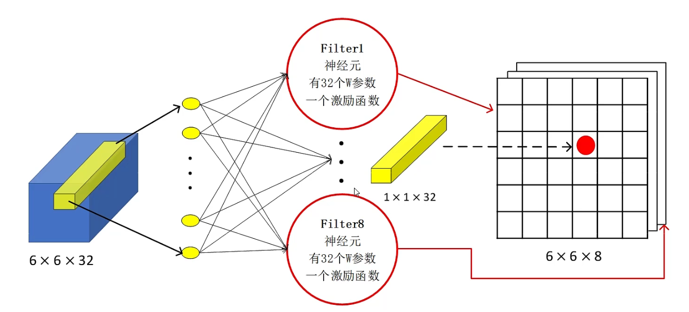
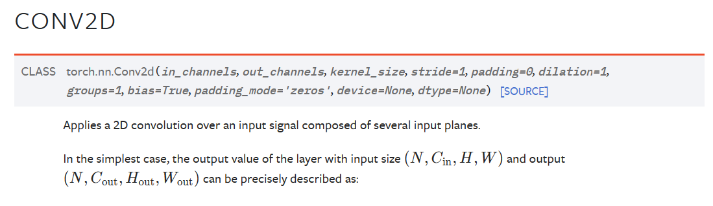
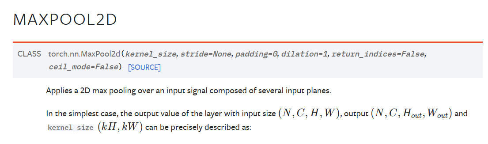

### nn.Module

在pytorch中 nn.Module是一个重要的基类

- 所有的“层”，比如线性层linear、池化层等都是它的子类
- 我们自己创建的net也必须要继承这个类

自定义的Net模型继承nn.Module最重要的是重写两个方法：

- \_\_init\_\_()  重写此方法通常包括以下内容
  1. 调用父类的init方法
  2. 定义模型中的各个“层”和激活函数等组件（这些东西都作为Net的属性存在），当然定义好组件后还需要对组件的参数进行初始化设置
- forward()  定义前向传播

#### 常用api

Module类为我们提供了很多方便的操作，也就是说Module的子类（我们自己定义的Net、各种层）都有如下这些常用的api（来自GPT3.5的列举）

1. **`.parameters()` 和 `.named_parameters()`**：这两个方法用于访问模型中的可学习参数。`.parameters()` 返回模型中的所有参数张量，`.named_parameters()` 返回参数张量以及它们的名称。
2. **`.modules()` 和 `.children()`**：这些方法用于递归遍历模型的所有子模块。`.modules()` 返回包括模型本身在内的所有模块，而`.children()`返回模型的子模块。
3. **`.to(device)`**：将模型的所有参数和子模块移动到指定的设备，如CPU或GPU。
4. **`.train()` 和 `.eval()`**：这两个方法用于设置模型的训练模式和评估模式，分别用于启用和禁用模型中的一些特定层，如Dropout和Batch Normalization的不同行为。
5. **`.apply()`**：该方法用于递归地应用一个函数到模型的所有子模块，通常用于初始化参数或进行其他自定义操作。
6. **`.state_dict()` 和 `.load_state_dict()`**：`.state_dict()` 用于返回模型的状态字典，其中包含模型的所有参数。`.load_state_dict()` 用于加载预训练模型的参数或保存和加载整个模型。
7. **`.zero_grad()`**：用于将模型的参数梯度清零，通常在每个批次的反向传播之前使用。
8. **`.forward(input)`**：定义了模型的前向传播过程，需要重写以描述数据如何在模型中流动。
9. **`.backward()`** 和 `.step()`：这两个方法通常与优化器一起使用，用于执行反向传播和参数更新。 `.backward()` 计算梯度，而 `.step()` 根据梯度更新模型参数。
10. **`.cuda()` 和 `.cpu()`**：这些方法用于将模型的参数和模块移到GPU或CPU上。

不同网络中共享权重：参数绑定（就是让两个模型公用同一个“层对象”）

tips：数据在GPU和CPU之间进行转移是一件很耗时间的事情！！！

### 卷积

超参数：核大小、填充、步幅、通道数、batch_size

#### 多通道

比如一个RGB图像就是一个3通道输入（RGB三个图层）

##### 多输入通道

意思实说多个通道输入，单通道输出

策略是：为每个通道设定一个卷积核，然后分别进行卷积操作后再把结果值相加得到单通道输出

简单来说就是输入时N维矩阵，再用一个n维的卷积核对其做卷积

- 输入：i x h x w
- 核：i x h x w
- 输出：h x w

##### 多输出通道

策略是：为每一个输出通道都设定一个n维的卷积核

简单来说就是把上面多输入通道的处理方式执行多次（你想要输出几通道就执行几次）

- 输入： i x h x w
- 核：o x i x h x w
- 输出：o x h x w

> 不同的输出通道可以理解为是一个不同的匹配模式（也就是提取数据中不同的特征信息模板）

##### 1x1卷积

字面意思，卷积核为1x1的卷积层，这个层不会识别任何空间信息，单纯是用来做通道的融合（它可以看作是一个特殊的全连接层）

从图上不难看出，1x1卷积其实就是在把所有通道同一位置的数作为输入，卷积核作为权重的一个感知机。（也就是说，1x1卷积可以看作一个特别的全连接层）

从形状来看：

- 卷积核个数 == 输出通道数

- 卷积核通道数 == 输入图像通道数（毕竟是在每个通道上做）

### 池化

卷积操作对位置非常的敏感，但是过于敏感不是一件好事。

比如我们检测边缘，当一个直线稍微歪一点点卷积就会得到完全不同的效果，但是从图像的整体情况来看可能这个图片不会有明显变化。

所以我们需要一定程度的平移不变性，从而忽略图像发生的一些变化（这些变化从微观上看是变化很大，但宏观来看二者没什么区别）。

**从形状上看：**

池化操作不改变图像的通道数，但减小了图像的尺寸（可以和1x1卷积操作对比）

ResNet

### “约定”

在PyTorch和Python中，有一些常见的约定和命名规则，用于指示属性的访问级别和用途。这些约定有助于编写清晰的、可维护的代码。以下是一些常见的规则：

1. 以一个下划线 `_` 开头的属性：通常表示属性是私有的，不应该直接访问或操作。这是一种命名约定，而不是Python语言本身的强制规则。在Python中，这样的属性仍然可以被访问，但它们被认为是不应该被公开使用的。

2. 以两个下划线 `__` 开头的属性：这通常用于名称修饰（name mangling），以确保属性的名称在子类中不会与父类的相同属性名称发生冲突。Python会自动对这些属性的名称进行转换，以包括类名，例如 `_classname__attribute`。

3. 以两个下划线 `__` 开头和结尾的特殊属性：这些是Python的魔术属性，如 `__init__`、`__str__`、`__call__` 等，它们具有特殊的行为，用于类的初始化、字符串表示等。

4. 以一个下划线 `_` 结尾的属性：通常表示属性是临时的，或者是局部变量，不应该长时间保留或传递。

这些命名约定并不是Python的硬性规则，但它们有助于代码的可读性和维护性。在PyTorch中，您通常会看到以一个下划线 `_` 开头的属性表示为私有属性，但还是可以访问它们。然而，以两个下划线 `__` 开头和结尾的属性不太常见，因为它们主要用于Python的名称修饰功能，而不是通用的属性命名约定。一般来说，遵循这些约定有助于编写更清晰、可维护的PyTorch代码。

nn.Flatten()，view()，reshape()

在各种深度学习模型中，比较常见的操作就是：经过每一个“块”之后让图像的大小减半（高宽减半）但是通道数翻倍

#### 通道优先

> CHW组织方式（Channel Height Width）

在处理图像时我们的图像通常有三个信息：通道、高、宽

而在不同的框架中对这三个信息有不同的组织方式。

##### pytorch

使用的是CHW方式（也就是所谓的通道优先）

##### 通道后置

> HWC，比如TensorFlow和OpenCV就是用这种方式组织图像信息

##### nn.BatchNormal2d

> 批量归一化

放在激活函数之前（它也是一个线性变换，也就是说它一般长这样：卷积->BN->Relu ， 或者这样：linear->BN->Relu）

对模型的精度没有影响（也就是原本可能准确率90%用它之后还是90%），唯一的作用是加快我们的收敛速度

李沐：简单理解一下这玩意儿的作用就是，使得每一层的输出变得更规范，使得我们的学习率可以设的更大，从而让我们模型收敛的更快。

