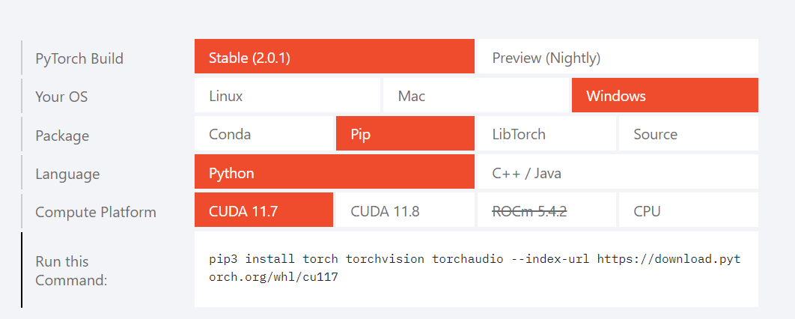

参考视频：李宏毅机器学习2023 spring

参考书籍：周志华《机器学习》

## 理论

### 名词

泛化误差：generalization error，模型在新样本上的误差称为泛化误差

- 我的理解：泛化在这里表示该参数是模型在从未试验过的数据上运行的结果
- 泛化：以旧判新，由已知的判未知的

过拟合：overfitting

欠拟合：underfitting

### 回归

### 分类

### 数学

P(A|B)：表示在B发生的条件下A发生的概率

## 实践

### 显卡、显卡驱动、CUDA、pytorch

显卡：是硬件，也就是GPU

显卡驱动：显卡厂商提供的控制显卡的接口软件

CUDA：是 Nvidia GPU 的通用计算平台

- 我的理解：CUDA就是英伟达提供的用来控制GPU更好的并行运算的一个软件
  - （类似操作系统控制CPU进行并发）

pytorch：

> 这几个玩意儿之间是有版本依赖关系的，所以需要一步步的确定本机的版本

依赖关系：显卡 ==> 显卡驱动 ==> CUDA ==> pytorch

1. 查看显卡版本：任务管理器 -> 性能 -> GPU

2. 查看驱动和CUDA的版本：nvidia-smi

3. 安装对应版本pytorch 
官网： https://pytorch.org/

由图可知目前官网推荐CUDA版本是11.7和11.8，而我电脑是11.6所以我决定升级以下

4. 如何升级？

首先显卡硬件是不可以改变的，那么就可以考虑升级驱动，或直接升级CUDA

- 原理就是无论是驱动或者CUDA都是向后兼容的，至少较近的几个版本兼容

英伟达官网：https://docs.nvidia.com/cuda/cuda-toolkit-release-notes/index.html

由官网可知，我机器的驱动版本支持11.8的CUDA故直接安装11.8版本CUDA即可

### Anaconda

一个包管理工具

#### 命令

> 【】表示括号内的内容由用户自己决定

查看环境：conda info --env

创建环境：conda create -n 【name】 python=【3.10】

删除环境：conda remove -n 【name】 --all

激活环境：conda activate 【name】

退出环境：conda deactivate

