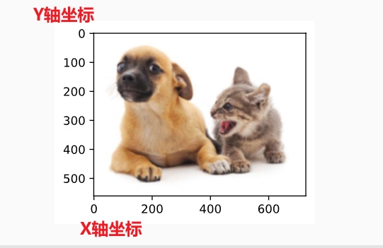

参考视频：李宏毅机器学习2023 spring

参考书籍：周志华《机器学习》

注意：机器学习里面很多时候某个模型效果好，它就是好你也法用一个理论啥的去完美解释，很多也都是先试出结果在给解释（也就是所谓的炼丹！）


## 理论

> 机器学习就是让计算机自己找出一个函数

### 名词

**泛化误差**：generalization error，模型在新样本上的误差称为泛化误差

- 我的理解：泛化在这里表示该参数是模型在从未试验过的数据上运行的结果
- 泛化：以旧判新，由已知的判未知的

**过拟合**：overfitting

**欠拟合**：underfitting

**参数**：模型的参数（大型模型的参数能上亿）可通过优化算法来学习

**超参数**：定义模型结构或优化策略的参数（由程序员来设定的）

**batch_size**：一次处理的数据量（如果每次只处理一张图片这样会很慢，故多张图片组成一个批次，每次处理一批数据这样更快）

**Feature Selection**：特征选择，你所选择的特征并不都有用，有些甚至会起反作用（噪声）所以需要对特征进行选择

**集成学习**：

**张量：**严格来讲张量和多为数组含义不一样，但是在深度学习中二者差不多（张量是数学家熟悉的名字，但是实际对机器学习来说张量就是多维数组）


**神经网络如何分层？**

李沐：这个得看分层的依据，一般来说还是以有无参数来计算，比如多层感知机（MLP）中：求和+激活 为一层


##### 神经网络可重复性

实际上神经网络可重复性是比较差的，比如cuda加快运算（并行运算）可能会出现执行顺序不同得到的结果也不同（精度损失）。但是虽然运行过程不完全一致，其结果（效果）同一个模型还是差不多，就挺神奇的（有种条条道路通罗马的感觉）


### 支持向量机


### 决策树


决策树学习三个步骤：特征选择、决策树生成、决策树剪枝

三种典型决策树算法：ID3、C4.5、CART

##### 特诊选择

常用准则：信息增益、增益率准则

##### 决策树生成

视频讲的很好：https://www.bilibili.com/video/BV1T7411b7DG


##### 决策树剪枝

> 剪枝就是对抗过拟合


##### 熵

##### 基尼系数

> Gini系数
>
> 可以用来描述数据的混沌程度，系数越小样本越统一，系数越大样本越混乱

基尼系数越小就表示纯度越高：也就是按照这个属性来划分的结果越好

样本一：5女5男：Gini = 0.5 则样本最不纯，混乱程度高 

样本二：10女0男：Gini = 0 则样本纯度极高，混乱程度低

由基尼系数的这个特点，不难想到用它来衡量我们分类结果的好坏程度（Gini越小分类越好）


### 数据增强

一句话概括：扩展一个已有数据集，使得其具有更多的多样性

比如：在语音里加入各种不同的噪音，改变图片的颜色和形状


作用：简单理解，图像只是现实场景中的一小个

GitHub上：imgaug（图像增强python库）


##### 我的理解

训练模型就是让模型做试卷，而我们的数据集可能比较片面，所以需要根据实际的应用场景来增减原始数据集的丰富程度。

换句话说，数据增强就是使数据集的丰富性（分布）更接近我们实际的场景


### 微调

> fine tune 可以看作是迁移学习中的一个分支


### 目标检测

> 物体检测，识别图片中多个物体的类别和位置

##### 边缘框

> 边界框，一般都是用一个矩形框来表示物体在图像中的位置

常见两种表示：

- 左上角坐标+右下角坐标
- 矩形中心坐标+矩形高宽

图像的坐标和数学上的坐标不一样，原点（0，0）在图像的左上角




##### 常用数据集

COCO：其地位相当于物体识别中的ImageNet


##### 锚框

> 简单理解：就是生成的预测框框

锚框只是一种方式（比较主流）感兴趣也可以选择别的方式


##### IoU

> 交并比，在目标检测任务中用来判定我们找到的框和真实标定的框之间的差别大小

我的理解：其作用相当于图像分类问题中的loss函数

计算方式：两框交集/两框并集

##### NMS

> 非极大值抑制

基于锚框的目标检测算法会生成大量的预测框，NMS就是一种筛选框框的方式，丢弃不准确的框保留较精准的框。

#### 常用算法

##### R-CNN

Fast RCNN

Fast R-CNN

Mask R-CNN

##### SSD

##### Yolo


### 序列模型

> 当前的数据和以前的数据是相关的

在之前学习过的任务中数据集中数据都是独立的随机变量，而在序列模型中数据之间不独立，后出现的数据与之前出现的数据有关联。（或者说先出现的数据影响后出现的数据）


自回归模型

##### 文本预处理


### 数学

李宏毅：机器学习分三大步

1. 设定范围（选择模型，比如CNN、Transformer等）
2. 设定标准（损失函数）
3. 达成目标（优化函数）

#### 模型

> 李宏毅：模型就是要找的函数范围（在此范围内找到合适的目标函数）

模型就是一系列候选函数的集合，比如：CNN、Transformer等


#### 损失函数

> 李宏毅：损失函数给定了衡量函数好坏的标准（指导我们在目标函数集合中找到最合适的）

评价一个函数好坏的方法：

- 有正确标定的数据集时：直接用此数据输入函数中，看结果和正确值的差距
- 没有正确标定的数据集时：相似的样本应该得到相似的输出

也可以理解为给定一个衡量函数好坏的标准


找到更好的函数

> 李宏毅：根据损失函数找到目前最好的函数后，还有对其进行优化（实际上函数是有很多很多参数的，大型的模型可能有上亿的参数，在写代码过程中手动设置的参数叫“超参数”）


#### 梯度

> 以下关于方向导数和梯度的描述均为二维情况（想来多维情况也一样）

数学上的原理直接看宋浩：[【九-15】梯度_哔哩哔哩_bilibili](https://www.bilibili.com/video/BV1Eb411u7Fw/?p=106)

**方向导数**（标量）：多元函数某一个点朝某一个方向切线的斜率

- 和偏导数不一样，偏导数是<u>*直线切线*</u> ，方向导数是<u>*射线切线*</u>
  - 也就是说方向导数存在而偏导数不一定存在

**梯度**（向量）：多元函数在某一点出所有偏导数组成的一个向量，<font color="red">**梯度指向的方向是方向导数取最大值的方向，它的模就是方向导数的最大值，梯度方向的反方向函数减小最快**</font>

某点的梯度方向就是等值线在这一点的法线方向

等值线：与梯度垂直的方向，（此方向：方向导数 == 0）

梯度的模就是沿这个方向的方向导数

**梯度下降：**所谓梯度下降其实就是计算loss函数在权重参数上的梯度（loss函数就是以权重参数为自变量的多元函数，每一轮的初始参数值组成一个坐标(向量)），计算出loss函数对每一个参数的偏导构成向量（梯度）再用原来的参数-梯度从而使得这一轮计算后使得loss输出值变小。

- 简单列个公式就是：($w_0$,$w_1$,$w_2$) - $\eta$（$\frac{\partial f}{\partial {w_0}}$,$\frac{\partial f}{\partial {w_1}}$,$\frac{\partial f}{\partial {w_2}}$） 

- 从上面的公式可以看出，我们实际的计算过程其实就是求偏导数的值
- 而实际上经过层层函数复合后loss函数会变得非常复杂，所以直接求偏导会很困难。还好我们聪明的前辈就发明了计算图，把复杂的符合函数拆分为较为简单的复合关系，再通过链式法则求偏导。

**总结：**梯度的几何意义为我们提供了修改参数的理论依据，而计算图和反向传播为我们实现算法提供可现实的可能。


生成式AI：其输出结果不再是一个简单的数字或概率，而是一个有结构的东西（图像、文字、视频等）


#### 概率论

P(A|B)：表示在B发生的条件下A发生的概率


#### 线性代数

##### 向量范数

> 向量范数是用来衡量向量大小，距离的函数，**通过距离的定义，进而我们可以讨论逼近程度，从而讨论收敛性、求极限**。

讲的很明白的博客：https://blog.csdn.net/weixin_43660703/article/details/108422077

对于一个标量我们可以很方便的比较其大小（距离），比如：1<2  , 1<3 而且3相对与2离1更远。但是对于向量我们不能直接比较大小。比如（1，2）（3，4）这两个向量我们根本不能判断大小（或者说判断它们之间的距离），为了解决这问题就引入范数的概念。

向量范数就是定义一个规则（函数）把不能进行比较的向量映射成能比较大小（距离）的一个数值（标量）。

其实距离也可以理解为**相似性**，两个向量接近（范数差值越小）则两个向量越相似

##### 常见范数

我们能定义不同的规则来进行计算，常见的有如下这些

- **0-范数**
- **1-范数**
- **2-范数**：就是向量的模长（也叫欧氏距离）
- **p-范数**
- **无穷范数**


##### 矩阵范数

> 和向量范数差不多，定义了矩阵的距离

常见有如下这些：

- **1-范数**（列模）：列向量模长的最大值
- **2-范数**（谱模）：
- **无穷范数**（行模）：行向量模长的最大值
- **f-范数**（Frobenius范数）：所有元素的平方和再开方（感觉像欧氏距离），等价于把矩阵拉长为一个向量再算向量的$L_2$范数


##### 矩阵乘法

矩阵乘法可以理解为将向量进行扭曲


##### 求导

梯度（导数）指向值变化最大的方向

关于求导：先了解输入和输出的图形变化即可，具体其原理有缘再学

分子布局符号，分母布局符号


## 实践

### 显卡、显卡驱动、CUDA、pytorch

显卡：是硬件，也就是GPU

显卡驱动：显卡厂商提供的控制显卡的接口软件

CUDA：是 Nvidia GPU 的通用计算平台

- 我的理解：CUDA就是英伟达提供的用来控制GPU更好的并行运算的一个软件
  - （类似操作系统控制CPU进行并发）

pytorch：


> 这几个玩意儿之间是有版本依赖关系的，所以需要一步步的确定自己的电脑应该搭配什么版本

依赖关系：显卡 ==> 显卡驱动 ==> CUDA ==> pytorch

1. 查看显卡版本：任务管理器 -> 性能 -> GPU


2. 查看驱动和CUDA的版本：nvidia-smi


3. 安装对应版本pytorch 
    官网： https://pytorch.org/

  

由图可知目前官网推荐CUDA版本是11.7和11.8，而我电脑是11.6所以我决定升级一下

4. 如何升级？

首先显卡硬件是不可以改变的，那么就可以考虑升级驱动，或直接升级CUDA

- 原理就是无论是驱动或者CUDA都是向后兼容的，至少较近的几个版本兼容

英伟达官网：https://docs.nvidia.com/cuda/cuda-toolkit-release-notes/index.html


由官网可知，我机器的驱动版本支持11.8的CUDA故直接安装11.8版本CUDA即可

我选择的是conda安装，所以复制命令打开anaconda prompt进入创建好的环境中


anaconda会自动扫描需要下载的所有包，选择y静等下载完成

验证安装结果：pip list


列表中由torch表示安装完成，当然也可以调用python，输入import torch来验证，只要不报错就是安装成功（linux的思想，没有消息就是好消息）

### Anaconda

一个包管理工具

其提供了一个命令行交互界面：anaconda prompt


#### 命令

> 【】表示括号内的内容由用户自己决定

查看当前conda版本：conda --version

查看环境：conda info --env

创建环境：conda create -n 【name】 python=【3.10】

删除环境：conda remove -n 【name】 --all

激活环境：conda activate 【name】

退出环境：conda deactivate

修改环境名称： conda create --name 【新名字】 --clone 【旧名字】

​							conda remove --name 【旧名字】 --all

### jupyter

一个web应用，简单来说和IDEA、PyCharm 类似只不过它是依赖web的应用，IDEA叫桌面应用

##### 打开jupyter

由于我已经安装好了，直接在cmd窗口输入：jupyter notebook，在弹出的窗口点击网址即可进入jupyter

注意：打开jupyter后不要关闭黑窗口，否则jupyter网页服务直接就没了（相当于本地部署了个服务器，服务器都关了还有个屁的网页）


#### 界面

##### 单元格

jupyter写代码的地方是单元格cell，一共有三种单元格：markdown、code、raw


raw单元格：不对输入的内容进行任何处理（比如markdown单元格输入内容会用markdown语法来进行相应渲染），在这类单元格上打字就和在 .txt 文件上打字是一样的

##### 两种模式

**编辑模式**：点击单元格进入编辑模式，框框变绿色，且右上角会有铅笔图案


编辑模式就是平常写代码写markdown的模式（类似VIM的插入模式）

**命令模式**：框框变蓝色


类似VIM的命令模式，此时键盘上不同按键表示输入不同的命令（就和快捷键一样）

命令模式的命令以及编辑模式的快捷键：https://blog.csdn.net/qq_46311811/article/details/122731879

**模式转换**

编辑模式==>命令模式：Esc键

命令模式==>编辑模式：Enter键（回车）


##### 快捷键

shift+Enter：运行当前cell的代码并创建下一个cell

ctrl+Enter：让makedown单元格渲染成对应样子，具体效果如下

未渲染：


已渲染：


### pytorch

#### 常用工具

dataset类

dataloder类

##### tensorboard类

运行后要查看tensorboard，直接在终端启用conda环境，再运行下面语句：

```powershell
 tensorboard --logdir="你的logs目录"
```

运行结果会给出URL，复制到浏览器即可查看

运行结果会给出URL，复制到浏览器即可查看

一个用图表形式表现训练过程中的效果变化


##### transforms

（一个处理图像的工具库）

比如将image转换为tensor


##### 卷积


上图是pytorch官方文档给出的Conv2d（2维卷积）输入参数和输出结果的计算公式，<a name="Conv2D输出结果形状"> </a>

其中：$（N ， C_{in} , H_{in} , W_{in}）$的含义如下

- N：表示batchsize，即：一个批次含图片数量
- $C_{in}$：表示输入图像的通道数（channel）
- $H_{in}$：输入图像的高度
- $W_{in}$：输入图像的宽度

Output公式中dilation是空洞卷积的参数，如果不是空洞卷积则为1


```python
Conv2d(3,32,5,padding=2)
'''
	输入图像为3通道，
	输出结果为32通道
	5x5的卷积核（同图像大小一样，宽高相同简写为5，也可以用元组）
	padding为2（就是图像周围填充2像素）
	stride取默认值1
'''
Conv2d(3,32,5,1,2)	# 这样写和上面的效果等价
```


### 卷积神经网络

> CNN

CNN的灵感就是人类识别物体的过程（获取边缘等特征 ==> 抽象为图形 ==> 抽象为图像）

很棒且通俗的解释：https://easyai.tech/ai-definition/cnn/（解释CNN各个部分的功能）

#### 神经网络

> 神经网络的灵感就是学习人脑的运作过程（了解一下即可，对后续学习CNN没什么帮助）

“启发”是一个非常模棱两可的词，由一个东西启发得来的结果，可以跟这个东西毫不相干。比如我也可以说，Yin 语言的设计是受了九 yin 真经的启发 。所以

从感知器到神经网络：https://www.ruanyifeng.com/blog/2017/07/neural-network.html

**神经网络类别**

神经网络类别很多，CNN只是其中很火的一种，多用于图像处理

- 前馈神经网络（FNN）
- 递归神经网络（RNN）
- 卷积神经网络（CNN）
- 生成式对抗网络（GAN）


#### 卷积层

> 卷积层的作用：提取特征（不要问为什么能提取，总之就是可以）

简单来说就是用一个卷积核对图像进行卷积操作

卷积的计算：矩阵内积乘法（注意不是矩阵乘法）

- 矩阵内积乘法具体计算方法：两个矩阵对应位置相乘，最终结果累加


**为什么卷积可以提取特征呢？**

《线性代数的几何原理》矩阵乘法就是把一个向量变成另一个方向或长度都不相同的新向量。在这个变换过程中，原向量发生了旋转伸缩的变换。而对原向量只进行伸缩变换而无旋转操作后得到的就是特征向量，伸缩比例就是对应的特征值。

我的理解：方向相同的向量相乘得到的模长更大（也就是说卷积结果值越大，图像和卷积核越相似），而不同的卷积核可以表示不同的边缘信息，所以用卷积核进行卷积可以提取图像的边缘信息（也就是所谓的特征）

从效果上来说：不同的卷积核就代表了不同的特征提取倾向，而具体要提取什么特征就由模型训练自己得出


**如何确定卷积核？**

答案是：先随机取值，使用反向传播算法调整，所以每经过一轮训练都会对卷积核做修改

所以pytorch代码中Conv2D我们只需要输入卷积核大小而不需要确定卷积核具体数值。代价就是连我们自己都不知道模型选取的卷积核的含义，换言之：我们并不知道模型提取了图片中的哪些特征

可参考博客：https://www.51cto.com/article/585871.html

**卷积与滤波**

在讨论CNN的时候二者是一个意思！这两个玩意儿很像，操作也类似，但是是不一样的两个东西（大概了解一下就好，不影响学习CNN），滤波这和称呼常可以在信号处理、图像处理等领域见到，所以看到别人说滤波器（filter）可以简单理解为卷积核（问题不大）

**如何计算神经元数量？**

简单来说：用卷积核进行一次卷积就是一个神经元（就是特征图像素点个数）

- 例1：图像是1000x1000像素，而滤波器大小是10x10，padding == 0，假设滤波器没有重叠，也就是步长为10，这样隐层的神经元个数就是100x100
- 例2：图像是100x100，卷积核10x10，步长为1（stride == 1），padding == 0 （不进行填充）则神经元个数为：98*98

其实torch.nn.Conv2D的输入输出shape就是这么算的


##### 卷积的输入和输出

举个例子：输入图像为27x27x3（HWC），则我们的卷积核必须是 HxWx3（也就是说卷积的通道数必须核输入图像保持一致），而一个HWC的卷积核对应一个输出通道（想输出多个通道就要指定HWC卷积核的数目）

所以对于给定的输入图像，我卷积操作只需要指定*输入通道、输出通道、卷积核size*这三个参数即可。

```python
nn.Conv2d(1, 6, 5), # in_channels, out_channels, kernel_size
```

事实上pytorch框架就是这么干的，我们只需要像上面这样给定参数即可


#### 池化层

> pooling 降低图像维度（降维加速，防止过拟合）

- pool这个英语单词有“汇总”的意思，池化层也就是做了下采样

具体的效果就像给图片打上马赛克一样（降低图像维度但又保留了绝大部分的信息），常见的有最大池化、均值等算法

理解：1080P的视频很清晰人能识别画面中物体，360P有些模糊但人还是能识别画面中的物体，因此可以得出结论：适当的降低图像的清晰度不会影响画面中物体的识别，同理机器也可以。


由上面图像可以看出，经过池化操作后图像大小明显变小（降维）

**关于池化**

采样也是有讲究的，具体来说采样肯定会丢失一部分的信息，但是这些信息大部分都是对我们目标判定没有影响的（或者说丢掉的那些特征基本上都是噪声）。

平移不变性，尺度不变性，形变不变性


#### 全连接层

> FC（full connect）对CNN来说就是MLP（又叫ANN），其作用就是：依据特征对样本进行分类

ANN是其他神经网络的基础，

以CNN为例：使用卷积、池化等操作获取特征，再把特征交给FC（全连接层）进行类别概率判断。而这里的FC其实就是MLP（多层感知机）


### 多层感知机

> MLP 又叫 ANN

卷积得到的是二维特征图，全连接层就可以整合这些特征（二维图转为一维向量），全连接层的每个节点都与上一层的所有节点相连所以叫全连接层。

从数学上看：**全连接层其实就是在做矩阵乘法**！！！，简单来说就是 $特征矩阵X_{i,j} * 权重矩阵W_{i,j} + 偏执U= 输出矩阵H_{i,j}$ 

从代码上看：

- 权重矩阵就是卷积核（Kernel）
- 平移不变性体现在同一层的卷积核相同（也就是说某一块像素不管移到图像的任何部分都能得到相同的结果）
- 局部性体现在卷积核的大小（也就是感受野）

李沐：对全连接层使用平移不变性和局部性就得到卷积层，卷积是一个特殊的全连接层


#### linear

> torch.nn.Linear 实现全连接层的一层

- 创建对象需要两个参数,就是感知机的输入权重个数和输出结果个数
- 比如CNN一般先将特征图展开为一维向量,然后丢到linear里面

```python
m = nn.Linear(20, 30)		# 20输入,30输出
input = torch.randn(128, 20)
output = m(input)
print(output.size())	# 运行结果:torch.Size([128, 30])
```


#### 感知机

> Perceptron，属于二元线性分类器

感知机（器）只能把数据进行二分类，而且只有样本线性可分才能正确分类。（又叫二元线性分类器）


**如何理解这个图？**

- $x_1到x_n表示n个特征，w_1到w_n$表示不同特征的权值，

- $x_0$是偏执值
  - 假设只有两个特征x和y，样本就是平面坐标上的若干点，那么这个感知器就可以理解为在二维坐标系下找到一条直线将样本点分为两类，可以看出权重决定了直线的斜率，而偏执值可以将这条直线平移
  - 我的理解：扩散一下思维，如果有n个特征输入，那么感知器就是找到一个超平面将样本在n维空间内分为两类，而偏置值可以将这个平面进行平移

感知机不能拟合XOR函数，它只能产生线性分割面！


**线性可分性**

以二维情况为例：线性可分就是能用一条直线将两类样本分开

如果没有激活函数，无论感知机有多少层都只能进行线性分类（不讲人话：无激活函数的网络无论有多少层都会退化为单层网络），可以证明：线性函数无论嵌套多少次都还是线性函数

激活函数功能和特点：[[5分钟深度学习\] #03 激活函数_哔哩哔哩_bilibili](https://www.bilibili.com/video/BV1qB4y1e7GJ) 讲的非常清晰，建议反复观看


**MLP隐藏层怎么设计？**

换句话说就是如何定义网络的形状？，超参数（隐藏层数、每层隐藏层宽度）怎么确定？

李沐：老中医手法，凭感觉，一般是由宽变窄

​																下图是VGG16模型


**SVM和MLP**

这两个从效果上来看差不了太多，SVM在数学特性上更漂亮，但是实际上我们用MLP更多，因为它可以很方便的转成其他网络，比如CNN，RNN

**深度学习和浅度学习**

首先，要想模拟一个函数（找到样本的分割面）我们的神经网络可以有两种选择，一种是“矮胖”（层数少但是层内的宽度很大，这就叫浅度学习），另一种是“高瘦”（层数多，但每层都比较窄，这就叫深度学习）。

两种选择可以达到差不多的模型复杂度（可理解为模型的能力大小）。但是“矮胖”不好训练（从感觉上：它更像是要一口吃成胖子，很容易overfit），“高瘦”更好训练（感觉像是循序渐进）


#### 激活函数

> Activation Funcation 功能：提供非线性

用到它的位置：输入层->隐藏层，隐藏层->隐藏层（换个说法就是：除了最后计算输出层外都要使用激活函数）

如果有位置忘记放隐藏函数了，那么这一层相当于没有（发生了层数的坍塌）

**我的理解**

比如输入是二维的（两个参数），做二分类就是找一条线把样本分开。如果没有激活函数，无论感知机有多少层都只能画出一条直线（线性分类），而引入了非线性的激活函数就能画出折线乃至曲线（毕竟折线它折的频繁一些就和曲线没什么区别嘛）

换个理解方式：激活函数也可以理解为把线性不可分的数据空间转换到线性可分的空间上

**常见函数**

**Relu**：它其实就是max(0 , x) ，它很常用，倒不是说它效果多么好，而是它计算简单（其他的函数有指数运算，更耗计算资源）

**sigmoid**：


**tanh**：

李沐：激活函数的选择远没有其它超参数对最终结果的影响大，所以随便选择就好（Relu计算简单，所以它最常用）

##### softmax

Softmax是一种激活函数，它可以将一个数值向量归一化为一个概率分布向量，且各个概率之和为1。Softmax可以用来作为神经网络的最后一层，用于多分类问题的输出。Softmax层常常和交叉熵损失函数一起结合使用。


### 损失函数

> 损失函数就是评估输出结果和目标结果之间的差距（loss越小越好），为更新输出提供参考依据（反向传播）

大概是这样子的：$f(模型结果，实际结果)$

讲的很好，很清晰的介绍：https://www.zhihu.com/tardis/zm/art/35709485?source_id=1003

##### 一个例子

$loss = \frac{1}{2}（y _{模型}- y_{真实}）^2$

 可以看出loss是关于$y_{模型}$的函数（$y_{真实}$是已知的常数），而$y_{模型}$是一系列权重的函数，从而loss是一系列权重的函数。因此可以计算loss关于所有权重的偏导（也就是所谓的梯度），由于实际的模型比较复杂，层次也比较多，所以实际的计算量较大，计算机实际是使用计算图来进行自动求导，而且采用的是反向传递（反向传播）来加速这个求导过程。尽管如此，计算梯度还是神经网络最“贵”的步骤，大部分时间都花在这上面。

##### 均方损失函数

##### 绝对值损失函数

##### 交叉熵损失函数

交叉熵常用来衡量两个概率之间的区别，而softmax的输出结果恰为一个概率向量，样本数据中仅目标为1其余均为0也可看做一个概率，所以多分类问题常让这两个配合使用。

其梯度为：预测概率-真实概率

##### IOU

> 交并比，图像分割任务中常用损失函数

就是：IOU = 预测区域和真实区域的交集 / 预测区域和真实区域的并集

与之类似的还有MIOU（所有类别IOU的均值）


### 反向传播

反向传播、前向传播、计算图：https://cloud.tencent.com/developer/article/1498635

反向传播是快速求偏导的一个方法，（求的是损失函数对权重、偏执值的偏导），偏导指向的是函数变化最大的方向，所以求得函数对权重的偏导就能知道函数在此权重上的变化趋势，从而知道怎么调整权重来使得loss函数最后结果变得更小

#### 梯度下降

损失函数是一个多元函数，其自变量是$w_i和b_i$（即模型每一层的参数），显然loss最终结果和每一个参数都有关系而且每一个参数对结果的影响程度都不同，梯度就是定量的描述每一个参数对Loss函数最终结果的影响大小。

每个变量的导数（梯度）告诉我们整个表达式对其值的敏感程度


> 关于梯度下降有没有可能让其像山上滚落的石头一样，遇到凹槽向前冲一段距离（这样子就有可能跳出局部最优解）？？？

梯度下降超级详细的计算过程（终于知道怎么计算了 (༎ຶ ෴ ༎ຶ) ）：[【08】4 介绍神经网络-反向传播_哔哩哔哩_bilibili](https://www.bilibili.com/video/BV1nJ411z7fe?p=8&vd_source=553038a6aa71e8272f6ae73b38f60f80)（关于这种过程复杂的计算知识点还是视频讲的最清楚，博客根本讲不明白！！！）

配套文字教程：https://cs231n.github.io/optimization-2/

而且讲课的小姐姐也太好看了，简直是超级大美女（绝无冒犯，相比看李沐视频简直是享受）


##### 计算原理

计算梯度实际上分为两步：

**前向传播**（求误差）：就是给模型一个输入，其经过模型多次转换得到输出的过程

**反向传播**（误差传回）：根据模型的输出和损失函数，将得到的误差一层一层的反向传回给每一层参数的过程

计算例子：有如下这个函数（实际上就是一个sigmod函数）


对于这个函数它的梯度应该是：（$\frac{\partial f}{\partial {w_0}}$,$\frac{\partial f}{\partial {w_1}}$,$\frac{\partial f}{\partial {w_2}}$），参数的更新应该是用所有参数组成一个向量减去这个梯度简单来说就是：

($w_0$,$w_1$,$w_2$) - $\eta$（$\frac{\partial f}{\partial {w_0}}$,$\frac{\partial f}{\partial {w_1}}$,$\frac{\partial f}{\partial {w_2}}$）  ， 其中 $\eta$ 就是所谓的学习率（实际上这只是梯度下降计算的一部分，还得在外面再复合一层损失函数才完整）

其实就是一个两个输入的感知机，$x_1，x_2$是输入值，$w_0和w_1$是权重，$w_2$是偏置值，其运算结果输入至sigmod激活函数中

下面是可能用到的求导公式


这是上述公式的一个可行的计算图


其中绿色数字是前向传播求得的值，而红色数字是反向传播求得的值

**计算例子**：实际上就是链式法则

最右侧红色-0.53

1/x的导数是$-1/x^2$ , 而此处的x取值应该是前向传播得到的绿色数字s1.37 ，所以这一步的梯度值为：$-1/1.37^2$  = -0.53

最左侧的绿色值是给定的输入值，其中，$x_1，x_2$是输入值（样本数据，也就是样本的特征），$w_0、w_1、w_2$是权重和偏置值（随机给定）


##### 自动求导

上面只是介绍了梯度计算的原理、但是实际上在模型训练中每一个梯度的计算都十分的复杂。

实际上我们计算梯度采用的是“自动求导”的方法。

包括了两个步骤：

- 前向计算
- 反向计算


雅可比矩阵


$\frac{\partial f}{\partial {w_0}} = \frac{\partial f}{\partial {P}}\frac{\partial p}{\partial {q}}\frac{\partial q}{\partial {a}}\frac{\partial a}{\partial {x}}\frac{\partial x}{\partial {w_0}}$

#### 梯度爆炸、梯度消失

> 数值的稳定性


对单独的某一个参数来说它的梯度计算就是一系列的偏导数连乘（斯坦福cs231n），而对整个模型而言就是一系列的矩阵乘法（李沐）。

我们训练模型的GPU大多还是16位的浮点数，其取值范围是：(6e-5~6e4)，所以我们的数值不能超过这个范围。

##### 出现原因

梯度爆炸和梯度消失最根本的原因是：梯度计算的方式是许多个偏导数的连乘！！！

除此之外它还和这些因素有关：

- 权重的初始选择
- 激活函数选择（与激活函数的导数相关）
  - 比如relu函数可能导致梯度爆炸，而sigmod可能导致梯度消失

##### 危害

梯度爆炸：就是梯度太大


##### 一些措施

- 把乘法变加法：ResNet、LSTM
- 归一化：梯度归一化、梯度裁剪
- 合理的权重初始和激活函数
  - 初始的权重最好一开始在比较平缓的地方（平缓=梯度小）
  - 比如说：使用Xavier初始化（对每一层输出的均值和方差做出限制）这样子就能在一定程度上避免数值出现极大或极小的异常值。


### 正则化

**权重衰退**

> 直观感受其作用就是使得模型拟合的函数更平滑，能一定程度上缓解过拟合，但一般效果不大


如上图，要想拟合图中红点，蓝色曲线和绿色曲线都可以做到，权重衰退的作用就避免蓝色曲线这样子。


**原理**：权重衰退是通过减小模型参数值的范围来降低模型的容量，所以它是一种解决过拟合的方法（由图像上看解决过拟合要么降低模型容量要么加大数据量，但实际上数据量可能不好增加）

- 使用均方范数（L2正则项）作为硬性限制（不常用）
- 使用均方范数作为柔性限制（常用）
  - 简单来说就是原有loss函数基础上增加一个二次项阀门
  - 这个阀门的作用就是在梯度下降时让原w变小再向梯度下降的方向移动

通常在优化器（SGD等）中Weight_Decay（正则项权重）设在0.0001左右

**总结**：Weight_Decay一般设0.0001、0.001左右（老中医手法），能一定程度上缓解过拟合，若是效果不佳就换方法


##### 丢弃法

> dropout，简单来说就是随机使一些神经元失效（mlp中隐藏层），同时使剩下的神经元效果增强，使得总的神经元效果期望不变

常用在多层感知机隐藏层的输出上

丢弃概率时控制模型复杂度的超参数

**总结**：目前dropout是最常用针对MLP的消除过拟合的方法，同样的dropout怎么设也是老中医手法，全靠调


### 其它

##### 数据集

训练数据集:训练模型参数

验证数据集:选择模型超参数

非大数据集上通常使用K-折交叉验证

##### 过拟合和欠拟合


模型容量:模型容量可以理解为模型拟合函数的能力,比如只能拟合一条线相比能拟合一条折现,肯定是拟合折线的模型容量大.

判断模型容量主要看两个因素

- 参数的个数
- 参数值的选择范围

李沐：一般我们模型训练都是先搞容量大一些造成结果过拟合，然后再用各种手段调参使得不再过拟合（其实直观上理解这样子做才能更好的利用好所有的训练数据）


##### 线性层

所谓线性层linear就是单层感知机


##### 全局平均池化

> global average pooling，GAP

##### softmax


#### GPU加速


### 代码tips

“广播机制”，即使两个矩阵维度不匹配（数学上不可乘）但是在代码中它会自动补全，让两个可以乘


当数据量很大时，数据多存放在磁盘中，所以可能会出翔训练速度够了但是读取数据的速度不够，导致训练速度变慢。为了防止这种情况，一般在训练前先检测一下数据的读取速度是多少（比如：扫一遍所有数据需要多少时间），应及时调整使读取速度高于训练速度。