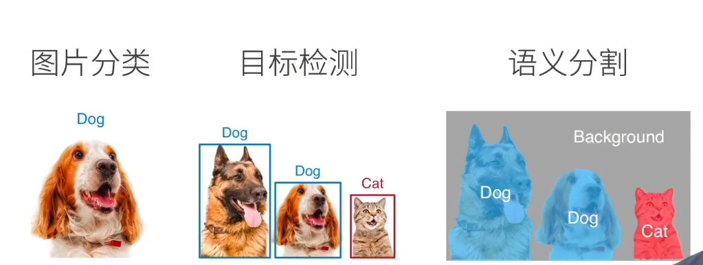
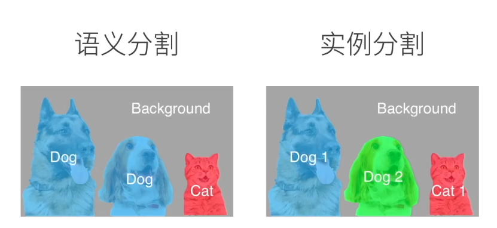
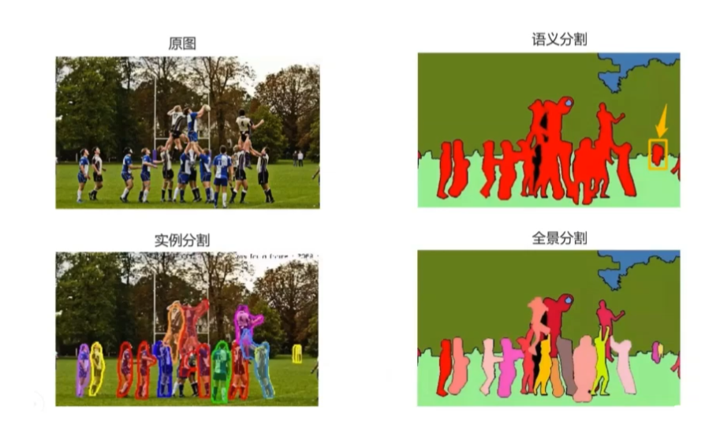

### 任务

**图片分类**：给张图片，判定图片中物体的类别

**目标检测**：给张图片，找到图片中的不同种类物体并找到其位置

- 物体位置一般都是用框给出，但是实际情况还是比较糙

##### 图像分割

**语义分割**：给张图片，将图片中的每个像素分类到对应的类别中

- 经典模型：U-Net（原文好像是用在医学细胞分割任务中的）

**实例分割**：在语义分割基础上还要判定同类中的不同个体

**全景分割**：

上采样方法：线性差值、转置卷积

### backbone、neck 、 head

https://zhuanlan.zhihu.com/p/607578342

